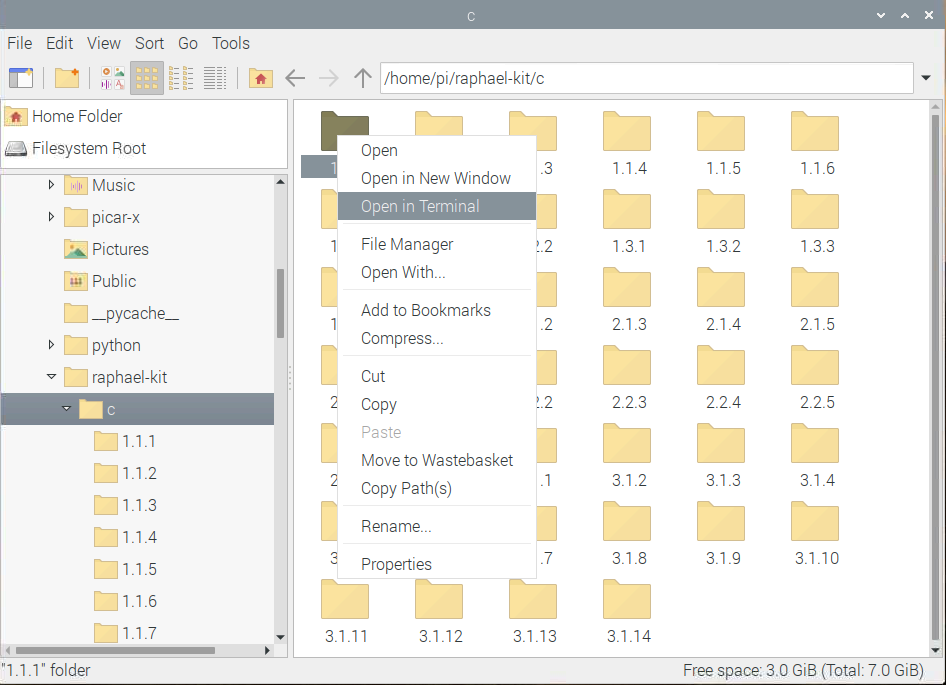
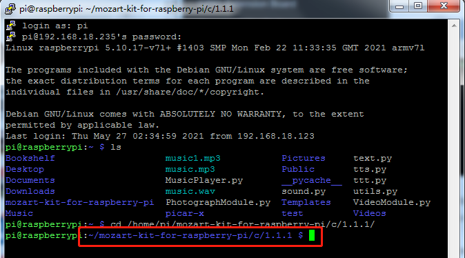

.. _1.1.1_c:

1.1.1 Blinking LED
=========================

Introduction
-----------------

In this project, we will learn how to make a blinking LED by programming.
Through your settings, your LED can produce a series of interesting
phenomena. Now, go for it.

Components
------------------

.. image:: media/blinking_led_list.png
    :width: 800
    :align: center

* :ref:`GPIO Extension Board`
* :ref:`Breadboard`
* :ref:`Resistor`
* :ref:`LED`

Schematic Diagram
---------------------

In this experiment, connect a 220Ω resistor to the anode (the long pin
of the LED), then the resistor to 3.3 V, and connect the cathode (the
short pin) of the LED to GPIO17 of Raspberry Pi. Therefore, to turn on
an LED, we need to make GPIO17 low (0V) level. We can get this
phenomenon by programming.

.. note::

    **Pin11** refers to the 11th pin of the Raspberry Pi from left to right, and its corresponding **wiringPi** and **BCM** pin numbers are shown in the following table.

In the C language related content, we make GPIO0 equivalent to 0 in the
wiringPi. Among the Python language related content, BCM 17 is 17 in the
BCM column of the following table. At the same time, they are the same
as the 11th pin on the Raspberry Pi, Pin 11.

============ ======== ======== ===
T-Board Name physical wiringPi BCM
GPIO17       Pin 11   0        17
============ ======== ======== ===

.. image:: media/image48.png
    :width: 800
    :align: center

Experimental Procedures
-----------------------------

**Step 1:** Build the circuit.

.. image:: media/image49.png
    :width: 800
    :align: center

**Step 2:** Go to the folder of the code.

1) If you use a screen, you're recommended to take the following steps.

Go to **/home/pi/** and find the folder **raphael-kit**.

Find **C** in the folder, right-click on it and select **Open in
Terminal**.

Then a window will pop up as shown below. So now you've entered the path
of the code **1.1.1_BlinkingLed.c** .

In the following projects, we will use command to enter the code file
instead of right-clicking. But you can choose the method you prefer.

2) If you log into the Raspberry Pi remotely, use ``cd`` to change directory:

.. raw:: html

   <run></run>

.. code-block::

   cd /home/pi/raphael-kit/c/1.1.1/

.. note::
    Change directory to the path of the code in this experiment via cd.

In either way, now you are in the folder C. The subsequent
procedures based on these two methods are the same. Let's move on.

**Step 3:** Compile the code

.. raw:: html

   <run></run>

.. code-block::

   gcc 1.1.1_BlinkingLed.c -o BlinkingLed -lwiringPi

.. note::
    gcc is GNU Compiler Collection. Here, it functions like
    compiling the C language file ``1.1.1_BlinkingLed.c`` and outputting an
    executable file.

In the command, ``-o`` means outputting (the character immediately
following -o is the filename output after compilation, and an executable
named ``BlinkingLed`` will generate here) and ``-lwiringPi`` is to load
the library wiringPi ( ``l`` is the abbreviation of library).

**Step 4:** Run the executable file output in the previous step.

.. raw:: html

   <run></run>

.. code-block::

   sudo ./BlinkingLed

.. note::

   If it does not work after running, or there is an error prompt: \"wiringPi.h: No such file or directory\", please refer to :ref:`C code is not working?`.

To control the GPIO, you need to run the program, by the
command, ``sudo`` (superuser do). The command ``./`` indicates the current
directory. The whole command is to run the ``BlinkingLed`` in the
current directory.

After the code runs, you will see the LED flashing.

If you want to edit the code file ``1.1.1_BlinkingLed.c``, stop the code and then type the following command to open it:

.. raw:: html

   <run></run>

.. code-block::

   nano 1.1.1_BlinkingLed.c

Press ``Ctrl+X`` to exit. If you have modified the code, there will be a
prompt asking whether to save the changes or not. Type in ``Y`` (save)
or ``N`` (don’t save). Then press ``Enter`` to exit. Repeat ``Step 3``
and ``Step 4`` to see the effect after modifying.

.. image:: media/image53.png
    :width: 800
    :align: center

**Code**

The program code is shown as follows:

.. code-block:: c

   #include <wiringPi.h>  
   #include <stdio.h>
   #define LedPin      0
   int main(void)
   {
      // When initialize wiring failed, print message to screen
      if(wiringPiSetup() == -1){
         printf("setup wiringPi failed !");
         return 1;
      }
      pinMode(LedPin, OUTPUT);// Set LedPin as output to write value to it.
      while(1){
         // LED on
         digitalWrite(LedPin, LOW);
         printf("...LED on\n");
         delay(500);
         // LED off
         digitalWrite(LedPin, HIGH);
         printf("LED off...\n");
         delay(500);
      }
      return 0;
   }

**Code Explanation**

.. code-block:: c

   #include <wiringPi.h>

The hardware drive library is designed for the C language of Raspberry
Pi. Adding this library is conducive to the initialization of hardware,
and the output of I/O ports, PWM, etc.

.. code-block:: c

   #include <stdio.h>

Standard I/O library. The pintf function used for printing the data
displayed on the screen is realized by this library. There are many
other performance functions for you to explore.

.. code-block:: c

   #define LedPin 0

Pin GPIO17 of the T_Extension Board is corresponding to the GPIO0 in
wiringPi. Assign GPIO0 to LedPin, LedPin represents GPIO0 in the code
later.

.. code-block:: c

   if(wiringPiSetup() == -1){
      printf("setup wiringPi failed !");
      return 1;

This initialises wiringPi and assumes that the calling program is going
to be using the wiringPi pin numbering scheme.

This function needs to be called with root privileges.
When initialize wiring failed, print message to screen. The function
``return`` is used to jump out of the current function. Using return in
``main()`` function will end the program.

.. code-block:: c

   pinMode(LedPin, OUTPUT);

Set ``LedPin`` as output to write value to it.

.. code-block:: c

   digitalWrite(LedPin, LOW);

Set GPIO0 as 0V (low level). Since the cathode of LED is connected to
GPIO0, thus the LED will light up if GPIO0 is set low. On the contrary,
set GPIO0 as high level, LED will go out.

.. code-block:: c

   printf("...LED off\n");

The printf function is a standard library function and its function
prototype is in the header file ``stdio.h``. 

The general form of the call is: ``printf(" format control string ", output table columns)``. The format
control string is used to specify the output format, which is divided
into format string and non-format string. The format string starts with
``%`` followed by format characters, such as ``%d`` for decimal integer
output. Unformatted strings are printed as prototypes. What is used here
is a non-format string, followed by ``\n`` that is a newline character,
representing automatic line wrapping after printing a string.

.. code-block:: c

   delay(500);

Keeps the current HIGH or LOW state for 500ms.

This is a function that suspends the program for a period of time. And
the speed of the program is determined by our hardware. Here we turn on
or off the LED. If there is no delay function, the program will run the
whole program very fast and continuously loop. So we need the delay
function to help us write and debug the program.

.. code-block:: c

   return 0;

Usually, it is placed behind the main function, indicating that the
function returns 0 on successful execution.

Phenomenon Picture
--------------------

.. image:: media/image54.jpeg
   :width: 800
   :align: center