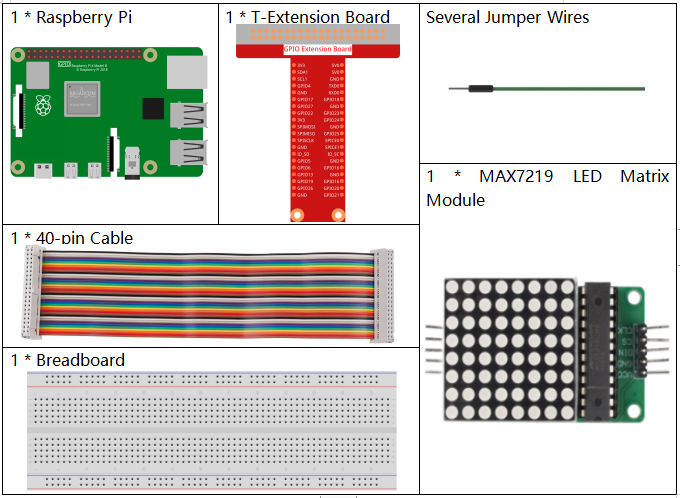
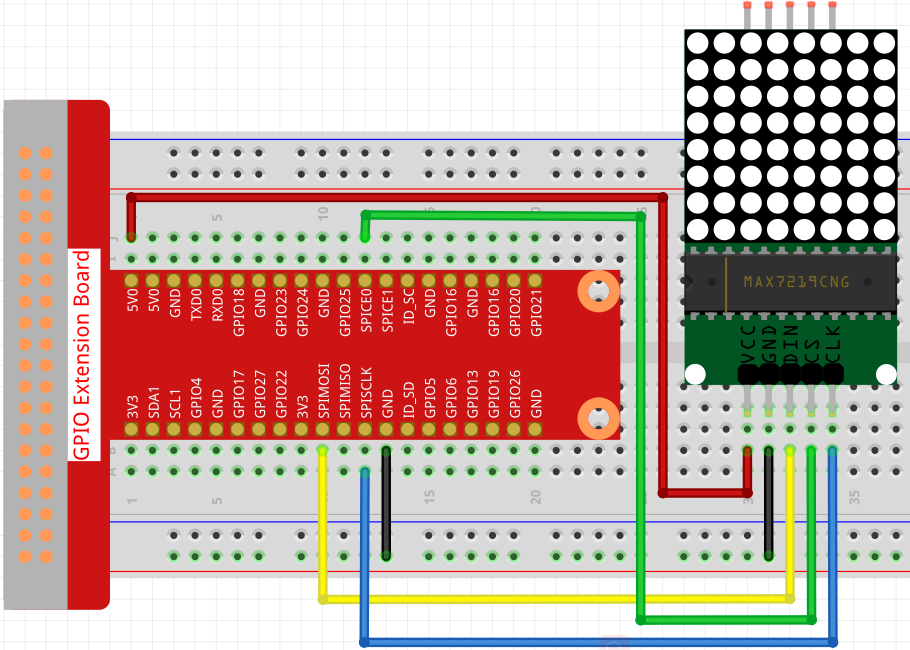

1.1.6 LED Dot Matrix
=====================

Introduction
--------------------

As the name suggests, an LED dot matrix is a matrix composed of LEDs.
The lighting up and dimming of the LEDs formulate different characters
and patterns.

Components
------------------

Principle
-----------

**LED Matrix**

The 64 LEDs are driven by 16 output pins of the IC. The maximum number 
of LEDs light up at the same time is actually eight. The LEDs are 
arranged as 8×8 set of rows and columns. So the MAX7219 activates each 
column for a very short period of time and at the same time it also 
drives each row. So by rapidly switching through the columns and rows 
the human eye will only notice a continuous light.

.. image:: media/1.1.6max72191.png
  :width: 700

**MAX7219**

These integrated circuits from Maxim are for driving either 64 individual 
LED’s, or up to 8 digits of 7-segment displays. The drivers implement a 
SPI compatible slave interface that can be controlled from the Arduino 
using only 3 of the digital output pins.

从 PyPi 安装
--------------

Open a terminal, and then install the dependencies for library first with:

.. code-block:: 

    sudo usermod -a -G spi,gpio pi
    sudo apt install build-essential python3-dev python3-pip libfreetype6-dev libjpeg-dev libopenjp2-7 libtiff5 

.. note::
    如果出现组件无法正常安装的情况，你需要先升级它们，再进行安装。

    .. code-block:: 

        sudo -H pip install --upgrade --ignore-installed pip setuptools

Proceed to install latest version of the luma.led_matrix library directly from PyPI:

.. code-block:: 

    sudo python3 -m pip install --upgrade luma.led_matrix

回到pi目录。

.. code-block:: 

    cd /home/pi

下载MAX7219 LED Matrix相关的库。

git clone https://github.com/rm-hull/luma.led_matrix.git

Schematic Diagram
-----------------------

============ ======== ======== ====
T-Board Name physical wiringPi BCM
SPIMOSI      Pin 19   12       MOSI
SPICE0       pin 24   10       CE0
SPISCLK      Pin 23   14       SCLK
============ ======== ======== ====

.. image:: media/schematic_dot.png

Experimental Procedures
----------------------------

**Step 1:** Build the circuit. 

实验开始前首先要开启SPI，具体参考`SPI Configuration`。

**Step 2:** Change directory.

.. code-block::

    cd /home/pi/raphael-kit/python/

**Step 3:** Run.

.. code-block::

    sudo python3 1.1.6_LedMatrix.py

运行代码后，LED Matrix将显示一个矩形两秒，然后显示文字'A'两秒，最后滚动显示文字"Hello, Nice to meet you!"。

**Code**

.. code-block:: python

   from luma.core.interface.serial import spi, noop
   from luma.core.render import canvas
   from luma.core.virtual import viewport
   from luma.led_matrix.device import max7219
   from luma.core.legacy import text
   from luma.core.legacy.font import proportional, CP437_FONT, LCD_FONT
   import time

   serial = spi(port=0, device=0, gpio=noop())
   device = max7219(serial, rotate=1)
   virtual = viewport(device, width=200, height=400)

   def displayRectangle():
      with canvas(device) as draw:
         draw.rectangle(device.bounding_box, outline="white", fill="black")

   def displayLetter():
      with canvas(device) as draw:
         text(draw, (0, 0), "A", fill="white", font=proportional(CP437_FONT))

   def scrollToDisplayText():
      with canvas(virtual) as draw:
         text(draw, (0, 0), "Hello, Nice to meet you!", fill="white", font=proportional(CP437_FONT))

      for offset in range(150):
         virtual.set_position((offset,0))
         time.sleep(0.1)

   def main():
      while True:
         displayRectangle()
         time.sleep(2)
         displayLetter()
         time.sleep(2)
         scrollToDisplayText()

   def destroy():
      pass

   if __name__ == '__main__':
      try:
         main()
      except KeyboardInterrupt:
         destroy()

**Code Explanation**

.. code-block:: python

    from luma.core.interface.serial import spi, noop
    from luma.core.render import canvas
    from luma.core.virtual import viewport
    from luma.led_matrix.device import max7219
    from luma.core.legacy import text
    from luma.core.legacy.font import proportional, CP437_FONT, LCD_FONT
    import time

导入相关的库，其中luma.core is a component library providing a Pillow-compatible drawing canvas for Python 3, and other functionality to support drawing primitives and text-rendering capabilities for small displays on the Raspberry Pi and other single board computers.
关于它的具体使用方法，你可以访问 `https://luma-core.readthedocs.io/en/latest/intro.html <https://luma-core.readthedocs.io/en/latest/intro.html>`_ 了解更多。

.. code-block:: python

    serial = spi(port=0, device=0, gpio=noop())
    device = max7219(serial, rotate=1)

初始化 ``luma.led_matrix.device.max7219`` 类。

.. note::
    如果你想要修改LED Matrix的显示方向，你可以通过修改rotate的值来实现，其中0表示不旋转，1表示顺时针旋转90°，2表示旋转180°，3表示顺时针旋转270°。

.. code-block:: python

    def displayRectangle():
        with canvas(device) as draw:
            draw.rectangle(device.bounding_box, outline="white", fill="black")

在LED Matrix的边缘区域显示一个空心矩形，修改fill的值为white，就可以显示一个实心矩形。

.. code-block:: python

    def displayLetter():
        with canvas(device) as draw:
            text(draw, (0, 0), "A", fill="white", font=proportional(CP437_FONT))

在LED Matrix的（0，0）的坐标上显示一个"A",其中CP437_FONT是一种适用于8*8点阵屏的字体。

.. code-block:: python

    virtual = viewport(device, width=200, height=400)

单个8x8 LED 矩阵是没办法显示一行文字的，我们需要使用luma.core.virtual.viewport方法，这样就能通过虚拟视窗来实现文字滚动。

.. code-block:: python

    def scrollToDisplayText():
        with canvas(virtual) as draw:
            text(draw, (0, 0), "Hello, Nice to meet you!", fill="white", font=proportional(CP437_FONT))

        for offset in range(150):
            virtual.set_position((offset,0))
            time.sleep(0.1)

scrollToDisplayText()实现了在LED Matrix上以滚动文本的方式显示"Hello, Nice to meet you!"。首先将virtual作为参数传入canvas()函数，这样我们就把虚拟视窗作为当前的显示窗口。然后通过text()函数在LED Matrix上显示"Hello, Nice to meet you!"。
使用for循环函数，把虚拟窗口向X方向移动，这样我们就能看到"Hello, Nice to meet you!"文本在滚动了。

Phenomenon Picture
-----------------------

.. image:: media/1.1.6led_dot_matrix.jpg
