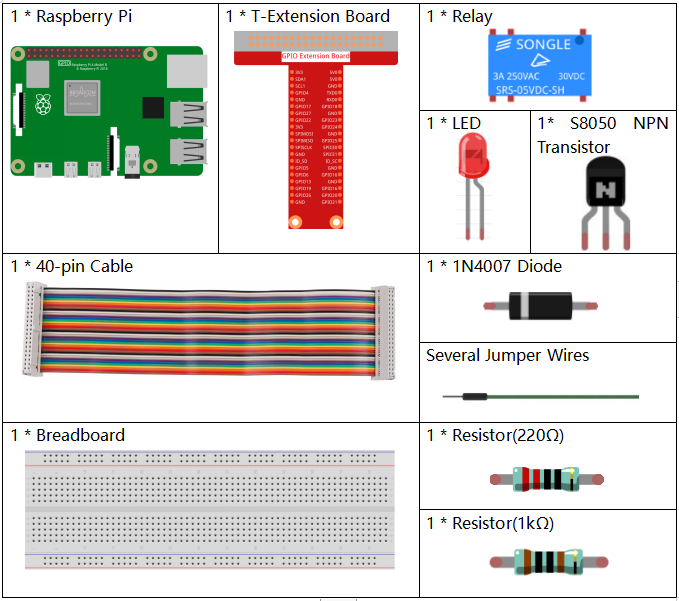

.. _1.3.3_py:

1.3.3 Relay
===========

Introduction
------------

In this project, we will learn to use a relay. It is one of the commonly
used components in automatic control system. When the voltage, current,
temperature, pressure, etc., reaches, exceeds or is lower than the
predetermined value, the relay will connect or interrupt the circuit, to
control and protect the equipment.

Components
----------

* :ref:`GPIO Extension Board`
* :ref:`Breadboard`
* :ref:`Resistor`
* :ref:`LED`
* :ref:`Transistor`
* :ref:`Relay`
* :ref:`Diode`

Schematic Diagram
-----------------

.. image:: media/image345.png

Experimental Procedures
-----------------------

**Step 1:** Build the circuit.

.. image:: media/image144.png

**Step 2:** Open the code file.

.. raw:: html

   <run></run>

.. code-block::

    cd /home/pi/raphael-kit/python

**Step 3:** Run.

.. raw:: html

   <run></run>

.. code-block::

    sudo python3 1.3.3_Relay.py

While the code is running, the LED lights up. In addition, you can hear
a ticktock caused by breaking normally close contact and closing
normally open contact.

**Code**

.. note::

    You can **Modify/Reset/Copy/Run/Stop** the code below. But before that, you need to go to  source code path like ``raphael-kit/python``. After modifying the code, you can run it directly to see the effect.

.. raw:: html

    <run></run>

.. code-block:: python

    #!/usr/bin/env python3

    import RPi.GPIO as GPIO
    import time

    # Set GPIO17 as control pin
    relayPin = 17

    # Define a setup function for some setup
    def setup():
        # Set the GPIO modes to BCM Numbering
        GPIO.setmode(GPIO.BCM)
        # Set relayPin's mode to output,
        # and initial level to High(3.3v)
        GPIO.setup(relayPin, GPIO.OUT, initial=GPIO.HIGH)

    # Define a main function for main process
    def main():
        while True:
            print ('Relay open...')
            # Tick
            GPIO.output(relayPin, GPIO.LOW)
            time.sleep(1)
            print ('...Relay close')
            # Tock
            GPIO.output(relayPin, GPIO.HIGH)
            time.sleep(1)

    # Define a destroy function for clean up everything after
    # the script finished
    def destroy():
        # Turn off LED
        GPIO.output(relayPin, GPIO.HIGH)
        # Release resource
        GPIO.cleanup()                    

    # If run this script directly, do:
    if __name__ == '__main__':
        setup()
        try:
            main()
        # When 'Ctrl+C' is pressed, the child program
        # destroy() will be  executed.
        except KeyboardInterrupt:
            destroy()

**Code Explanation**

.. code-block:: python

    GPIO.output(relayPin, GPIO.LOW)

Set the pins of transistor as low level to let the relay open, LED does not turn on.

.. code-block:: python

    time.sleep(1)

wait for 1 second. 

.. code-block:: python

    GPIO.output(relayPin, GPIO.HIGH)

Set the pins of the transistor as low level to actuate the relay, LED
lights up.

Phenomenon Picture
------------------

.. image:: media/image145.jpeg