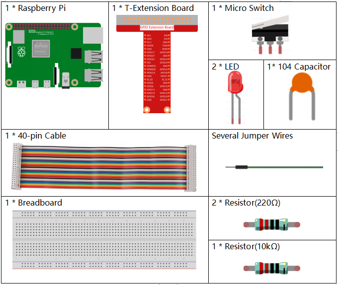
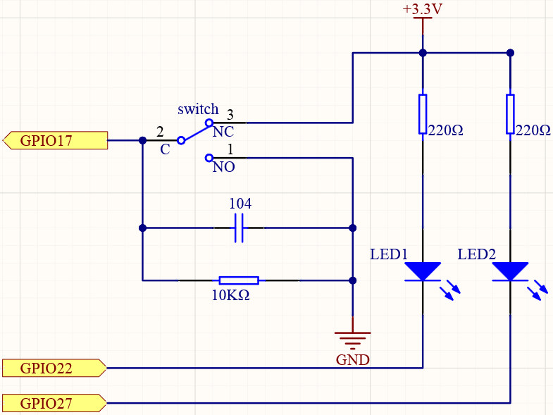
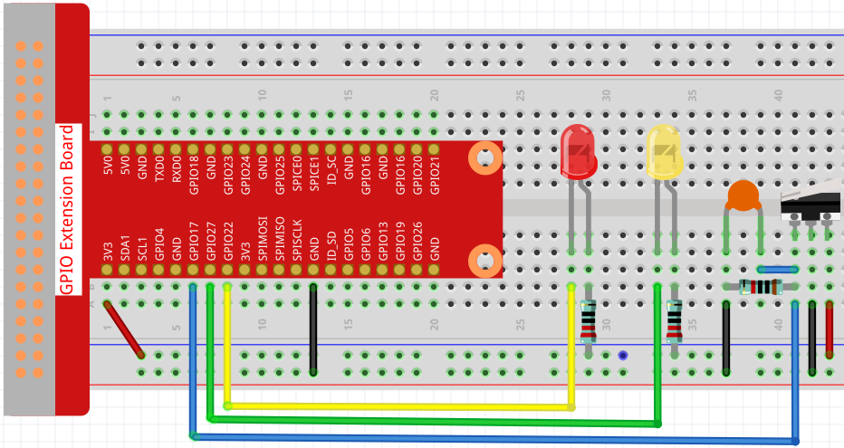

2.1.2 Micro Switch
======================

Introduction
--------------------

In this lesson, we will learn how to use Micro Switch. A Micro Switch is a small, very sensitive switch which requires minimum compression to activate. Because they are reliable and sensitive, micro switches are often used as a safety device. 

They are used to prevent doors from closing if something or someone is in the way and other applications similar.

Components
----------

Principle
---------

**Micro Switch**

The construction of a micro switch is really simple. The main parts of the switch are:

.. image:: media/micro_switch2.png

* 1.Plunger (Actuator)
* 2.Cover
* 3.Moving piece
* 4.Support
* 5.Case
* 6.NO terminal: normally open
* 7.NC terminal: normally closed
* 8.Contact
* 9.Moving arm

After a micro switch makes physical contact with an object, its contacts change position. The basic working principle is as follows.

When the plunger is in the released or rest position.

* The normally closed circuit can carry current.
* The normally open circuit is electrically insulated.

When the plunger is depressed or switched.

* The normally closed circuit is open.
* The normally open circuit is closed.

.. image:: media/micro_switch1.png

**Capacitor**

The capacitor is a component that has the capacity to store energy in
the form of electrical charge or to produce a potential difference
(Static Voltage) between its plates, much like a small rechargeable
battery.

Standard Units of Capacitance

Microfarad (μF) 1μF = 1/1,000,000 = 0.000001 = :math:`10^{- 6}` F

Nanofarad (nF) 1nF = 1/1,000,000,000 = 0.000000001 = :math:`10^{- 9}`\ F

Picofarad (pF) 1pF = 1/1,000,000,000,000 = 0.000000000001 =
:math:`10^{- 12}`\ F

.. note::
    Here we use **104 capacitor(10 x 10\ 4\ PF)**. Just like the
    ring of resistors, the numbers on the capacitors help to read the values
    once assembled onto the board. The first two digits represent the value
    and the last digit of the number means the multiplier. Thus 104
    represents a power of 10 x 10 to 4 (in pF) equal to 100 nF.

Visit: https://en.wikipedia.org/wiki/Capacitance, for more information about Capacitor.

Schematic Diagram
-----------------

Connect the left pin of the Micro Switch to GPIO17, and two LEDs to
pin GPIO22 and GPIO27 respectively. Then when you press and release the 
move arm of the Micro Switch, you can see the two LEDs light up alternately.

.. image:: media/image305.png

Experimental Procedures
-----------------------

**Step 1:** Build the circuit.

**Step 2**: Get into the folder of the code.

.. code-block::

    cd /home/pi/raphael-kit/python

**Step 3**: Run.

.. code-block::

    sudo python3 2.1.2_MicroSwitch.py

While the code is running, press the moving arm, then the yellow LED lights up; release the moving arm, the red LED turns on.

**Code**

.. code-block:: python

    #!/usr/bin/env python3

    import RPi.GPIO as GPIO
    import time

    # Set #17 as micro switch pin, #22 as led1 pin, #27 as led2 pin
    microPin = 17
    led1Pin = 22
    led2Pin = 27

    # Define a setup function for some setup
    def setup():
        # Set the GPIO modes to BCM Numbering
        GPIO.setmode(GPIO.BCM)
        # Set microPin input
        # Set ledPin output, 
        # and initial level to High(3.3v)
        GPIO.setup(microPin, GPIO.IN)
        GPIO.setup(led1Pin, GPIO.OUT, initial=GPIO.HIGH)
        GPIO.setup(led2Pin, GPIO.OUT, initial=GPIO.HIGH)

    # Define a main function for main process
    def main():
        while True:
            # micro switch high, led1 on
            if GPIO.input(microPin) == 1:
                print ('LED1 ON')
                GPIO.output(led1Pin, GPIO.LOW)
                GPIO.output(led2Pin, GPIO.HIGH)

            # micro switch low, led2 on
            if GPIO.input(microPin) == 0:
                print ('    LED2 ON')
                GPIO.output(led2Pin, GPIO.LOW)
                GPIO.output(led1Pin, GPIO.HIGH)

            time.sleep(0.5)
    # Define a destroy function for clean up everything after
    # the script finished 
    def destroy():
        # Turn off LED
        GPIO.output(led1Pin, GPIO.HIGH)
        GPIO.output(led2Pin, GPIO.HIGH)
        # Release resource
        GPIO.cleanup()                     

    # If run this script directly, do:
    if __name__ == '__main__':
        setup()
        try:
            main()
        # When 'Ctrl+C' is pressed, the program 
        # destroy() will be  executed.
        except KeyboardInterrupt:
            destroy()	

**Code Explanation**

.. code-block:: python

    if GPIO.input(slidePin) == 1:
                GPIO.output(led1Pin, GPIO.LOW)
                GPIO.output(led2Pin, GPIO.HIGH)

When the moving arm of the micro switch is released, the left pin is connected to the right pin; at this time, a high level will be read on GPIO17, and then LED1 will be on and LED2 will be off.

.. code-block:: python

    if GPIO.input(slidePin) == 0:
                GPIO.output(led2Pin, GPIO.LOW)
                GPIO.output(led1Pin, GPIO.HIGH)

When the move arm is pressed, the left pin and the middle pin are connected. At this point a low level will be read on GPIO17, then turns LED2 on and LED1 off.

Phenomenon Picture
------------------

.. image:: media/2.1.2micro_switch.jpg