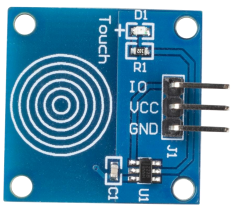
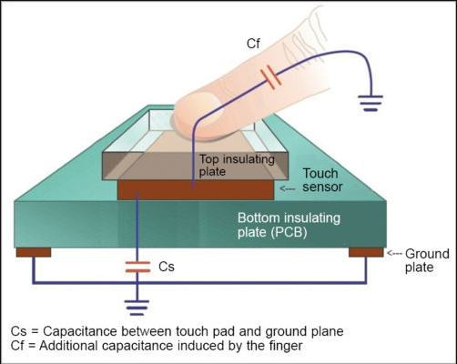
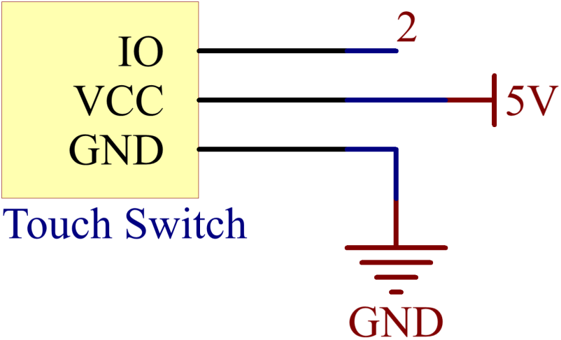
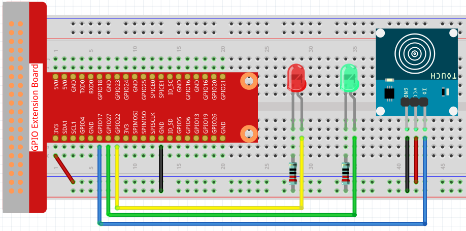

2.1.3 Touch Switch Module
========================

**Introduction**
-------------------

In this lesson, you will learn about touch switch module. It can replace 
the traditional kinds of switch with these advantages: convenient operation, 
fine touch sense, precise control and least mechanical wear.

**Components**
-----------------------------

.. image:: media/2.1.3component.png
    :width: 700
    :align: center

**Principle**
---------------------------

Touch switch module works by detecting a change in capacitance due to influence 
of an external object. The touch plate is covered with insulating material, 
and the user does not come in contact with the electrical circuit.

A capacitive touch switch has different layers—top insulating face plate 
followed by touch plate, another insulating layer and then ground plate.

In practice, a capacitive sensor can be made on a double-sided PCB by regarding one side as the touch sensor and the opposite side as ground plate of the capacitor. When power is applied across these plates, the two plates get charged. In equilibrium state, the plates have the same voltage as the power source.

The touch detector circuit has an oscillator whose frequency is dependent on capacitance of the touchpad. When a finger is moved close to the touchpad, additional capacitance causes frequency of this internal oscillator to change. The detector circuit tracks oscillator frequency at timed intervals, and when the shift crosses the threshold change, the circuit triggers a key-press event.

Visit: https://en.wikipedia.org/wiki/Touch_switch, for more information.

Schematic Diagram
-----------------

**Experimental Procedures**
------------------------------

**Step 1::** Build the circuit.

**Step 2:** Change directory.

.. code-block::

    cd /home/pi/raphael-kit/c/2.1.3/

**Step 3:** Compile.

.. code-block::

    gcc 2.1.3_TouchSwitch.py

**Step 4:** Run.

.. code-block::

    sudo ./a.out

**Code**

.. code-block:: c

    #include <wiringPi.h>
    #include <stdio.h>

    #define touchPin		   0
    #define led1		   3
    #define led2 		   2

    int main(void)
    {
        // When initialize wiring failed, print message to screen
        if(wiringPiSetup() == -1){
            printf(etup w"siringPi failed !");
            return 1; 
        }
        
        pinMode(touchPin, INPUT);
        pinMode(led1, OUTPUT);
        pinMode(led2, OUTPUT);
        
        while(1){
            // touch switch high, led1 on
            if(digitalRead(touchPin) == 1){
                digitalWrite(led1, LOW);
                digitalWrite(led2, HIGH);
                printf("You touch it!");
            }
            // touch switch low, led2 on
            if(digitalRead(touchPin) == 0){
                digitalWrite(led2, LOW);
                digitalWrite(led1, HIGH);
            }
        }

        return 0;
    }

**Code Explanation**

.. code-block:: c

    #define touchPin		   0
    #define led1		   3
    #define led2 		   2
    
Pin GPIO17, GPIO22 and GPIO27 of the T_Extension Board is corresponding to 
the GPIO0, GPIO3 and GPIO2 in wiringPi. Assign GPIO0, GPIO3 and GPIO2 to 
touchPin, led1 and led2, touchPin, led1 and led2 represents GPIO0, GPIO3 
and GPIO2 in the code later. 

.. code-block:: c

    pinMode(touchPin, INPUT);
    pinMode(led1, OUTPUT);
    pinMode(led2, OUTPUT);

Set led1, led2 as output to write value to it and set touchPin as input to
read value from it.

.. code-block:: c

    while(1){
        // touch switch high, led1 on
            if(digitalRead(touchPin) == 1){
            digitalWrite(led1, LOW);
            digitalWrite(led2, HIGH);
            printf("You touch it!");
        }
        // touch switch low, led2 on
        if(digitalRead(touchPin) == 0){
            digitalWrite(led2, LOW);
            digitalWrite(led1, HIGH);
        }

Set an infinite loop, when touchPin is high, led1 
will light up and print "You touch it!".When touchPin is low, it means not 
touch switch and led2 will light up.
``digitalRead()`` function is to read HIGH (high level) or LOW (low level) of 
the input parameter word pin, it returns 1 when pin is HIGH and returns 0 
when pin is LOW.
``digitalWrite()`` function is to write HIGH (high level) or LOW (low level) to 
the input parameter word pin.

Now, touch the metal disk, you can see the LED change its colors and "ON" 
and "OFF" printed on the screen.

**Phenomenon Picture**
------------------------

.. image:: media/2.1.3touch_switch_module.jpg
    :width: 500
    :align: center