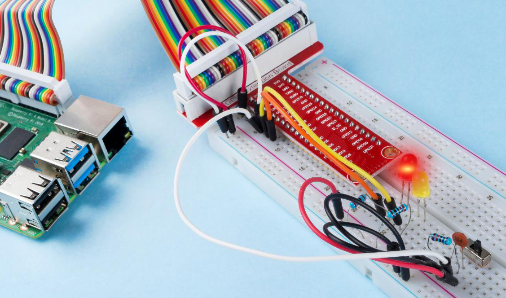

**2.1.4 Slide Switch**
========================

Introduction
------------

In this project, we will learn how to use a slide switch. Usually,the
slide switch is soldered on PCB as a power switch, but here we need to
insert it into the breadboard, thus it may not be tightened. And we use
it on the breadboard to show its function.

Components
----------

.. image:: media/list_2.1.2_slide_switch.png

* :ref:`GPIO Extension Board`
* :ref:`Breadboard`
* :ref:`Resistor`
* :ref:`LED`
* :ref:`Slide Switch`
* :ref:`Capacitor`

Schematic Diagram
-----------------

Connect the middle pin of the Slide Switch to GPIO17, and two LEDs to
pin GPIO22 and GPIO27 respectively. Then when you pull the slide, you
can see the two LEDs light up alternately.

.. image:: media/image305.png

.. image:: media/image306.png

Experimental Procedures
-----------------------

**Step 1:** Build the circuit.

.. image:: media/image161.png

**Step 2**: Go to the folder of the code.

.. raw:: html

   <run></run>

.. code-block::

    cd /home/pi/raphael-kit/c/2.1.4

**Step 3**: Compile.

.. raw:: html

   <run></run>

.. code-block::

    gcc 2.1.4_Slider.c -lwiringPi 

**Step 4**: Run the executable file above.

.. raw:: html

   <run></run>

.. code-block::

    sudo ./a.out

While the code is running, get the switch connected to the left, then
the yellow LED lights up; to the right, the red light turns on.

.. note::

    If it does not work after running, please refer to :ref:`C code is not working?`

**Code**

.. code-block:: c

    #include <wiringPi.h>
    #include <stdio.h>
    #define slidePin        0
    #define led1            3
    #define led2            2

    int main(void)
    {
        // When initialize wiring failed, print message to screen
        if(wiringPiSetup() == -1){
            printf("setup wiringPi failed !");
            return 1;
        }
        pinMode(slidePin, INPUT);
        pinMode(led1, OUTPUT);
        pinMode(led2, OUTPUT);
        while(1){
            // slide switch high, led1 on
            if(digitalRead(slidePin) == 1){
                digitalWrite(led1, LOW);
                digitalWrite(led2, HIGH);
                printf("LED1 on\n");
            }
            // slide switch low, led2 on
            if(digitalRead(slidePin) == 0){
                digitalWrite(led2, LOW);
                digitalWrite(led1, HIGH);
                printf(".....LED2 on\n");
            }
        }
        return 0;
    }

**Code Explanation**

.. code-block:: c

    if(digitalRead(slidePin) == 1){
                digitalWrite(led1, LOW);
                digitalWrite(led2, HIGH);
                printf("LED1 on\n");
        }

When the slide is pulled to the right, the middle pin and right one are
connected; the Raspberry Pi reads a high level at the middle pin, so the
LED1 is on and LED2 off

.. code-block:: c

    if(digitalRead(slidePin) == 0){
                digitalWrite(led2, LOW);
                digitalWrite(led1, HIGH);
                printf(".....LED2 on\n");
            }

When the slide is pulled to the left, the middle pin and left one are
connected; the Raspberry Pi reads a low, so the LED2 is on and LED1 off

Phenomenon Picture
------------------

