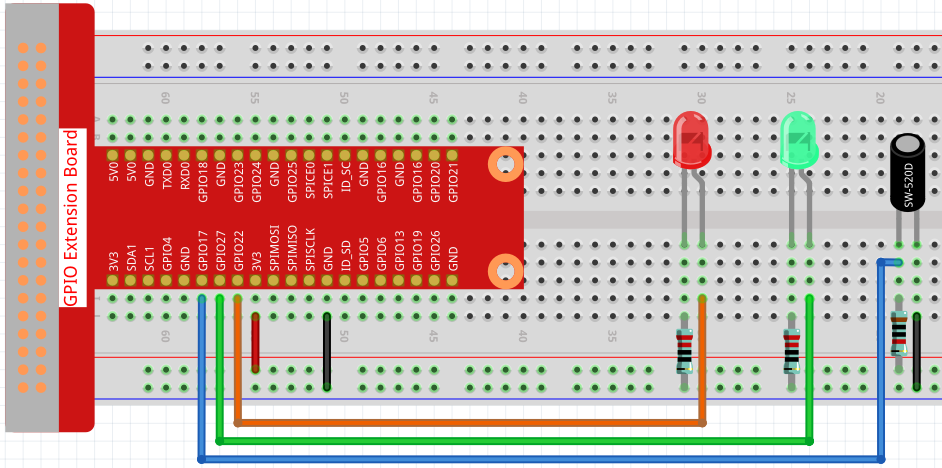

2.1.5 Tilt Switch
=================

Introduction
------------

This is a ball tilt-switch with a metal ball inside. It is used to
detect inclinations of a small angle.

Components
----------

.. image:: media/list_2.1.3_tilt_switch.png

* :ref:`GPIO Extension Board`
* :ref:`Breadboard`
* :ref:`Resistor`
* :ref:`LED`
* :ref:`Tilt Switch`

Schematic Diagram
-----------------

.. image:: media/image307.png

.. image:: media/image308.png

Experimental Procedures
-----------------------

**Step 1:** Build the circuit.

**Step 2:** Change directory.

.. raw:: html

   <run></run>

.. code-block::

    cd /home/pi/raphael-kit/c/2.1.5/

**Step 3:** Compile.

.. raw:: html

   <run></run>

.. code-block::

    gcc 2.1.5_Tilt.c -lwiringPi

**Step 4:** Run.

.. raw:: html

   <run></run>

.. code-block::

    sudo ./a.out

Place the tilt vertically, and the green LED will turns on. If you
tilt it, "Tilt!" will be printed on the screen and the red LED will
lights on. Place it vertically again, and the green LED will turns on
again.

.. note::

    If it does not work after running, please refer to :ref:`C code is not working?`

**Code**

.. code-block:: c

    #include <wiringPi.h>
    #include <stdio.h>

    #define TiltPin     0
    #define Gpin        2
    #define Rpin        3

    void LED(char* color)
    {
        pinMode(Gpin, OUTPUT);
        pinMode(Rpin, OUTPUT);
        if (color == "RED")
        {
            digitalWrite(Rpin, HIGH);
            digitalWrite(Gpin, LOW);
        }
        else if (color == "GREEN")
        {
            digitalWrite(Rpin, LOW);
            digitalWrite(Gpin, HIGH);
        }
        else
            printf("LED Error");
    }

    int main(void)
    {
        if(wiringPiSetup() == -1){ //when initialize wiring failed,print message to screen
            printf("setup wiringPi failed !");
            return 1;
        }

        pinMode(TiltPin, INPUT);
        LED("GREEN");
        
        while(1){
            if(0 == digitalRead(TiltPin)){
                delay(10);
                if(0 == digitalRead(TiltPin)){
                    LED("RED");
                    printf("Tilt!\n");
                }
            }
            else if(1 == digitalRead(TiltPin)){
                delay(10);
                if(1 == digitalRead(TiltPin)){
                    LED("GREEN");
                }
            }
        }
        return 0;
    }

**Code Explanation**

.. code-block:: c

    void LED(char* color)
    {
        pinMode(Gpin, OUTPUT);
        pinMode(Rpin, OUTPUT);
        if (color == "RED")
        {
            digitalWrite(Rpin, HIGH);
            digitalWrite(Gpin, LOW);
        }
        else if (color == "GREEN")
        {
            digitalWrite(Rpin, LOW);
            digitalWrite(Gpin, HIGH);
        }
        else
            printf("LED Error");
    }

Define a function ``LED()`` to turn the two LEDs on or off. If the parameter
color is RED, the red LED lights up; similarly, if the parameter color
is GREEN, the green LED will turns on.

.. code-block:: c

    while(1){
            if(0 == digitalRead(TiltPin)){
                delay(10);
                if(0 == digitalRead(TiltPin)){
                    LED("RED");
                    printf("Tilt!\n");
                }
            }
            else if(1 == digitalRead(TiltPin)){
                delay(10);
                if(1 == digitalRead(TiltPin)){
                    LED("GREEN");
                }
            }
        }

If the read value of tilt switch is 0, it means that the tilt switch is
tilted then you write the parameter ”RED” into function LED to get the
red LED lighten up; otherwise, the green LED will lit.

Phenomenon Picture
------------------

.. image:: media/image170.jpeg

