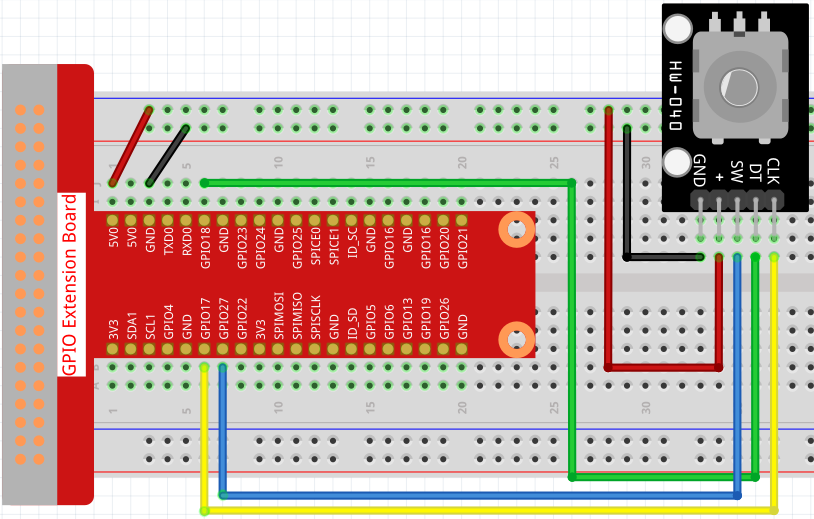

2.1.6 Rotary Encoder Module
===========================

**Introduction**
-------------------

In this lesson, you will learn about Rotary Encoder. A rotary encoder is
an electronic switch with a set of regular pulses in strictly timing
sequence. When used with IC, it can achieve increment, decrement, page
turning and other operations such as mouse scrolling, menu selection,
and so on.

**Components**
-----------------

.. image:: media/Part_two_25.png

**Principle**
-----------------

There are mainly two types of rotary encoders: absolute and incremental
(relative) encoders. An incremental one is used in this experiment.

Most rotary encoders have 5 pins with three functions of
turning left & right and pressing down. Pin 1 and pin 2 are switch
wiring terminals used to press. Pin 4 is generally connected to ground.
Pin 3 and pin 5 are first connected to a pull-up resistor and then to
VCC and they can generate two-phase square waves whose phase difference
is 90°. Usually these waves are called channel A and channel B as shown
below:

.. image:: media/image205.jpeg
    :width: 300
    :align: center

As shown on the right, when channel A changes from high level to low
level, if channel B is high level, it indicates the rotary encoder spins
clockwise (CW); if at that moment channel B is low level, it means spins
counterclockwise (CCW). So if we read the value of channel B when
channel A is low level, we can know in which direction the rotary
encoder rotates.

.. image:: media/image206.png
    :width: 300
    :align: center

**Schematic Diagram**
------------------------

.. image:: media/image349.png
   :width: 3.42083in
   :height: 1.81181in
   :align: center

Experimental Procedures
-----------------------

**Step 1:** Build the circuit.

In this example, we can connect the Rotary Encoder pin directly to the
Raspberry Pi using a breadboard and 40-pin Cable, connect the GND of the Rotary 
Encoder to GND, 「+」to 5V, SW to digital GPIO27, DT to digital GPOI18, and CLK to digital GPIO
17.

**Step 2:** Open the code file.

.. code-block::

    cd /home/pi/raphael-kit/c/2.1.6/

**Step 3:** Compile the code.

.. code-block::

    gcc 2.1.6_RotaryEncoder.c -lwiringPi

**Step 4:** Run.

.. code-block::

    sudo ./a.out

After the code runs, rotate the knob on the potentiometer, The number of 
rotations will be printed out on the screen.

**Code**

.. code-block:: c

   #include <stdio.h>
   #include <string.h>
   #include <errno.h>
   #include <stdlib.h>
   #include <wiringPi.h>

   #define  RoAPin    0
   #define  RoBPin    1
   #define  SWPin     2

   static volatile int globalCounter = 0 ;

   unsigned char flag;
   unsigned char Last_RoB_Status;
   unsigned char Current_RoB_Status;

   void btnISR(void)
   {
      globalCounter = 0;
   }

   void rotaryDeal(void)
   {
      Last_RoB_Status = digitalRead(RoBPin);

      while(!digitalRead(RoAPin)){
         Current_RoB_Status = digitalRead(RoBPin);
         flag = 1;
      }

      if(flag == 1){
         flag = 0;
         if((Last_RoB_Status == 0)&&(Current_RoB_Status == 1)){
            globalCounter ++;	
         }
         if((Last_RoB_Status == 1)&&(Current_RoB_Status == 0)){
            globalCounter --;
         }
      }
   }

   int main(void)
   {
      if(wiringPiSetup() < 0){
         fprintf(stderr, "Unable to setup wiringPi:%s\n",strerror(errno));
         return 1;
      }

      pinMode(SWPin, INPUT);
      pinMode(RoAPin, INPUT);
      pinMode(RoBPin, INPUT);

      pullUpDnControl(SWPin, PUD_UP);

      if(wiringPiISR(SWPin, INT_EDGE_FALLING, &btnISR) < 0){
         fprintf(stderr, "Unable to init ISR\n",strerror(errno));	
         return 1;
      }
      
      int tmp = 0;

      while(1){
         rotaryDeal();
         if (tmp != globalCounter){
            printf("%d\n", globalCounter);
            tmp = globalCounter;
         }
      }

      return 0;
   }

**Code Analysis**

When Rotary Encoder is used, the following situations of pin level will
occur.

① When rotating the shaft, dtPin will go from high level to low level.

② clkPin will remain high level when the shaft rotates clockwise,
otherwise it goes low level.

③ When the shaft is pressed, swPin will have low level.

From this, the program flow is shown on the right.

For detailed analysis of potential state change judgment, please refer
to :ref:`1.10 State Change Detection`.

.. image:: media/image209.png
   :align: center

**Phenomenon Picture**
-------------------------

.. image:: media/2.1.6rotary_ecoder.jpg
   :alt: 2.25
   :width: 7.71736in
   :height: 5.07569in
   :align: center