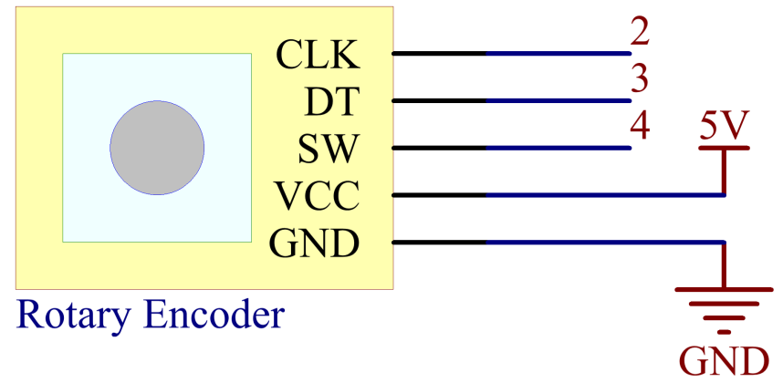
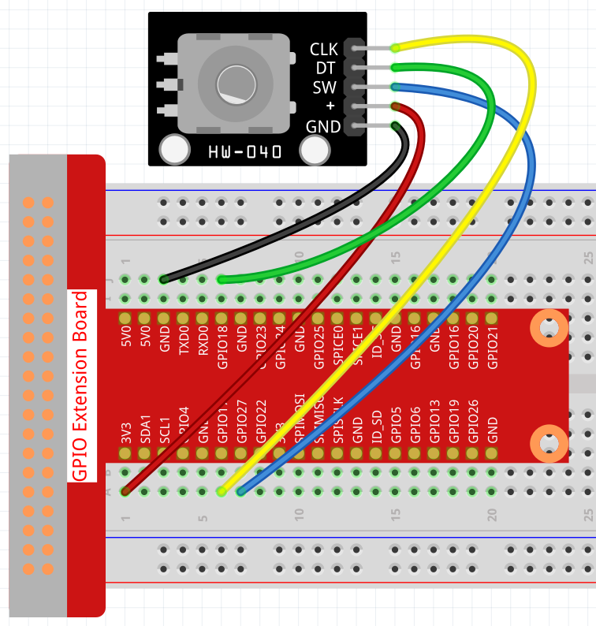
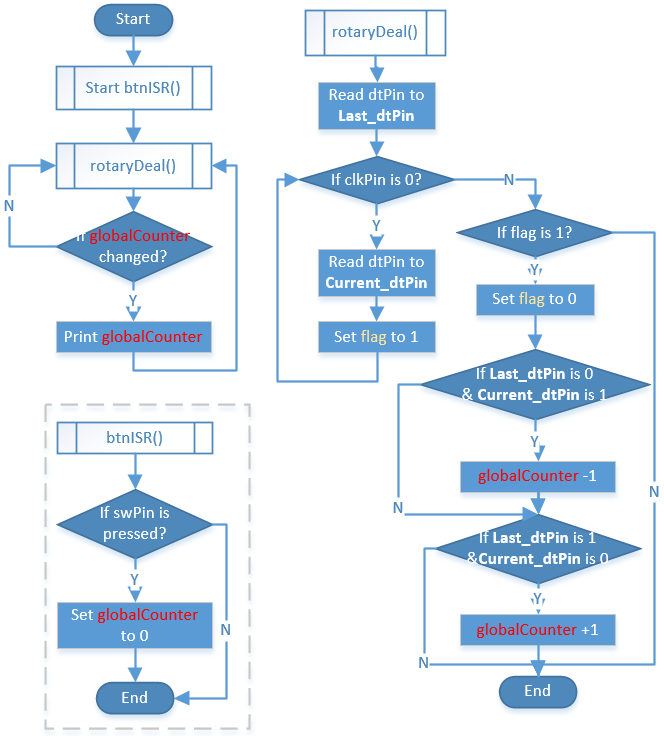
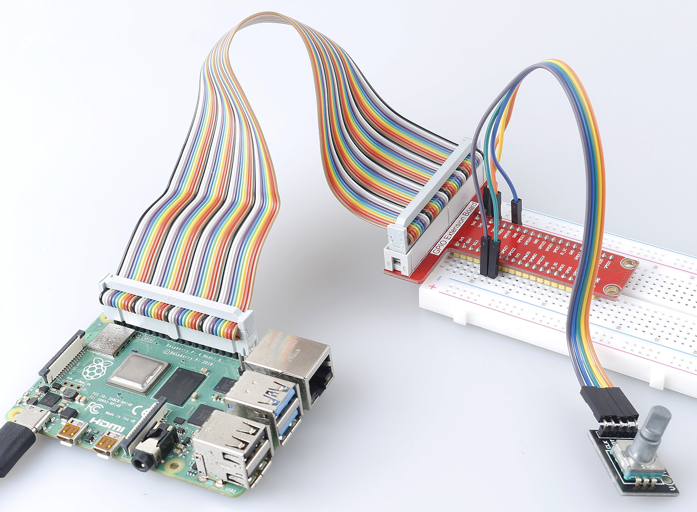

.. _2.1.6_c:

2.1.6 Rotary Encoder Module
=================================

**Introduction**
-------------------

In this project, you will learn about Rotary Encoder. A rotary encoder is
an electronic switch with a set of regular pulses in strictly timing
sequence. When used with IC, it can achieve increment, decrement, page
turning and other operations such as mouse scrolling, menu selection,
and so on.

**Components**
-----------------

.. image:: media/Part_two_25.png

* :ref:`GPIO Extension Board`
* :ref:`Breadboard`
* :ref:`Rotary Encoder Module`

**Schematic Diagram**
------------------------

Experimental Procedures
-----------------------

**Step 1:** Build the circuit.

**Step 2:** Open the code file.

.. raw:: html

   <run></run>

.. code-block::

    cd /home/pi/raphael-kit/c/2.1.6/

**Step 3:** Compile the code.

.. raw:: html

   <run></run>

.. code-block::

    gcc 2.1.6_RotaryEncoder.c -lwiringPi

**Step 4:** Run.

.. raw:: html

   <run></run>

.. code-block::

    sudo ./a.out

You will see the count on the shell. When you turn the rotary encoder clockwise, the count is increased; when turn it counterclockwise, the count is decreased. If you press the switch on the rotary encoder, the readings will return to zero.

.. note::

   If it does not work after running, or there is an error prompt: \"wiringPi.h: No such file or directory\", please refer to :ref:`C code is not working?`.

**Code**

.. code-block:: c

   #include <stdio.h>
   #include <string.h>
   #include <errno.h>
   #include <stdlib.h>
   #include <wiringPi.h>

   #define  clkPin    0
   #define  dtPin    1
   #define  swPin     2

   static volatile int globalCounter = 0 ;

   unsigned char flag;
   unsigned char Last_dtPin_Status;
   unsigned char Current_dtPin_Status;

   void btnISR(void)
   {
      globalCounter = 0;
   }

   void rotaryDeal(void)
   {
      Last_dtPin_Status = digitalRead(dtPin);

      while(!digitalRead(clkPin)){
         Current_dtPin_Status = digitalRead(dtPin);
         flag = 1;
      }

      if(flag == 1){
         flag = 0;
         if((Last_dtPin_Status == 0)&&(Current_dtPin_Status == 1)){
            globalCounter --;	
         }
         if((Last_dtPin_Status == 1)&&(Current_dtPin_Status == 0)){
            globalCounter ++;
         }
      }
   }

   int main(void)
   {
      if(wiringPiSetup() < 0){
         fprintf(stderr, "Unable to setup wiringPi:%s\n",strerror(errno));
         return 1;
      }

      pinMode(swPin, INPUT);
      pinMode(clkPin, INPUT);
      pinMode(dtPin, INPUT);

      pullUpDnControl(swPin, PUD_UP);

      if(wiringPiISR(swPin, INT_EDGE_FALLING, &btnISR) < 0){
         fprintf(stderr, "Unable to init ISR\n",strerror(errno));	
         return 1;
      }
      
      int tmp = 0;

      while(1){
         rotaryDeal();
         if (tmp != globalCounter){
            printf("%d\n", globalCounter);
            tmp = globalCounter;
         }
      }

      return 0;
   }

**Code Analysis**

* Read dtPin value when clkPin is low.
* When clkPin is high, if dtPin goes from low to high, the count decreases, otherwise the count increases.
* swPin will output low when the shaft is pressed.

From this, the program flow is shown below:

**Phenomenon Picture**
-------------------------

