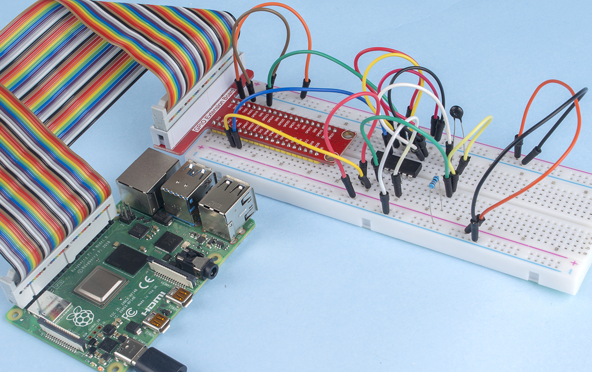

2.2.2 Thermistor
======================

Introduction
------------

Just like photoresistor can sense light, thermistor is a temperature
sensitive electronic device that can be used for realizing functions of
temperature control, such as making a heat alarm.

Components
----------

.. image:: media/list_2.2.2_thermistor.png

* :ref:`GPIO Extension Board`
* :ref:`Breadboard`
* :ref:`Resistor`
* :ref:`Thermistor`
* :ref:`ADC0834`

Schematic Diagram
-----------------

.. image:: media/image323.png

.. image:: media/image324.png

Experimental Procedures
-----------------------

**Step 1:** Build the circuit.

.. image:: media/image202.png

**Step 2:** Go to the folder of the code.

.. raw:: html

   <run></run>

.. code-block::

    cd /home/pi/raphael-kit/c/2.2.2/

**Step 3:** Compile the code.

.. raw:: html

   <run></run>

.. code-block::

    gcc 2.2.2_Thermistor.c -lwiringPi -lm

.. note::
    -lm is to load the library math. Do not omit, or you will make
    an error.

**Step 4:** Run the executable file.

.. raw:: html

   <run></run>

.. code-block::

    sudo ./a.out

With the code run, the thermistor detects ambient temperature which will
be printed on the screen once it finishes the program calculation.

.. note::

    If it does not work after running, please refer to :ref:`C code is not working?`

**Code**

.. code-block:: c

    #include <wiringPi.h>
    #include <stdio.h>
    #include <math.h>

    typedef unsigned char uchar;
    typedef unsigned int uint;

    #define     ADC_CS    0
    #define     ADC_CLK   1
    #define     ADC_DIO   2

    uchar get_ADC_Result(uint channel)
    {
        uchar i;
        uchar dat1=0, dat2=0;
        int sel = channel > 1 & 1;
        int odd = channel & 1;

        pinMode(ADC_DIO, OUTPUT);
        digitalWrite(ADC_CS, 0);
        // Start bit
        digitalWrite(ADC_CLK,0);
        digitalWrite(ADC_DIO,1);    delayMicroseconds(2);
        digitalWrite(ADC_CLK,1);    delayMicroseconds(2);
        //Single End mode
        digitalWrite(ADC_CLK,0);
        digitalWrite(ADC_DIO,1);    delayMicroseconds(2);
        digitalWrite(ADC_CLK,1);    delayMicroseconds(2);
        // ODD
        digitalWrite(ADC_CLK,0);
        digitalWrite(ADC_DIO,odd);  delayMicroseconds(2);
        digitalWrite(ADC_CLK,1);    delayMicroseconds(2);
        //Select
        digitalWrite(ADC_CLK,0);
        digitalWrite(ADC_DIO,sel);    delayMicroseconds(2);
        digitalWrite(ADC_CLK,1);

        digitalWrite(ADC_DIO,1);    delayMicroseconds(2);
        digitalWrite(ADC_CLK,0);
        digitalWrite(ADC_DIO,1);    delayMicroseconds(2);

        for(i=0;i<8;i++)
        {
            digitalWrite(ADC_CLK,1);    delayMicroseconds(2);
            digitalWrite(ADC_CLK,0);    delayMicroseconds(2);

            pinMode(ADC_DIO, INPUT);
            dat1=dat1<<1 | digitalRead(ADC_DIO);
        }

        for(i=0;i<8;i++)
        {
            dat2 = dat2 | ((uchar)(digitalRead(ADC_DIO))<<i);
            digitalWrite(ADC_CLK,1);    delayMicroseconds(2);
            digitalWrite(ADC_CLK,0);    delayMicroseconds(2);
        }

        digitalWrite(ADC_CS,1);
        pinMode(ADC_DIO, OUTPUT);
        return(dat1==dat2) ? dat1 : 0;
    }

    int main(void)
    {
        unsigned char analogVal;
    double Vr, Rt, temp, cel, Fah;
        if(wiringPiSetup() == -1){ //when initialize wiring failed,print messageto screen
            printf("setup wiringPi failed !");
            return 1;
        }
        pinMode(ADC_CS,  OUTPUT);
        pinMode(ADC_CLK, OUTPUT);

        while(1){
            analogVal = get_ADC_Result(0);
            Vr = 5 * (double)(analogVal) / 255;
            Rt = 10000 * (double)(Vr) / (5 - (double)(Vr));
            temp = 1 / (((log(Rt/10000)) / 3950)+(1 / (273.15 + 25)));
            cel = temp - 273.15;
            Fah = cel * 1.8 +32;
            printf("Celsius: %.2f C  Fahrenheit: %.2f F\n", cel, Fah);
            delay(100);
        }
        return 0;
    }

**Code Explanation**

.. code-block:: c

    #include <math.h>

There is a C numerics library which declares a set of functions to
compute common mathematical operations and transformations.

.. code-block:: c

    analogVal = get_ADC_Result(0);

This function is used to read the value of the thermistor.

.. code-block:: c

    Vr = 5 * (double)(analogVal) / 255;
    Rt = 10000 * (double)(Vr) / (5 - (double)(Vr));
    temp = 1 / (((log(Rt/10000)) / 3950)+(1 / (273.15 + 25)));
    cel = temp - 273.15;
    Fah = cel * 1.8 +32;
    printf("Celsius: %.2f C  Fahrenheit: %.2f F\n", cel, Fah);

These calculations convert the thermistor values into Celsius values.

.. code-block:: c

    Vr = 5 * (double)(analogVal) / 255;
    Rt = 10000 * (double)(Vr) / (5 - (double)(Vr));

These two lines of codes are calculating the voltage distribution with
the read value analog so as to get Rt (resistance of thermistor).

.. code-block:: c

    temp = 1 / (((log(Rt/10000)) / 3950)+(1 / (273.15 + 25)));

This code refers to plugging Rt into the formula
**T\ K\ =1/(ln(R\ T/R\ N)/B+1/T\ N)** to get Kelvin temperature.

.. code-block:: c

    temp = temp - 273.15;

Convert Kelvin temperature into degree Celsius.

.. code-block:: c

    Fah = cel * 1.8 +32;

Convert degree Celsius into Fahrenheit.
    
.. code-block:: c

    printf("Celsius: %.2f C  Fahrenheit: %.2f F\n", cel, Fah);

Print centigrade degree, Fahrenheit degree and their units on the
display.

Phenomenon Picture
------------------

