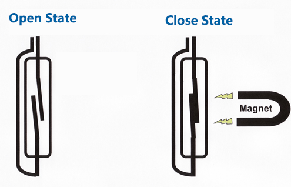

2.2.4 Reed Switch Module
========================

Introduction
-------------------

In this lesson, we will learn about the reed switch, which is an electrical switch that operates by means of an applied magnetic field.

.. image:: media/2.2.4reed_switch.png
    :width: 300
    :align: center

Components
--------------

.. image:: media/2.2.4component.png
    :width: 700
    :align: center

Principle
---------------
Reed switch, also known as a magnetic switch or reed switch.
It has two internal metal reeds, sealed in a glass tube, which is filled with inert gas. Normally the two reeds overlap each other, but are separated by a gap, and the circuit is broken. When there is a magnetic object close to the two reeds will produce a mutual attraction of the magnetic force, which will be sucked together, the circuit is connected. Therefore, the reed switch can be used to make a magnetic sensor.

The reed switch module consists of a reed switch, potentiometer, LM393 comparator, LED, etc. The internal circuit is shown below, when the magnet is close to the module, it will be on, and the module will output low level; when there is no magnetism, it will be off, and output high level. Reed switch and magnet induction distance should be within 1.5cm, beyond will not be sensitive or no trigger phenomenon, you can also adjust the sensitivity through the potentiometer on the module.

.. image:: media/reedswitch_sche.jpg

Visit: https://en.wikipedia.org/wiki/Reed_switch, for more information.

Schematic Diagram
-----------------------

============ ======== ======== ===
T-Board Name physical wiringPi BCM
GPIO17       Pin 11   0        17
GPIO27       Pin 13   2        27
GPIO22       Pin 15   3        22
============ ======== ======== ===

.. image:: media/reed_schematic.png
    :width: 400
    :align: center

.. image:: media/reed_schematic2.png
    :width: 400
    :align: center

Experimental Procedures
-------------------------------

**Step 1:** Build the circuit.

.. image:: media/2.2.4fritzing.png
    :width: 700
    :align: center

**Step 2:** Change directory.

.. code-block::

    cd /home/pi/raphael-kit/python/

**Step 3:** Run.

.. code-block::

    sudo python3 2.2.4_ReedSwitch.py

The green LED will light up when the code is run. If a magnet is placed close to the reed switch module, the red LED lights up; take away the magnet and the green LED lights up again.

**Code**

.. code-block:: python

    #!/usr/bin/env python3
    import RPi.GPIO as GPIO
    import time

    ReedPin = 17
    Gpin    = 27
    Rpin    = 22

    def setup():
        GPIO.setmode(GPIO.BCM)       # 
        GPIO.setup(Gpin, GPIO.OUT)     # Set Green Led Pin mode to output
        GPIO.setup(Rpin, GPIO.OUT)     # Set Red Led Pin mode to output
        GPIO.setup(ReedPin, GPIO.IN, pull_up_down=GPIO.PUD_UP)    # Set ReedPin's mode is input, and pull up to high level(3.3V)
        GPIO.add_event_detect(ReedPin, GPIO.BOTH, callback=detect, bouncetime=200)

    def Led(x):
        if x == 0:
            GPIO.output(Rpin, 1)
            GPIO.output(Gpin, 0)
        if x == 1:
            GPIO.output(Rpin, 0)
            GPIO.output(Gpin, 1)

    def detect(chn):
        Led(GPIO.input(ReedPin))

    def loop():
        while True:
            pass

    def destroy():
        GPIO.output(Gpin, GPIO.HIGH)       # Green led off
        GPIO.output(Rpin, GPIO.HIGH)       # Red led off
        GPIO.cleanup()                     # Release resource

    if __name__ == '__main__':     # Program start from here
        setup()
        detect()
        try:
            loop()
        except KeyboardInterrupt:  # When 'Ctrl+C' is pressed, the child program destroy() will be  executed.
            destroy()

**Code Explanation**

.. code-block::

    ReedPin = 17
    Gpin    = 27
    Rpin    = 22

    def setup():
        GPIO.setmode(GPIO.BCM)       # 
        GPIO.setup(Gpin, GPIO.OUT)     # Set Green Led Pin mode to output
        GPIO.setup(Rpin, GPIO.OUT)     # Set Red Led Pin mode to output
        GPIO.setup(ReedPin, GPIO.IN, pull_up_down=GPIO.PUD_UP)    # Set ReedPin's mode is input, and pull up to high level(3.3V)
        GPIO.add_event_detect(ReedPin, GPIO.BOTH, callback=detect, bouncetime=200)

Set the GPIO modes to BCM Numbering. ``ReedPin``, ``Gpin`` and ``Rpin`` connects to the GPIO17, GPIO27 and GPIO22.

``GPIO.add_event_detect()`` is used to add an event that is triggered by a change in the value (level) of ``ReedPin``, at which point the callback function ``detect()`` is called.

.. code-block::

    def Led(x):
        if x == 0:
            GPIO.output(Rpin, 1)
            GPIO.output(Gpin, 0)
        if x == 1:
            GPIO.output(Rpin, 0)
            GPIO.output(Gpin, 1)

Define a function ``Led()`` to turn the two LEDs on or off. If ``x=0``, the red LED lights up; otherwise, the green LED will be lit.

.. code-block::

    def detect(chn):
    Led(GPIO.input(ReedPin))

In this callback function, the value of the reed switch is used to control the 2 LEDs.

 
Phenomenon Picture
------------------------

.. image:: media/2.2.4reed_switch.JPG
    :width: 500
    :align: center