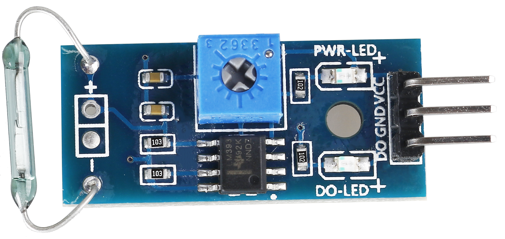
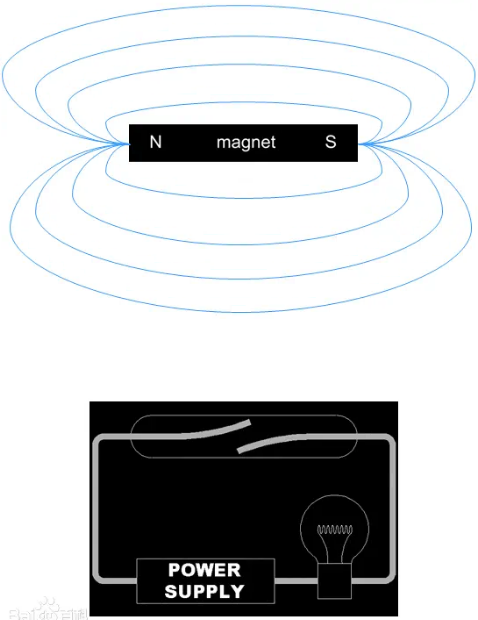
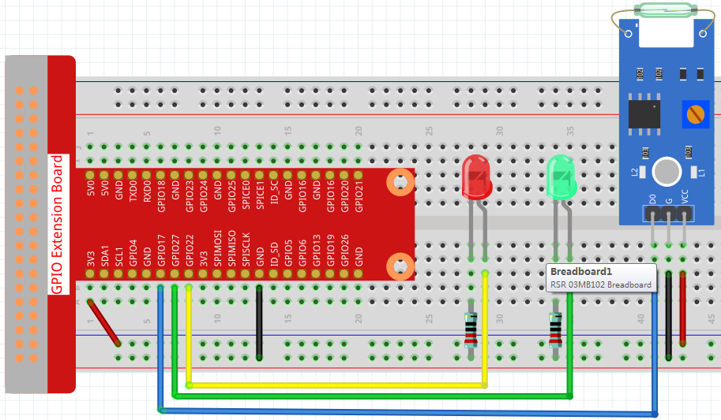

2.2.4 Reed Switch Module
========================

**Introduction**
-------------------

这节课，我们将学习reed switch(as shown below)，它是一个通过所施加的磁场操作的电开关。

**Components**
---------------

.. image:: media/2.2.4component.png
    :width: 700
    :align: center

**Principle**
---------------
reed switch是一种通过磁信号实现控制的线路开关元件。这里的“开关”指的是干簧管，
是一种结构简单、体积小、控制方便的接触式无源电子开关元件。reed switch的外壳
一般为密封玻璃管，其中装有两块铁弹性簧片电镀，并充入惰性气体。

通常情况下，玻璃管中由特殊材料制成的两个簧片是分开的。然而，当磁性物质接近玻璃管时。
玻璃管中的两个簧片在磁力线的作用下相互吸引并接触。结果，两个簧片将拉在一起，连接与
节点相连的电路。

外部磁力消失后，由于具有相同的磁性，两个簧片会相互分离，电路也就断开了,由此达到
控制电路的目的。

Visit: https://en.wikipedia.org/wiki/Reed_switch, for more information.

**Schematic Diagram**
-----------------------

============ ======== ======== ===
T-Board Name physical wiringPi BCM
GPIO17       Pin 11   0        17
GPIO27       Pin 13   2        27
GPIO22       Pin 15   3        22
============ ======== ======== ===

.. image:: media/reed_schematic.png
    :width: 400
    :align: center

.. image:: media/reed_schematic2.png
    :width: 400
    :align: center

**Experimental Procedures**
-------------------------------

**Step 1:** Build the circuit.

**Step 2:** Change directory.

.. code-block::

    cd /home/pi/raphael-kit/python/

**Step 3:** Run.

.. code-block::

    sudo python3 2.2.4_ReedSwitch.py

After code run,the LED will flash green. Place a magnet near the reed switch, 
the LED will change to red. Move away the magnet, the LED will turn green again.

**Code**

.. code-block:: python

    #!/usr/bin/env python3
    import RPi.GPIO as GPIO
    import time

    ReedPin = 17
    Gpin    = 27
    Rpin    = 22

    def setup():
        GPIO.setmode(GPIO.BCM)       # Numbers GPIOs by physical location
        GPIO.setup(Gpin, GPIO.OUT)     # Set Green Led Pin mode to output
        GPIO.setup(Rpin, GPIO.OUT)     # Set Red Led Pin mode to output
        GPIO.setup(ReedPin, GPIO.IN, pull_up_down=GPIO.PUD_UP)    # Set BtnPin's mode is input, and pull up to high level(3.3V)
        GPIO.add_event_detect(ReedPin, GPIO.BOTH, callback=detect, bouncetime=200)

    def Led(x):
        if x == 0:
            GPIO.output(Rpin, 1)
            GPIO.output(Gpin, 0)
        if x == 1:
            GPIO.output(Rpin, 0)
            GPIO.output(Gpin, 1)

    def detect(chn):
        Led(GPIO.input(ReedPin))

    def loop():
        while True:
            pass

    def destroy():
        GPIO.output(Gpin, GPIO.HIGH)       # Green led off
        GPIO.output(Rpin, GPIO.HIGH)       # Red led off
        GPIO.cleanup()                     # Release resource

    if __name__ == '__main__':     # Program start from here
        setup()
        detect()
        try:
            loop()
        except KeyboardInterrupt:  # When 'Ctrl+C' is pressed, the child program destroy() will be  executed.
            destroy()

**Code Explanation**

.. code-block::

    ReedPin = 17
    Gpin    = 27
    Rpin    = 22

    def setup():
        GPIO.setmode(GPIO.BCM)       # Numbers GPIOs by physical location
        GPIO.setup(Gpin, GPIO.OUT)     # Set Green Led Pin mode to output
        GPIO.setup(Rpin, GPIO.OUT)     # Set Red Led Pin mode to output
        GPIO.setup(ReedPin, GPIO.IN, pull_up_down=GPIO.PUD_UP)    # Set BtnPin's mode is input, and pull up to high level(3.3V)
        GPIO.add_event_detect(ReedPin, GPIO.BOTH, callback=detect, bouncetime=200)

Set the GPIO modes to BCM Board Numbering.ReedPin, Gpin and Rpin connects to 
the GPIO17, GPIO27 and GPIO22.
``GPIO.add_event_detect(ReedPin, GPIO.BOTH, callback=detect, bouncetime=200)``
Set up a detect on ReedPin, and callback function to detect.

.. code-block::

    def Led(x):
        if x == 0:
            GPIO.output(Rpin, 1)
            GPIO.output(Gpin, 0)
        if x == 1:
            GPIO.output(Rpin, 0)
            GPIO.output(Gpin, 1)

Define a function Led() to turn the two LEDs on or off. If x=0, the red
LED lights up; otherwise, the green LED will be lit.

.. code-block::

    def detect(chn):
    Led(GPIO.input(ReedPin))

Define a callback function for reed switch callback. Get the read value of 
the reed switch then the function Led() controls the turning on or off of
the two LEDs that is depended on the read value of the reed switch.

 
**Phenomenon Picture**
------------------------

.. image:: media/2.2.4reed_switch.jpg
    :width: 500
    :align: center