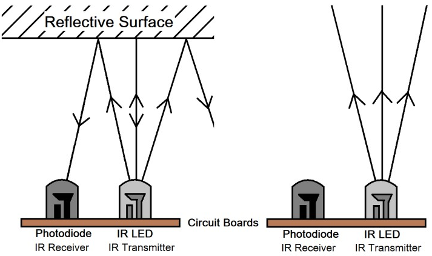

2.2.5 IR Obstacle Avoidance Module
===================================

Introduction
-----------------

In this lesson, we will learn IR obstacle avoidance module, which is a sensor module that can be used to detect obstacles at short distances, with small interference, easy to assemble, easy to use, etc. It can be widely used in robot obstacle avoidance, obstacle avoidance trolley, assembly line counting, etc.

Components
-----------------

.. image:: media/2.2.5component.png
   :width: 700
   :align: center

Principle
----------------

.. image:: media/2.2.5IR_Obstacle.png
   :width: 300
   :align: center

The IR obstacle avoidance module module has strong adaptability to environmental light, it has a pair of infrared transmitting and receiving tubes.

The transmitting tube emits infrared frequency, when the detection direction encounters an obstacle, the infrared radiation is received by the receiving tube, 
after the comparator circuit processing, the green indicator will light up and output low level signal.

The detection distance can be adjusted by potentiometer, the effective distance range 2-30cm.

Schematic Diagram
-----------------------

.. image:: media/IR_schematic.png
   :width: 500
   :align: center

Experimental Procedures
-----------------------------

**Step 1:** Build the circuit.

.. image:: media/2.2.5fritzing.png
   :width: 700
   :align: center

**Step 2:** Change directory.

.. code-block::
   
   cd /home/pi/raphael-kit/c/2.2.5/

**Step 3:** Compile.

.. code-block::

   gcc 2.2.5_IrObstacle.c -lwiringPi

**Step 4:** Run.

.. code-block::

   sudo ./a.out

After the code runs, when you put your hand in front of the module's probe, the output indicator on the module lights up and the "Detected Barrier!" will be 
repeatedly printed on the screen until the your hand is removed.

**Code**

.. code-block:: c

   #include <wiringPi.h>
   #include <stdio.h>

   #define ObstaclePin      0

   void myISR(void)
   {
      printf("Detected Barrier !\n");
   }

   int main(void)
   {
      if(wiringPiSetup() == -1){ //when initialize wiring failed,print messageto screen
         printf("setup wiringPi failed !\n");
         return 1; 
      }
      
      if(wiringPiISR(ObstaclePin, INT_EDGE_FALLING, &myISR) < 0){
         printf("Unable to setup ISR !!!\n");
         return 1;
      }
      
      while(1){
         ;
      }

      return 0;
   }

**Code Explanation**

.. code-block:: c

   void myISR(void)
   {
      printf("Detected Barrier !\n");
   }

Define a function ``myISR()`` to print ``obstacle detected'', indicating that an obstacle is detected.

.. code-block:: c

   if(wiringPiISR(ObstaclePin, INT_EDGE_FALLING, &myISR) < 0){
      printf("Unable to setup ISR !!!\n");
      return 1;
   }

This ``wiringPiISR()`` function registers a ``myISR()`` function to received interrupts on the specified ``ObstaclePin``.

When ObstaclePin changes from high to low, it means that an obstacle is detected. At this time, call the ``myISR()'' function to print "Detected Barrier !"

The prototype of this ``wiringPiISR()`` function is shown below.

.. code-block:: c

   int wiringPiISR (int pin, int edgeType,  void (*function)(void)) ;

The edgeType parameter is either INT_EDGE_FALLING, INT_EDGE_RISING, INT_EDGE_BOTH or INT_EDGE_SETUP. If it is INT_EDGE_SETUP then no initialisation of the pin will happen – it’s assumed that you have already setup the pin elsewhere (e.g. with the gpio program), but if you specify one of the other types, then the pin will be exported and initialised as specified. 

For more information, please refer to: `wiringPi-Functions (API) <https://projects.drogon.net/raspberry-pi/wiringpi/functions/>`_.

Phenomenon Picture
-----------------------

.. image:: media/2.2.5IR.jpg
   :width: 500
   :align: center