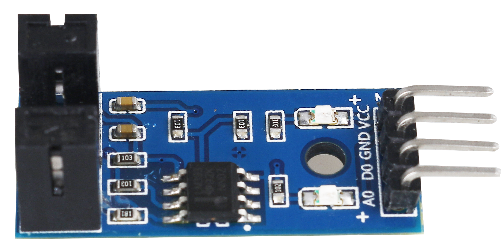
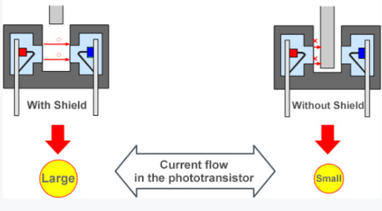
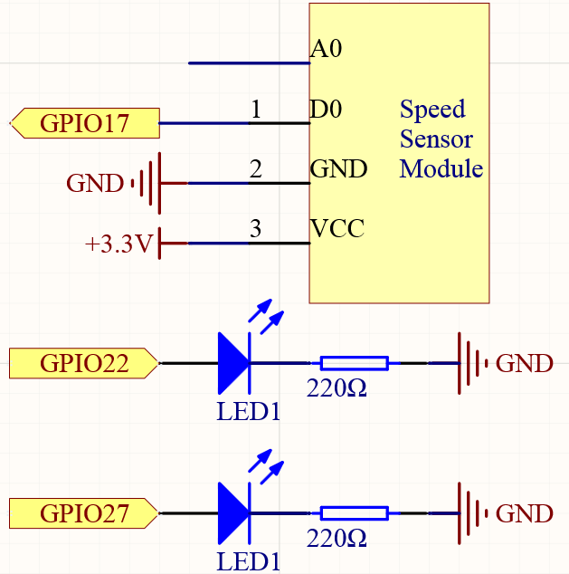
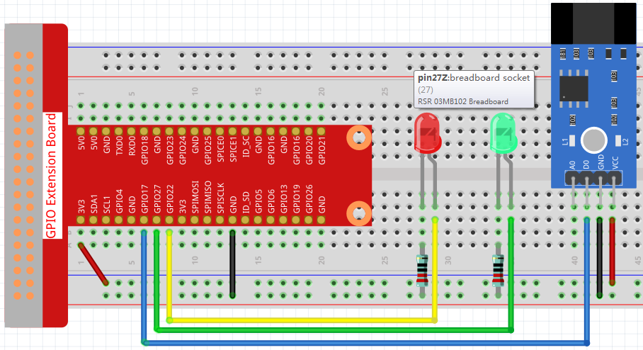

2.2.6 Photo Interrupter
=========================

**Introduction**
------------------

photo-interrupter又叫Speed sensor(如下所示)是一种封装有发光组件和光接收组件的传感
器。它应用的原理是，当物体通过传感器时，光线被打断。因此，photo-interrupter在速度
测量中得到了广泛的应用。

**Components**
-----------------

.. image:: media/2.2.6component.png
    :width: 700
    :align: center

**Principle**
----------------

基本上，一个光中断包括两个部分:发射器和接收器发射器(例如，anLEDoralaser)发射光，
然后光进入接收器。如果发射器和接收器之间的光束被障碍物打断，接收器将检测不到入射光，
即使是一瞬间，输出电平也会改变。在这个实验中，我们将利用这个变化来打开或关闭LED。

**Schematic Diagram**
-----------------------

**Experimental Procedures**
------------------------------

**Step 1:** Build the circuit.

.. note::
    在本课程中没有用到信号口A0。

**Step 2:** Change directory.

.. code-block::
    
    cd /home/pi/raphael-kit/c/2.2.6/

**Step 3:** Compile.

.. code-block::

    gcc 2.2.6_photo_interrupter.c -lwiringPi

**Step 4:** Run.

.. code-block::

    sudo ./a.out

**Code**

.. code-block:: c

    #include <wiringPi.h>
    #include <stdio.h>

    #define LBPin		0  // light break pin set to GPIO0
    #define Gpin		2
    #define Rpin		3

    void LED(int color)
    {
        pinMode(Gpin, OUTPUT);
        pinMode(Rpin, OUTPUT);
        if (color == 0){
            digitalWrite(Rpin, HIGH);
            digitalWrite(Gpin, LOW);
        }
        else if (color == 1){
            digitalWrite(Rpin, LOW);
            digitalWrite(Gpin, HIGH);
        }
    }

    void Print(int x){
        if ( x == 0 ){
            printf("Light was blocked\n");
        }
    }

    int main(void){

        if(wiringPiSetup() == -1){ //when initialize wiring failed,print messageto screen
            printf("setup wiringPi failed !");
            return 1; 
        }

        pinMode(LBPin, INPUT);
        int temp;
        while(1){
            //Reverse the input of LBPin
            if ( digitalRead(LBPin) == 0 ){  
                temp = 1;
            }
            if ( digitalRead(LBPin) == 1 ){
                temp = 0;
            }

            LED(temp);
            Print(temp);
        }
        return 0;
    }

**Code Explanation**

.. code-block::

    void LED(int color)
    {
        pinMode(Gpin, OUTPUT);
        pinMode(Rpin, OUTPUT);
        if (color == 0){
            digitalWrite(Rpin, HIGH);
            digitalWrite(Gpin, LOW);
        }
        else if (color == 1){
            digitalWrite(Rpin, LOW);
            digitalWrite(Gpin, HIGH);
        }
    }    

Define a function ``LED()``, when color is 0 red light on otherwise
green light on.

.. code-block::

    while(1){
        //Reverse the input of LBPin
        if ( digitalRead(LBPin) == 0 ){  
            temp = 1;
        }
        if ( digitalRead(LBPin) == 1 ){
            temp = 0;
        }

        LED(temp);
        Print(temp);
    }

When LBPin is low, call LED(1) and Print(1) and the green light is on. 
When LBPin is high, call LED(0) and Print(0), the red light is on and 
"Light was blocked!" is printed.

Now the LED will light up green. Stick a piece of paper in the gap of photo 
interrupter. Then "Light was blocked" will be printed on the screen and the 
LED will flash red. Remove the paper, and the LED will turn green again.

**Phenomenon Picture**
-----------------------

.. image:: media/2.2.6photo_interrrupter.jpg
   :width: 500
   :align: center