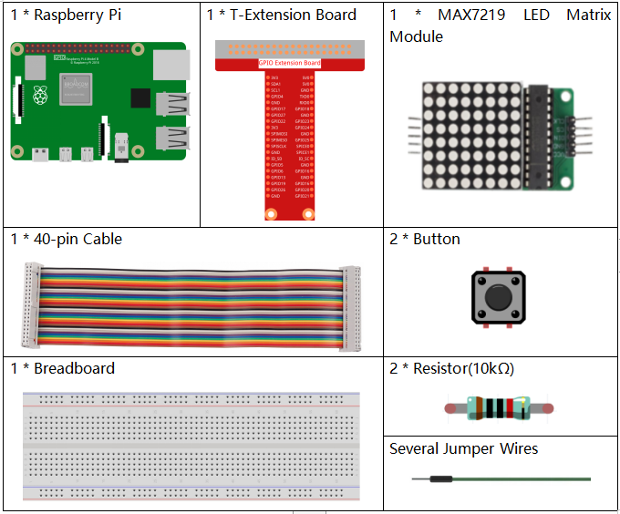
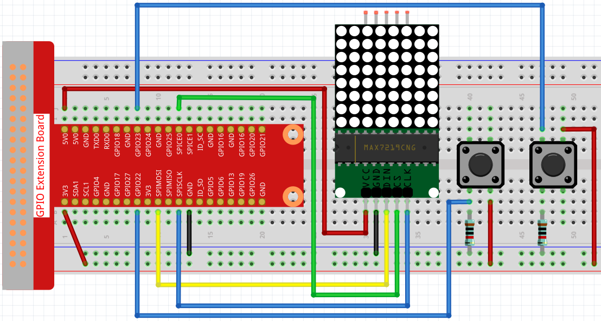

3.1.14 GAME– NotNot
~~~~~~~~~~~~~~~~~~~~~~

**Introduction**
-------------------

In this lesson, we will make an interesting game device, and we call it “Not Not”.

During the game, the dot matrix will refresh an arrow randomly. What you need to do is to press the button in the opposite direction of the arrow within a limited time. If the time is up, or if the button in the same direction as the arrow is pressed, you are out.

This game can really practice your reverse thinking, and now shall we have a try?

**Components**
----------------

**Schematic Diagram**
------------------------

============ ======== ======== ====
T-Board Name physical wiringPi BCM
GPIO22       Pin 15   3        22
GPIO23       Pin 16   4        23
SPIMOSI      Pin 19   12       MOSI
SPICE0       pin 24   10       CE0
SPISCLK      Pin 23   14       SCLK
============ ======== ======== ====

.. image:: media/Schematic_three_one13.png
   :align: center

**Experimental Procedures**
---------------------------------

**Step 1**: Build the circuit.

**Step 2**: Go to the folder of the code.

.. code-block:: c

    cd /home/pi/raphael-kit/c/3.1.14/

**Step 3**: Compile the code.

.. code-block:: c

    make

**Step 4**: Run the executable file.

.. code-block:: c

    sudo ./a.out

After the program starts, a left or right arrow will be refreshed at 
random on the dot matrix. What you need to do is to press the button 
in the opposite direction of the arrow within a limited time. Then “√” 
appears on the dot matrix. If the time is up, or if the button in the 
same direction as the arrow is pressed, you are out and the dot matrix 
displays “x”. You can also add 2 new buttons or replace them with 
Joystick keys for up, down, left and right— 4 directions to increase 
the difficulty of the game.

**Code Explanation**

Based on 1.1.6 LED Dot Matrix, this lesson adds 2 buttons to make an amusing game device. So, if you are not very familiar with the dot matrix, please refer to 1.1.6 LED Dot Matrix.

The whole program process is as below:

1. Randomly select an arrow direction and generate timer 1.

2. Display the arrow image on the dot matrix.

3. Judge the button input. If the button is pressed or timer 1 reminds time’s up, judgement starts.

4. Display the image on the basis of a judging result; meanwhile, generate timer 2.

5. Rerun step 1 when timer 2 reminds time’s up.

.. code-block:: c

    int get_index()
    {
        srand((unsigned)time(NULL));
        return rand()%2;
    }

通过系统时间来改变系统的种子值，即srand((unsigned)time(NULL))，这样每次调用rand函数时获取的值是完全随机的，最后将获取的结果对2整除，这样获取的值就是0和1了。

.. code-block:: c

    int get_key(uint num)
    {
        while (1)
        {
            if (1 == bcm2835_gpio_lev(AButtonPin) && num == 0){
                return 1;
            }
            else if (1 == bcm2835_gpio_lev(BButtonPin) && num == 1){
                return 1;
            }
            else if (1 == bcm2835_gpio_lev(AButtonPin) && num == 1){
                return 0;
            }
            else if (1 == bcm2835_gpio_lev(BButtonPin) && num == 0){
                return 0;
            }
        }
    }

判断按键是否被按下，如果按下的位置与随机数的值是否符合游戏胜利的规则，如果是，返回1，否则返回0.

.. code-block:: c

    void display(uint index){
        uchar i;
        if (stage == 0){
            for(i=1;i<9;i++)
            {
                Write_Max7219(i,arrow[index][i-1]);
            }
        }
        else if(stage == 1){
            for(i=1;i<9;i++)
            {
                Write_Max7219(i,check[index][i-1]);
            }
        }
    }

将图案显示在led矩阵屏上，如果stage=0，就根据输入参数显示箭头方向。如果stage=0，就根据输入参数显示对错符号。

