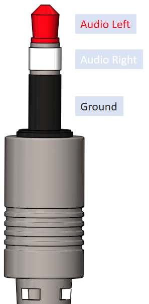
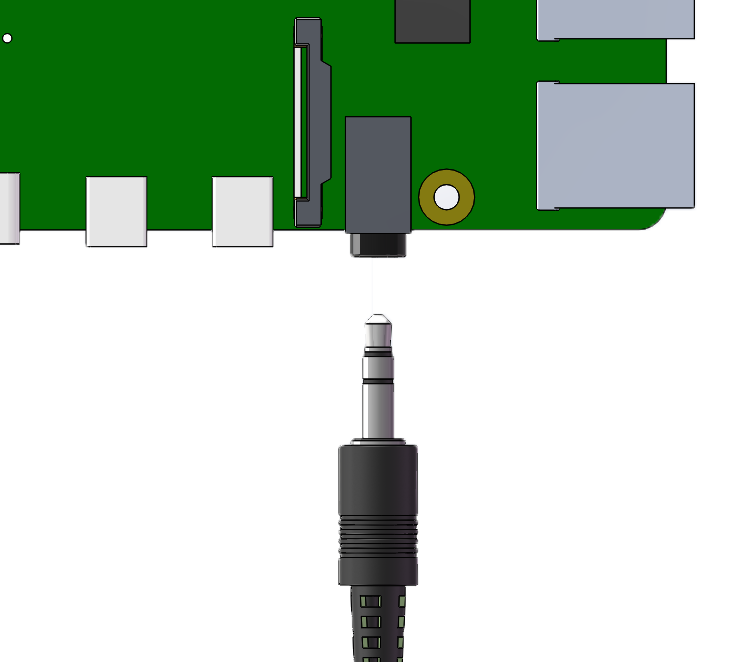

3.1.3 Audio Module
=====================

Introduction
-----------------

Let's try to play local audio files on raspberry pi.

Components
----------------

.. image:: media/audio2.png
  :width: 700
  :align: center

Audio power amplifier 
-----------------------
The audio connector we are equipped with is a 3-pole interface. There are 3 
contacts on its plug. From the tip to the root, they are audio left, audio 
right and power ground. Among them, audio left is connected to the red 
Dupont line, audio right is connected to the white Dupont line, and the 
power ground is connected to the black Dupont line.

When assembling the speakers, plug one end of the audio connector into the 
audio interface of the Raspberry Pi, and connect the other end to the audio 
power amplifier module.

+------------------+--------------------------------------+
| audio connector  | audio power amplifier module         |
+------------------+--------------------------------------+
| Red Dupont Line  | L                                    |
+------------------+--------------------------------------+
| Black Dupont wire| GND                                  |
+------------------+--------------------------------------+
| White dupont wire| R                                    |
+------------------+--------------------------------------+

如果你的树莓派连接了一个没有喇叭的屏幕，可能会导致扬声器没有声音，详细请参考: FAQ
另外，如果你想调节音量大小，可以通过命令行调节，请参考: FAQ

Experimental Procedures
------------------------------

**Step 1:** Build the circuit.

.. image:: media/4.1.4fritzing.png
  :width: 800
  :align: center   

First, you have to assemble the speaker and connect it to the Raspberry 
Pi. Refer to :ref:`Audio power amplifier` for the specific tutorial.

**Step 2:** Get into the folder of the code.

.. code-block::

    cd /home/pi/raphael-kit/python/

**Step 3:** Run.

.. code-block::

    sudo python3 3.1.3_AudioModule.py

After the code runs, raspberry pi will play the my_music.mp3 file in 
the /home/pi/raphael-kit/music directory.If you want 
to upload other music files to raspberry pi, you can refer to
:ref:`Use Filezilla Software`

**Code**

.. code-block:: python

    from pygame import mixer

    mixer.init()
    
    def main():
        mixer.music.load('/home/pi/raphael-kit/music/my_music.mp3')
        mixer.music.set_volume(0.7)
        mixer.music.play()
        while True:
            pass# Don't do anything.
    
    def destroy():
        mixer.music.stop()
    
    if __name__ == '__main__':
        try:
            main()
        except KeyboardInterrupt:
            destroy()

**Code Explanation**

.. code-block:: python

    from pygame import mixer

    mixer.init()

Import the Mixer method in the pygame library and initialize the method.

.. code-block:: python

    mixer.music.load('/home/pi/raphael-kit/music/my_music.mp3')
    mixer.music.set_volume(0.7)
    mixer.music.play()

Raspberry pi reads the my_music.mp3 file in the /home/pi/raphael-kit/music 
directory and sets the volume to 0.7. The raspberry pi will start playing 
audio When ``mixer.music.play()`` is executed.

.. note::
    Setting range of the volume is 0~1.

.. code-block:: python

    mixer.music.stop()

The raspberry pi stops playing audio when ``mixer.music.stop()`` is executed. 
In addition, you can also pause the music with ``mixer.music.pause()``, and 
replay the music with ``mixer.music.unpause()``.

**Phenomenon Picture**
------------------------

.. image:: media/3.1.3audio.jpg
   :align: center
