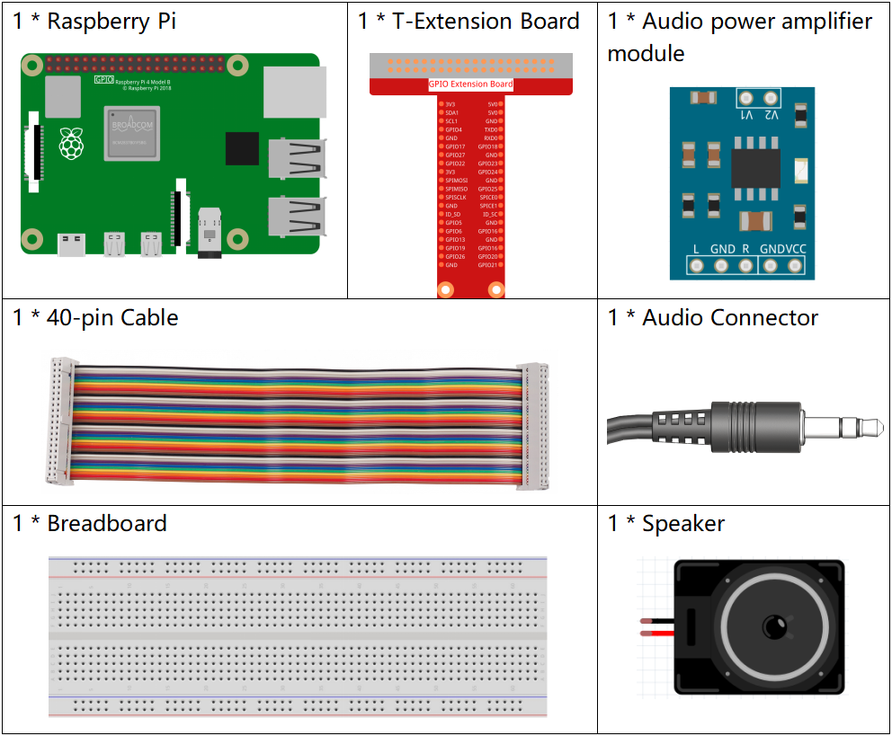

3.1.4 Text-to-speech
=======================

Introduction
-----------------

In many places, we can come into contact with TTS (Text-to-speech) technology, which converts text into natural-sounding speech and brings people a good interactive experience.

Let's try to make your project speak.

Components
----------------

Experimental Procedures
------------------------------

**Step 1:** Configure speakers.

.. image:: media/4.1.4fritzing.png
  :width: 800
  :align: center   

Plug the 3.5mm audio jack into the Raspberry Pi.

**Step 2:** Install TTS.

.. code-block::

    sudo apt-get install espeak -y

**Step 3:** Get into the folder of the code.

.. code-block::

    cd /home/pi/raphael-kit/python/3.1.4/

**Step 4:** Run.

.. code-block::

    sudo python3 3.1.4_Text-to-speech.py

Raspberry pi will greet you kindly after the code runs, and it will say goodbye to you when the code stops.

**Code**

.. code-block:: python

    from tts import TTS

    tts = TTS(engine="espeak")
    tts.lang('en-US')

    def main():
        tts.say('Hello, nice to meet you!')

    def destroy():
        tts.say('See you later')

    if __name__ == '__main__':
        setup()
        try:
            main()
        except KeyboardInterrupt:
            destroy()

**Code Explanation**

.. code-block:: python

    from tts import TTS

    tts = TTS(engine="espeak")

Import the TTS class and instantiate an object.

.. code-block:: python

    tts.lang('en-US')

Set the language.

.. note::
    Currently the switchable language only supports English.

.. code-block:: python

    tts.say("Hello, nice to meet you!")

Fill in the text to be said as a parameter, after executing ``tts.say()``, raspberry pi will say the text you wrote.

**Phenomenon Picture**
------------------------

.. image:: media/3.1.3audio.jpg
   :align: center
