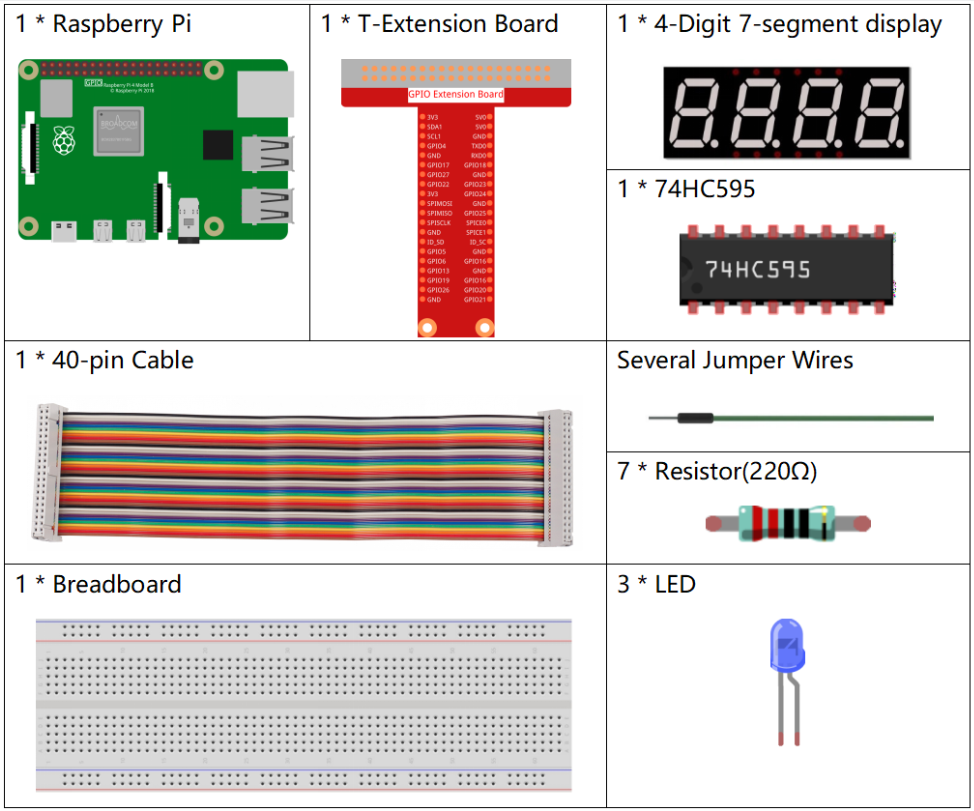

**3.1.6 Traffic Light**
~~~~~~~~~~~~~~~~~~~~~~~~~~

Introduction
---------------

In this project, we will use LED lights of three colors to realize the
change of traffic lights and a four-digit 7-segment display will be used
to display the timing of each traffic state.

Components
------------

* :ref:`GPIO Extension Board`
* :ref:`Breadboard`
* :ref:`Resistor`
* :ref:`LED`
* :ref:`4-Digit 7-Segment Display`
* :ref:`74HC595`

Schematic Diagram
--------------------

============ ======== ======== ===
T-Board Name physical wiringPi BCM
GPIO17       Pin 11   0        17
GPIO27       Pin 13   2        27
GPIO22       Pin 15   3        22
SPIMOSI      Pin 19   12       10
GPIO18       Pin 12   1        18
GPIO23       Pin 16   4        23
GPIO24       Pin 18   5        24
GPIO25       Pin 22   6        25
SPICE0       Pin 24   10       8
SPICE1       Pin 26   11       7
============ ======== ======== ===

.. image:: media/Schematic_three_one7.png
   :align: center

Experimental Procedures
------------------------

**Step 1:** Build the circuit.

.. image:: media/image254.png
   :alt: 3.1.7_TrafficLight_bb
   :width: 6.84444in
   :height: 3.54097in

**Step 2:** Change directory.

.. raw:: html

   <run></run>

.. code-block:: 

    cd /home/pi/raphael-kit/c/3.1.6/

**Step 3:** Compile.

.. raw:: html

   <run></run>

.. code-block:: 

    gcc 3.1.6_TrafficLight.c -lwiringPi

**Step 4:** Run.

.. raw:: html

   <run></run>

.. code-block:: 

    sudo ./a.out

As the code runs, LEDs will simulate the color changing of traffic
lights. Firstly, the red LED lights up for 60s, then the green LED
lights up for 30s; next, the yellow LED lights up for 5s. After that,
the red LED lights up for 60s once again. In this way, this series of
actions will be executed repeatedly.

.. note::

    If it does not work after running, please refer to :ref:`C code is not working?`

Code
---------

.. code-block:: c

    #include <wiringPi.h>
    #include <stdio.h>
    #include <wiringShift.h>
    #include <signal.h>
    #include <unistd.h>
    #define     SDI     5 
    #define     RCLK    4  
    #define     SRCLK    1   

    const int ledPin[]={6,10,11};  
    const int placePin[] = {12, 3, 2, 0};
    unsigned char number[] = {0xc0, 0xf9, 0xa4, 0xb0, 0x99, 0x92, 0x82, 0xf8, 0x80, 0x90};

    int greenLight = 30;
    int yellowLight = 5;
    int redLight = 60;
    int colorState = 0;
    char *lightColor[]={"Red","Green","Yellow"};
    int counter = 60;

    void lightup()
    {
        for(int i=0;i<3;i++){
            digitalWrite(ledPin[i],HIGH);
        }
        digitalWrite(ledPin[colorState],LOW);    
    }

    void pickDigit(int digit)
    {
        for (int i = 0; i < 4; i++)
        {
            digitalWrite(placePin[i], 1);
        }
        digitalWrite(placePin[digit], 0);
    }

    void hc595_shift(int8_t data)
    {
        int i;
        for (i = 0; i < 8; i++)
        {
            digitalWrite(SDI, 0x80 & (data << i));
            digitalWrite(SRCLK, 1);
            delayMicroseconds(1);
            digitalWrite(SRCLK, 0);
        }
        digitalWrite(RCLK, 1);
        delayMicroseconds(1);
        digitalWrite(RCLK, 0);
    }

    void clearDisplay()
    {
        int i;
        for (i = 0; i < 8; i++)
        {
            digitalWrite(SDI, 1);
            digitalWrite(SRCLK, 1);
            delayMicroseconds(1);
            digitalWrite(SRCLK, 0);
        }
        digitalWrite(RCLK, 1);
        delayMicroseconds(1);
        digitalWrite(RCLK, 0);
    }

    void display()
    {
        clearDisplay();
        pickDigit(0);
        hc595_shift(number[counter % 10]);

        clearDisplay();
        pickDigit(1);
        hc595_shift(number[counter % 100 / 10]);

        clearDisplay();
        pickDigit(2);
        hc595_shift(number[counter % 1000 / 100]);
    
        clearDisplay();
        pickDigit(3);
        hc595_shift(number[counter % 10000 / 1000]);
    }

    void loop()
    {
        while(1){
        display();
        lightup(); 
        }
    }

    void timer(int  timer1){       //Timer function
        if(timer1 == SIGALRM){   
            counter --;         
            alarm(1); 
            if(counter == 0){
                if(colorState == 0) counter = greenLight;
                if(colorState == 1) counter = yellowLight;
                if(colorState == 2) counter = redLight;
                colorState = (colorState+1)%3; 
            }
            printf("counter : %d \t light color: %s \n",counter,lightColor[colorState]);
        }
    }

    int main(void)
    {
        int i;
        if(wiringPiSetup() == -1){ 
            printf("setup wiringPi failed !");
            return 1; 
        }
        pinMode(SDI,OUTPUT);        
        pinMode(RCLK,OUTPUT);
        pinMode(SRCLK,OUTPUT);
        for(i=0;i<4;i++){       
            pinMode(placePin[i],OUTPUT);
            digitalWrite(placePin[i],HIGH);
        }
        for(i=0;i<3;i++){       
            pinMode(ledPin[i],OUTPUT);
            digitalWrite(ledPin[i],HIGH);
        }
        signal(SIGALRM,timer);  
        alarm(1); 
        loop();
        return 0;
    }

Code Explanation
--------------------

.. code-block:: c

    #define     SDI     5 
    #define     RCLK    4  
    #define     SRCLK    1   

    const int placePin[] = {12, 3, 2, 0};
    unsigned char number[] = {0xc0, 0xf9, 0xa4, 0xb0, 0x99, 0x92, 0x82, 0xf8, 0x80, 0x90};

    void pickDigit(int digit);
    void hc595_shift(int8_t data);
    void clearDisplay();
    void display();

These codes are used to realize the function of number display of 4-Digit 7-Segment 
Displays. Refer to chapter 1.1.5 of the document for more details. Here, we use the 
codes to display countdown of traffic light time.

.. code-block:: c

    const int ledPin[]={6,10,11};  

    int colorState = 0;

    void lightup()
    {
        for(int i=0;i<3;i++){
            digitalWrite(ledPin[i],HIGH);
        }
        digitalWrite(ledPin[colorState],LOW);    
    }

The codes are used to switch the LED on and off.

.. code-block:: c

    int greenLight = 30;
    int yellowLight = 5;
    int redLight = 60;
    int colorState = 0;
    char *lightColor[]={"Red","Green","Yellow"};
    int counter = 60;

    void timer(int  timer1){       //Timer function
        if(timer1 == SIGALRM){   
            counter --;         
            alarm(1); 
            if(counter == 0){
                if(colorState == 0) counter = greenLight;
                if(colorState == 1) counter = yellowLight;
                if(colorState == 2) counter = redLight;
                colorState = (colorState+1)%3; 
            }
            printf("counter : %d \t light color: %s \n",counter,lightColor[colorState]);
        }
    }

The codes are used to switch the timer on and off. Refer to chapter
1.1.5 for more details. Here, when the timer returns to zero, colorState
will be switched so as to switch LED, and the timer will be assigned to
a new value.

.. code-block:: c

    void loop()
    {
        while(1){
        display();
        lightup(); 
        }
    }

    int main(void)
    {
        //…
        signal(SIGALRM,timer);  
        alarm(1); 
        loop();
        return 0;
    }

The timer is started in the main() function. In loop() function, use
**while(1)** loop and call the functions of 4-Digit 7-Segment and LED.

Phenomenon Picture
-------------------

.. image:: media/image255.jpeg
   :align: center