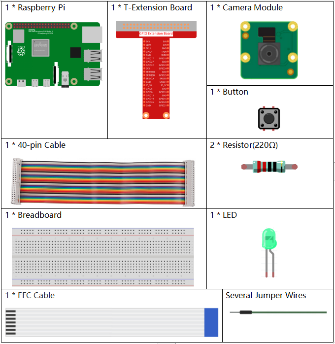
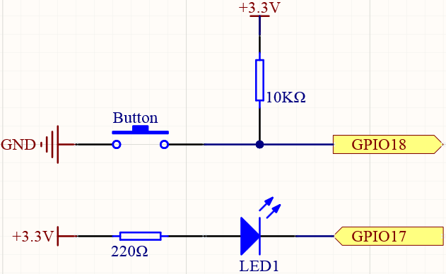

4.1.1 Camera
~~~~~~~~~~~~~~~~

Introduction
-----------------

Let's try to assemble a simple camera with raspberry pi.

Components
----------------

**Schematic Diagram**
-----------------------

============ ======== ======== ===
T-Board Name physical wiringPi BCM
GPIO17       Pin 11   0        17
GPIO18       Pin 12   1        18
============ ======== ======== ===

Experimental Procedures
------------------------------

**Step 1:** Build the circuit.

.. image:: media/3.1.15camera_fritzing.png
  :width: 800
  :align: center

**Step 2:** Complete camera installation.

Prior to the project, make sure you have completed :ref:`Install the camera` .

**Step 3:** Get into the folder of the code.

.. code-block::

    cd /home/pi/raphael-kit/python/

**Step 4:** Run.

.. code-block::

    sudo python3 4.1.1_Camera.py

After the code runs, press the button, the Raspberry Pi will flash the LED and take a picture. The photo will be named ``my_photo.jpg`` and stored in the /home/pi directory.

**Code Explanation**

.. code-block:: python

    GPIO.add_event_detect(BtnPin, GPIO.FALLING, callback=takePhotos)

Set the event of ``BtnPin``, when the button is pressed (the level signal changes from high to low) , call the function ``takePhotos()``.

.. code-block:: python

    def takePhotos(pin):
        global status
        status = True

When ``takePhotos()`` is called, modify the ``status`` .

.. code-block:: python

    if status:
        for i in range(5):
            GPIO.output(LedPin, GPIO.LOW)
            time.sleep(0.1)
            GPIO.output(LedPin, GPIO.HIGH)
            time.sleep(0.1)
        camera.capture('/home/pi/my_photo.jpg')
        print ('Take a photo!')          
        status = False
    else:
        GPIO.output(LedPin, GPIO.HIGH)
    time.sleep(1)

When ``status`` is ``True`` , the Raspberry Pi will flash the LED and take a picture. The photo will be named ``my_photo.jpg`` and stored in the /home/pi directory.

**Phenomenon Picture**
------------------------

.. image:: media/4.1.1camera.jpg
   :align: center
