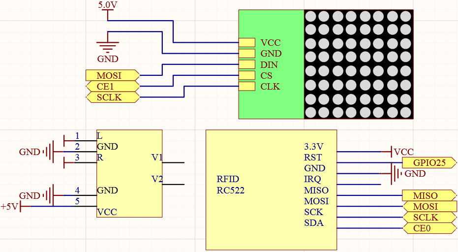
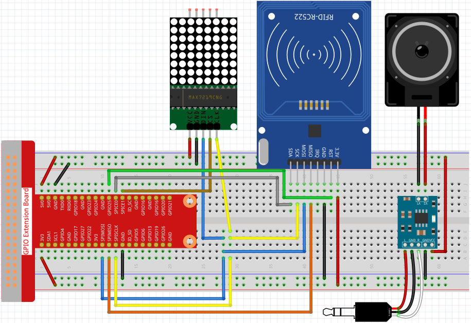
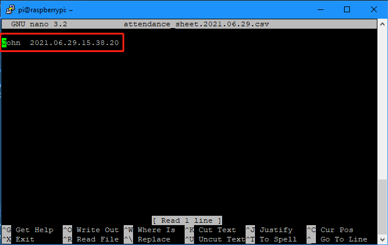

4.1.20 AttendanceSystem
~~~~~~~~~~~~~~~~~~~~~~~~

Introduction
---------------

Let's make a simple attendance system. When we scan the card, the Raspberry Pi will record our information and generate a csv file.

Components
-----------

.. image:: media/4.1.20components2.png

Schematic Diagram
----------------------

============ ======== ======== ====
T-Board Name physical wiringPi BCM
GPIO25       Pin 22   6        25
SPIMOSI      Pin 19   12       MOSI
SPIMISO      Pin 19   12       MISO
SPICE0       pin 24   10       CE0
SPICE1       pin 26   11       CE1
SPISCLK      Pin 23   14       SCLK
============ ======== ======== ====

Experimental Procedures
-------------------------

.. note::

    Turn on the SPI before starting the experiment, refer to :ref:`SPI Configuration` for details.
    
    The :ref:`Luma.LED_Matrix` module And the :ref:`Spidev and MFRC522` libraries are also needed.

Step 1: Build the circuit.

Step 2: Run the ``2.2.10_write.py`` file to modify the content of the rfid card.

.. code-block:: 

    cd /home/pi/davinci-kit-for-raspberry-pi/python/2.2.10
    sudo python3 2.2.10_write.py

Step 3: Enter your name (here we use **John** as an example), then press **Enter** to confirm, and finally press **Ctrl + C** to stop the code.

.. image:: media/atten2.png
  :width: 400

Step 4:  Get into the folder of code and run.

.. code-block::

    cd /home/pi/davinci-kit-for-raspberry-pi/python
    sudo python3 4.1.20_Attendance_System.py

    After starting the program, we put the RFID card close to the MFRC522 RFID Module, the Raspberry Pi will send out a voice to greet you and display it on the LED matrix.

    We can also find a csv file that records the time and list in the same directory. Open it with the nano command and you will see the record just now.

.. code-block:: python

    sudo nano attendance_sheet.2021.06.29.csv

Code Explanation
-------------------

In order to better understand the program, you may need to complete :ref:`1.1.6 LED Dot Matrix` , :ref:`2.2.10 MFRC522 RFID Module` and :ref:`3.1.4 Text-to-speech` first.

.. code-block:: python

    def get_time():
	    time.time()
	    year = str(time.strftime('%Y',time.localtime(time.time())))
	    month = str(time.strftime('%m',time.localtime(time.time())))
	    day = str(time.strftime('%d',time.localtime(time.time())))
	    hour = str(time.strftime('%H',time.localtime(time.time())))
	    minute = str(time.strftime('%M',time.localtime(time.time())))
	    second = str(time.strftime('%S',time.localtime(time.time())))
	    present_time = year + '.' + month + '.' + day + '.' + hour + '.' + minute + '.' + second
	    present_date = year + '.' + month + '.' + day
	    return present_date, present_time

Use the ``get_time()`` function to get the current timestamp and return two values.
Among them, ``present_date`` is accurate to the number of days of the current timestamp, and ``present_time`` is accurate to the number of seconds of the current timestamp.

.. code-block:: python

    id, name = reader.read()
    greeting = name.rstrip() + ", Welcome!"
    present_date, present_time = get_time()
    attendance_statistics[name.rstrip()] = present_time

The ``reader.read()`` function reads the name information, and then creates a greeting.
Then an ``attendance_statistics`` dictionary is generated, and ``name.rstrip()`` and ``present_time`` are stored as keys and values.

.. code-block:: python

    tts.say(greeting)

Say a greeting through the speaker.

.. code-block:: python

    with open('attendance_sheet.' + present_date + '.csv', 'w') as f:
        [f.write('{0}  {1}\n'.format(key, value)) for key, value in attendance_statistics.items()]

Write the ``attendance_statistics`` to the csv file.

.. code-block:: python

    with canvas(virtual) as draw:
        text(draw, (0, 0), greeting, fill="white", font=proportional(CP437_FONT))
    for offset in range(95):
        virtual.set_position((offset,0))
        time.sleep(0.1)

Scroll to display this greeting.

