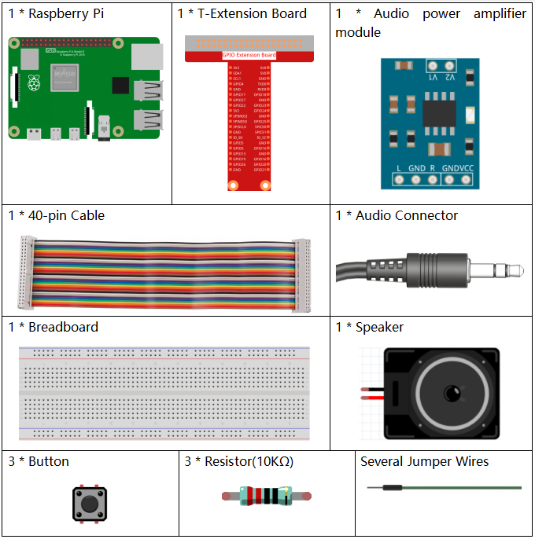
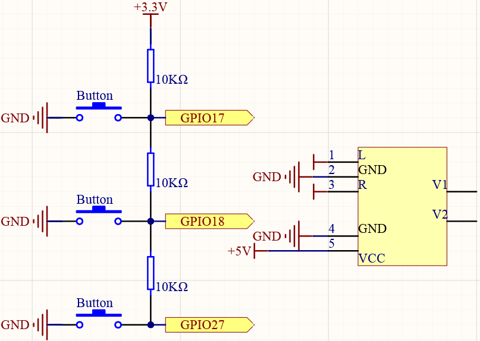

4.1.2 Music Player
~~~~~~~~~~~~~~~~~~~~~~

Introduction
-----------------

Let's try to assemble a simple music player with raspberry pi.

Components
----------------

**Schematic Diagram**
-----------------------

============ ======== ======== ===
T-Board Name physical wiringPi BCM
GPIO17       Pin 11   0        17
GPIO18       Pin 12   1        18
GPIO27       Pin 13   2        27
============ ======== ======== ===

Experimental Procedures
------------------------------

**Step 1:** Build the circuit.

.. image:: media/3.1.16fritzing.png
  :width: 800
  :align: center

First, you have to assemble the speaker and connect it to the Raspberry 
Pi. Refer to :ref:`Audio power amplifier` for the specific tutorial.

**Step 2:** Get into the folder of the code.

.. code-block::

    cd /home/pi/raphael-kit/python/

**Step 3:** Run.

.. code-block::

    sudo python3 4.1.2_MusicPlayer.py

After the code runs, raspberry pi will play the my_music.mp3 file in 
the /home/pi/raphael-kit/music directory.If you want 
to upload other music files to raspberry pi, you can refer to
:ref:`How to use Ftp`

**Code Explanation**

.. code-block:: python

    from pygame import mixer

    mixer.init()

Import the Mixer method in the pygame library and initialize the method.

.. code-block:: python

    BtnPin1 = 18
    BtnPin2 = 17
    BtnPin3 = 27
    volume = 0.7

Define the pin ports of the three buttons and set the initial volume to 0.7.

.. code-block:: python

    upPressed = False
    downPressed = False
    playPressed = False

UpPressed, downPressed and playPressed are all interrupt flags, the corresponding task will be executed When they are True.

.. code-block:: python

    def clip(x,min,max):
    if x < min:
        return min
    elif x > max:
        return max
    return x

The clip() function is used to set the upper and lower limits of input parameters.

.. code-block:: python

    GPIO.add_event_detect(BtnPin1, GPIO.FALLING, callback=play)
    GPIO.add_event_detect(BtnPin2, GPIO.FALLING, callback=volDown)
    GPIO.add_event_detect(BtnPin3, GPIO.FALLING, callback=volUp)

Set the key detection events of BtnPin1, BtnPin2 and BtnPin3. 
When BtnPin1 is pressed, the interrupt function play() is executed, 
when BtnPin2 is pressed, the interrupt function volDown() is executed, 
and when BtnPin3 is pressed, the interrupt function volUp() is executed.

**Phenomenon Picture**
------------------------

.. image:: media/4.1.2musicplayer.jpg
   :align: center
