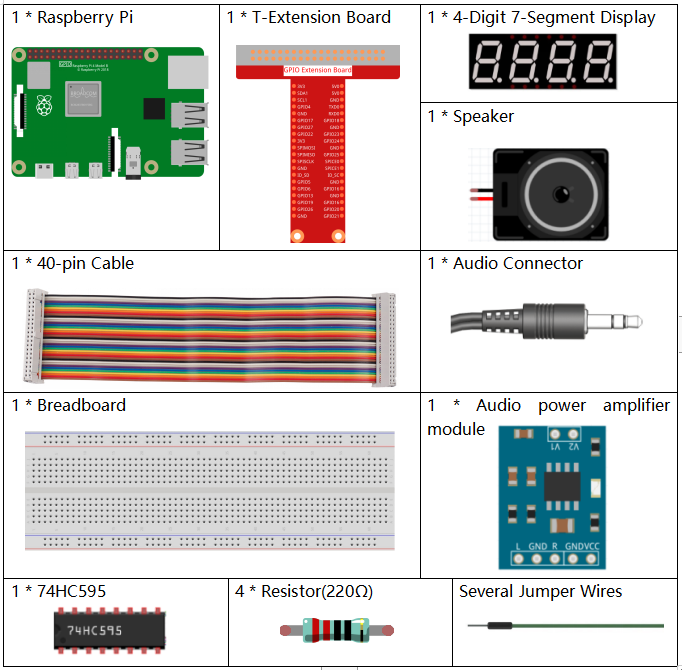
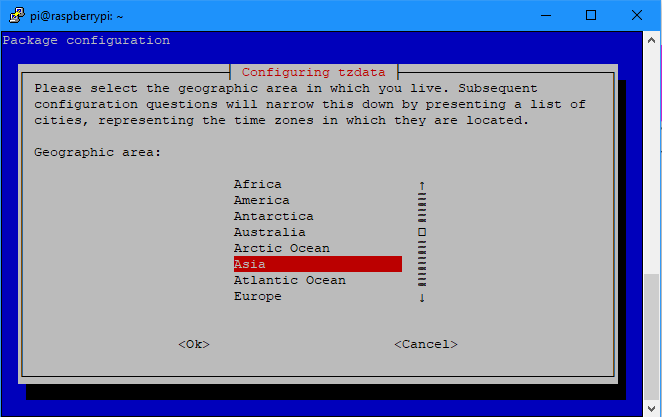
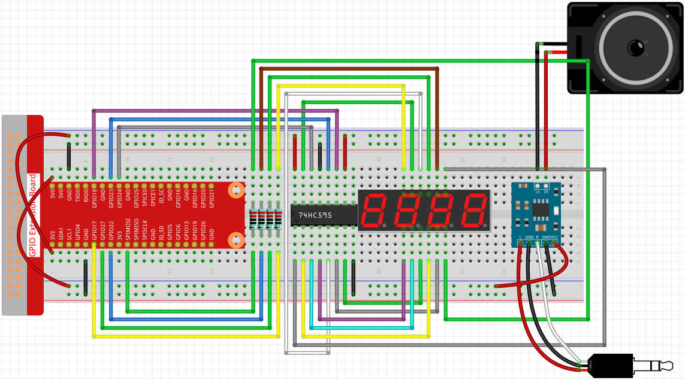

4.1.3 Speech Clock
~~~~~~~~~~~~~~~~~~~~~~

Introduction
-----------------

Let's try to make a simple Speech Clock with raspberry pi.

Components
----------------

设置时区
----------

首先使用命令 ``date`` 来查看本地时间是否正确。

.. code-block:: python

    date

如果本地时间与当地时间不一样，需要对时区进行设置，使用以下命令打开图形界面设置时区。

.. code-block:: python

    sudo dpkg-reconfigure tzdata

选择你当地的时区。

Schematic Diagram
--------------------------

============ ======== ======== ===
T-Board Name physical wiringPi BCM
GPIO17       Pin 11   0        17
GPIO27       Pin 13   2        27
GPIO22       Pin 15   3        22
SPIMOSI      Pin 19   12       10
GPIO18       Pin 12   1        18
GPIO23       Pin 16   4        23
GPIO24       Pin 18   5        24
============ ======== ======== ===

.. image:: media/schmatic_4_digit.png

.. image:: media/3.1.17_schematic.png
  :width: 500
  :align: center

Experimental Procedures
------------------------------

**Step 1:** Build the circuit.

First, you have to assemble the speaker and connect it to the Raspberry 
Pi. Refer to :ref:`Audio power amplifier` for the specific tutorial.

**Step 2:** Get into the folder of the code.

.. code-block::

    cd /home/pi/raphael-kit/python/

**Step 3:** Run.

.. code-block::

    sudo python3 4.1.3_SpeechClock.py

代码运行之后，数码管会实时显示当前时间，且每到整点时刻，会将当前时间通过语音播报出来。

**Code Explanation**

.. code-block:: python

    time.localtime(time.time())
    hour = int(time.strftime('%H',time.localtime(time.time())))
    minute = int(time.strftime('%M',time.localtime(time.time())))

Through the function time.time(), we can get the timestamp of the current time (the number of floating-point seconds that have passed since the 1970 epoch), and then use the time formatting method of the time module (time.localtime(time.time())) To process the current timestamp, so that we can format the timestamp as a local time. The input result is:

time.struct_time(tm_year=2021, tm_mon=5, tm_mday=28, tm_hour=13, tm_min=54, tm_sec=26, tm_wday=4, tm_yday=148, tm_isdst=0)

Finally, we use the time.strftime() method to format the large string of information just now into what we want. If you want to get the current hour, you can get it through the function time.strftime('%H',time.localtime(time.time())). The following will list the specified formatted string output obtained by modifying the first parameter.

+----+----------------------------------------------------+
| %y | Two-digit year representation(00-99)               |
+----+----------------------------------------------------+
| %Y | Four-digit year representation(000-9999)           |
+----+----------------------------------------------------+
| %m | month(01-12)                                       |
+----+----------------------------------------------------+
| %H | Day of the month(0-31)                             |
+----+----------------------------------------------------+
| %I | Hours in a 24-hour clock(0-23)                     |
+----+----------------------------------------------------+
| %M | Hours in 12-hour clock(01-12)                      |
+----+----------------------------------------------------+
| %y | Minutes(00=59)                                     |
+----+----------------------------------------------------+
| %S | second(00-59)                                      |
+----+----------------------------------------------------+
| %a | Local simplified week name                         |
+----+----------------------------------------------------+
| %A | Full local week name                               |
+----+----------------------------------------------------+
| %b | Local simplified month name                        |
+----+----------------------------------------------------+
| %B | Local full month name                              |
+----+----------------------------------------------------+
| %c | Local corresponding date and time display          |
+----+----------------------------------------------------+
| %j | Day of the year(001-366)                           |
+----+----------------------------------------------------+
| %p | The equivalent of local A.M. or P.M.               |
+----+----------------------------------------------------+
| %U | Num of weeks of one year(00-53)starting with Sunday|
+----+----------------------------------------------------+
| %w | Week (0-6), starting with Sunday                   |
+----+----------------------------------------------------+
| %W | Num of weeks of one year(00-53)starting with Monday|
+----+----------------------------------------------------+
| %x | Local corresponding date representation            |
+----+----------------------------------------------------+
| %X | Local corresponding time representation            |
+----+----------------------------------------------------+
| %Z | The name of the current time zone                  |
+----+----------------------------------------------------+

.. note::
    The output of the time.strftime() method is all string variables. Before using it, remember to do a coercive type conversion.

.. code-block:: python

    clearDisplay() 
    pickDigit(0)  
    hc595_shift(number[minute % 10])
    
    clearDisplay()
    pickDigit(1)
    hc595_shift(number[minute % 100//10])

    clearDisplay()
    pickDigit(2)
    hc595_shift(number[hour % 10])

    clearDisplay()
    pickDigit(3)
    hc595_shift(number[hour % 100//10])

The tens digit of the hour is displayed on the first nixie tube, and the ones digit is displayed on the second nixie tube. Then the ten digits of the minutes are displayed on the first digital tube, and the ones digits are displayed on the second digital tube.

.. code-block:: python

    if minute == 0 and status == 0:
        tts.say('The time is now ' + str(hour) + ' hours and ' + str(minute) + ' minutes')
        status = 1
    elif minute != 0:
        status = 0

When the number of minutes is 0 (on the hour), the raspberry pi will broadcast the time for us through the speaker.

**Phenomenon Picture**
------------------------

.. image:: media/4.1.3speech_clock.jpg
   :align: center
