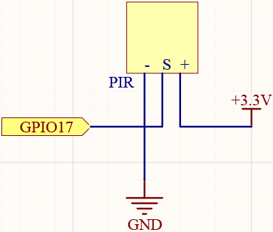
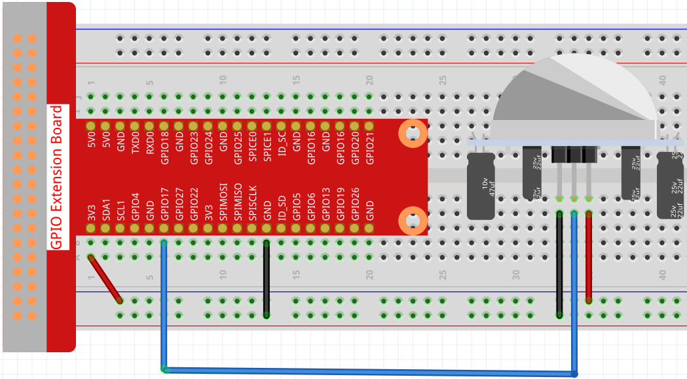

4.1.4 Automatic Capture Camera
===================================

Introduction
-----------------

When you are out, the little squirrels in the woods might visit your windowsill. Let's make a automatic capture camera to leave pictures of these little cuties!

Components
----------------

.. image:: media/3.1.18components.png
  :width: 800
  :align: center

* :ref:`GPIO Extension Board`
* :ref:`Breadboard`
* :ref:`Camera Module`
* :ref:`PIR Motion Sensor Module`

Schematic Diagram
-----------------------

============ ======== ======== ===
T-Board Name physical wiringPi BCM
GPIO17       Pin 11   0        17
============ ======== ======== ===

Experimental Procedures
------------------------------

Before this project, you need to make sure you complete :ref:`3.1.1 Photograph Module` .

**Step 1:** Build the circuit.

**Step 2:** To connect the camera module and complete the configuration, please refer to: :ref:`Camera Module`.

**Step 3:** Go into the Raspberry Pi Desktop. You may need a screen for a better experience, refer to: `Connect your Raspberry Pi <https://projects.raspberrypi.org/en/projects/raspberry-pi-setting-up/3>`_. Or access the Raspberry Pi desktop remotely, for a detailed tutorial please refer to :ref:`Remote Desktop`.

**Step 4:** Open a Terminal and get into the folder of the code.

.. raw:: html

   <run></run>

.. code-block::

    cd /home/pi/raphael-kit/python/

**Step 5:** Run.

.. raw:: html

   <run></run>

.. code-block::

    sudo python3 4.1.4_AutomaticCaptureCamera.py

After the code runs, PIR will detect the surrounding environment, and if it senses the little squirrel passing by, the camera will take a photo.
The photo interval is 3 seconds, and the total number of photos taken will be displayed through the print window.

.. note::

   You can also open ``4.1.4_AutomaticCaptureCamera.py`` in the ``/home/pi/raphael-kit/python/`` path with a Python IDE, click Run button to run, and stop the code with Stop button.

**Code**

.. note::
    You can **Modify/Reset/Copy/Run/Stop** the code below. But before that, you need to go to  source code path like ``raphael-kit/python``. After modifying the code, you can run it directly to see the effect.

.. raw:: html

    <run></run>

.. code-block:: python

   #!/usr/bin/env python3

   from picamera import PiCamera
   import RPi.GPIO as GPIO
   import time

   camera = PiCamera()

   pirPin = 17    # the pir connect to pin17

   def setup():
      GPIO.setmode(GPIO.BCM)
      GPIO.setup(pirPin, GPIO.IN)
      camera.start_preview(alpha=200)

   def main():
      i = 1
      while True:
         pirVal = GPIO.input(pirPin)
         if pirVal==GPIO.HIGH:
               camera.capture('/home/pi/capture%s.jpg' % i)
               print('The number is %s' % i)
               time.sleep(3)
               i = i + 1

   def destroy():
      GPIO.cleanup()
      camera.stop_preview()

   if __name__ == '__main__':
      setup()
      try:
         main()
      except KeyboardInterrupt:
         destroy()

**Code Explanation**

.. code-block:: python

   pirVal = GPIO.input(pirPin)
   if pirVal==GPIO.HIGH:
         camera.capture('/home/pi/capture%s.jpg' % i)
         print('The number is %s' % i)
         time.sleep(3)
         i = i + 1

Every time a little squirrel is detected by the PIR module, the Raspberry Pi will take a photo and tell you through the print window how many pictures have been taken. The interval between each photo is 3s.

Phenomenon Picture
------------------------

.. image:: media/4.1.4spycamera.JPG
   :align: center
