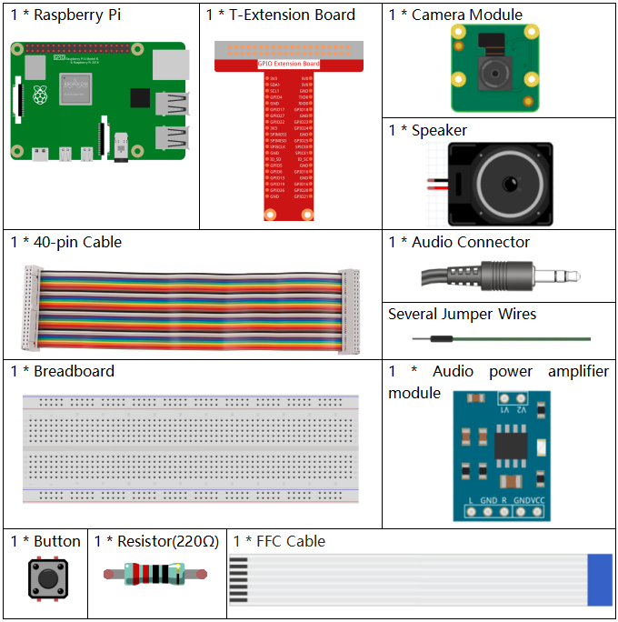
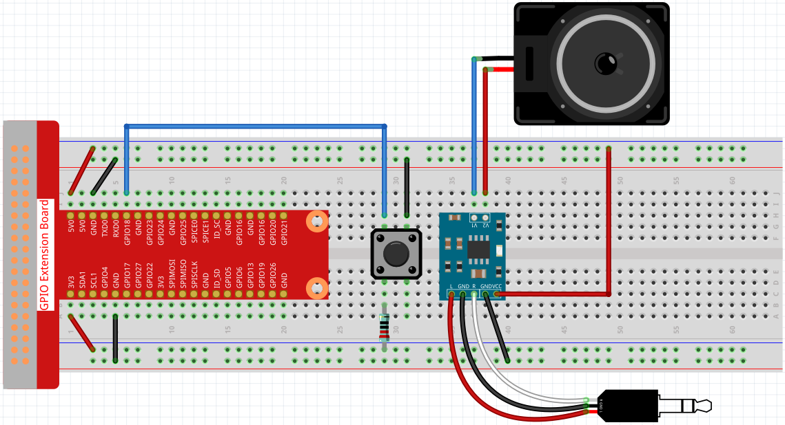

4.1.5 Intelligent Visual Doorbell
==========================================

Introduction
-----------------

In this project, let's make a DIY intelligent visual doorbell.

Components
----------------

* :ref:`GPIO Extension Board`
* :ref:`Breadboard`
* :ref:`Resistor`
* :ref:`Button`
* :ref:`Audio Module and Speaker`
* :ref:`Camera Module`

Schematic Diagram
-----------------------

============ ======== ======== ===
T-Board Name physical wiringPi BCM
GPIO27       Pin 13   2        27
============ ======== ======== ===

.. image:: media/3.1.19_schematic.png
   :width: 500
   :align: center

Experimental Procedures
------------------------------

**Step 1:** Build the circuit.

Before this project, you need to make sure you complete :ref:`3.1.3 Audio Module` & :ref:`3.1.2 Video Module`.

**Step 2:** Get into the folder of the code.

.. raw:: html

    <run></run>

.. code-block::

    cd /home/pi/raphael-kit/python/

**Step 3:** Run.

.. raw:: html

    <run></run>

.. code-block::

    python3 4.1.5_DoorBell.py

After the code runs, when the button is pressed, a bell will sound, and the camera will record a 5s video, which is stored as the ``visitor.h264`` file in the ``/home/pi`` directory. If you have a screen, you can also view visitors by previewing the video in real time.

**Code**

.. note::
    You can **Modify/Reset/Copy/Run/Stop** the code below. But before that, you need to go to  source code path like ``raphael-kit/python``. After modifying the code, you can run it directly to see the effect.

.. raw:: html

    <run></run>

.. code-block:: python

    #!/usr/bin/env python3
    from picamera import PiCamera
    from pygame import mixer
    import RPi.GPIO as GPIO
    import time

    camera = PiCamera()

    BtnPin = 18
    status = False

    def setup():
        GPIO.setmode(GPIO.BCM)
        GPIO.setup(BtnPin, GPIO.IN, GPIO.PUD_UP)
        mixer.init()

    def takePhotos(pin):
        global status
        status = True

    def main():
        global status
        GPIO.add_event_detect(BtnPin, GPIO.FALLING, callback=takePhotos)
        while True:
            if status:
                mixer.music.load('/home/pi/raphael-kit/music/doorbell.wav')
                mixer.music.set_volume(0.7)
                mixer.music.play()
                camera.start_preview(alpha=200)
                camera.start_recording('/home/pi/visitor.h264')
                print ('Have a visitor')
                time.sleep(5)
                mixer.music.stop()
                camera.stop_preview()
                camera.stop_recording()
                status = False 

    def destroy():
        GPIO.cleanup()
        mixer.music.stop()
        camera.stop_preview()
        camera.stop_recording()

    if __name__ == '__main__':
        setup()
        try:
            main()
        except KeyboardInterrupt:
            destroy()

**Code Explanation**

.. code-block:: python

    status = False

This is a flag used to record whether the doorbell is used.

.. code-block:: python

    GPIO.add_event_detect(BtnPin, GPIO.FALLING, callback=takePhotos)

Set the event of ``BtnPin``, when the button is pressed (the level signal changes from high to low) , call the function ``takePhotos()``.

.. code-block:: python

    if status:
        mixer.music.load('/home/pi/raphael-kit/music/doorbell.wav')
        mixer.music.set_volume(0.7)
        mixer.music.play()
        camera.start_preview(alpha=200)
        camera.start_recording('/home/pi/visitor.h264')
        print ('Have a visitor')
        time.sleep(5)
        mixer.music.stop()
        camera.stop_preview()
        camera.stop_recording()
        status = False 

Five seconds are used here to play music and record videos, thus functioning as a doorbell.

Phenomenon Picture
------------------------

.. image:: media/4.1.5door_bell.JPG
   :align: center

