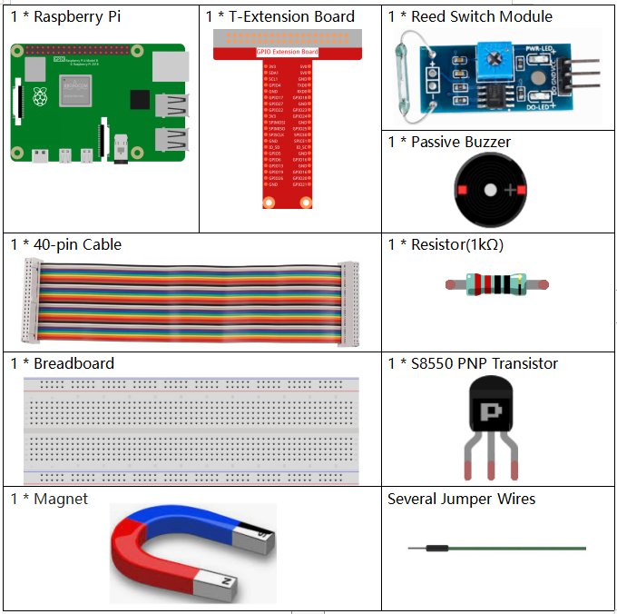
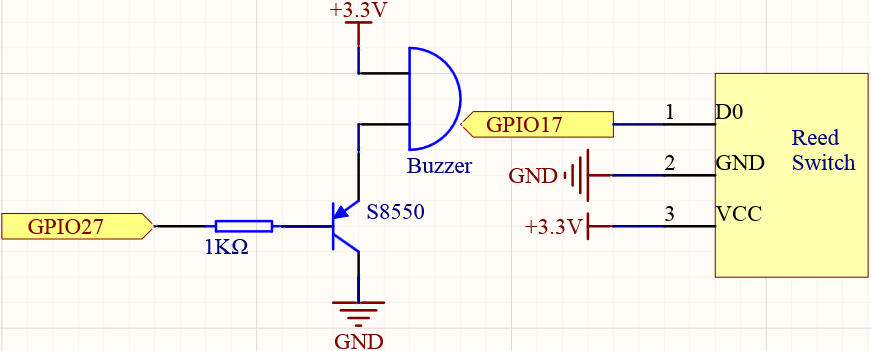
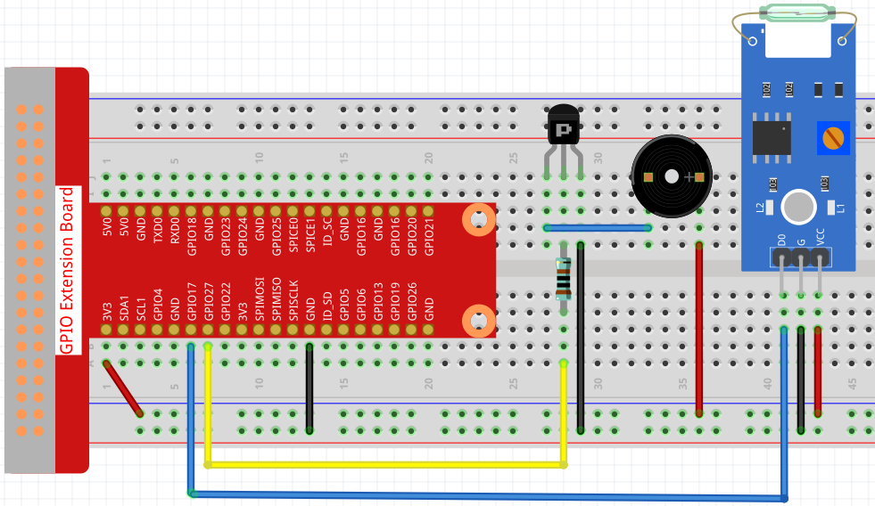

4.1.6 Security System
~~~~~~~~~~~~~~~~~~~~~~~~~~

Introduction
-----------------

Let's try to assemble a simple Security system with raspberry pi.

Components
----------------

**Schematic Diagram**
-----------------------

============ ======== ======== ===
T-Board Name physical wiringPi BCM
GPIO17       Pin 11   0        17
GPIO27       Pin 13   2        27
============ ======== ======== ===

Experimental Procedures
------------------------------

**Step 1:** Build the circuit.

**Step 2:** Get into the folder of the code.

.. code-block::

    cd /home/pi/raphael-kit/python/

**Step 3:** Run.

.. code-block::

    sudo python3 4.1.6_Securitysystem.py

If the reed switch is affected by the magnet (for example, the reed switch is placed on the base and the magnet is placed in the vase), the object is safe. At this time, the reed switch is in the closed state, and the buzzer is silent.
After removing the magnet (such as the vase being stolen), the reed switch is not affected by the magnetic field, the switch opens, and the buzzer sounds an alarm.

**Code Explanation**

.. code-block:: python

    def loop():
        while True:
            if GPIO.input(ReedPin) == 0:
                GPIO.output(BeepPin, GPIO.HIGH)
            else:
                GPIO.output(BeepPin, GPIO.LOW)
                time.sleep(0.1)
                GPIO.output(BeepPin, GPIO.HIGH)
                time.sleep(0.1)

We judge the state of the reed switch in the main loop. If the reed switch is closed, the buzzer does not work; otherwise, the buzzer beeps.

**Phenomenon Picture**
------------------------

.. image:: media/4.1.6_security.jpg
   :align: center

