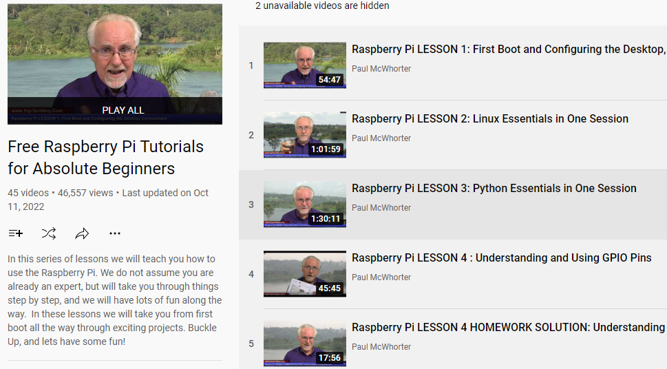

About Video Course
=========================

The kit also contains 45 free video lessons (30 hours) produced by SunFounder and Paul, a experienced programming educator.

Paul is an experienced programming educator with 300,000 followers on YouTube and currently has 45 Raspberry Pi video lessons that continue to be updated weekly.

The video lessons are made for beginners who have no basic programming skills and use the Sunfounder Ultimate Raspberry Pi Kit - Raphael Kit.

Here is the video link：https://www.youtube.com/playlist?list=PLGs0VKk2DiYxdMjCJmcP6jt4Yw6OHK85O

From the video, you will learn the following points：

* Master the installation, configuration and use of the Raspberry Pi system.
* Understanding and using Raspberry Pi GPIO pins.
* Learn Python's programming logic so you can control what happens in your scripts.
* Acquire the skill to create Python libraries to better prototype your ideas.
* Utilize multithreading to run multiple scripts at once.
* Know how to get and use analog signals from ADC module.
* Learn the circuit principles so that you can design the circuit to your own specifications.
* Get to know Joystick, Servo, Ultrasonic module, PIR, DHT11, I2C LCD, Keyboard, etc.

You don't have to worry about learning programming too hard, because we don't consider you an expert and will take you step by step, with simple and interesting projects to learn each point and make sure every beginner can learn.

Through the video tutorials, you can make temperature alarm systems, light sensing systems and security monitoring systems, all of which are very common and interesting projects in life.

