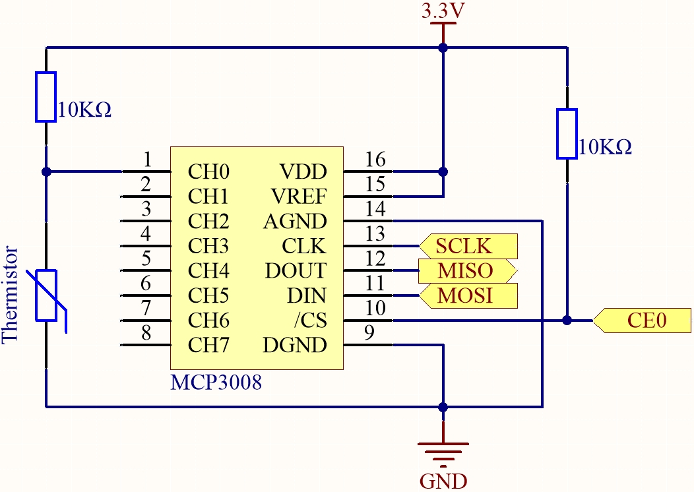

.. note::

    Bonjour, bienvenue dans la communauté SunFounder Raspberry Pi & Arduino & ESP32 Enthusiasts sur Facebook ! Approfondissez vos connaissances sur Raspberry Pi, Arduino et ESP32 avec d’autres passionnés.

    **Pourquoi rejoindre ?**

    - **Support d’experts** : Résolvez les problèmes après‑vente et les défis techniques avec l’aide de notre communauté et de notre équipe.
    - **Apprendre et partager** : Échangez des astuces et des tutoriels pour améliorer vos compétences.
    - **Aperçus exclusifs** : Accédez en avant‑première aux annonces de nouveaux produits et aux aperçus.
    - **Réductions spéciales** : Profitez de réductions exclusives sur nos tout derniers produits.
    - **Promotions et cadeaux festifs** : Participez à des concours et promotions spéciales pendant les fêtes.

    👉 Prêt à explorer et à créer avec nous ? Cliquez sur [|link_sf_facebook|] et rejoignez‑nous dès aujourd’hui !

.. _2.2.2_c_mcp3008:

2.2.2 Thermistance (MCP3008)
============================

.. note::

   .. image:: ../img/mcp3008_and_adc0834.jpg
      :width: 25%
      :align: left
    

   Selon la version de votre kit, identifiez si vous disposez d’un **ADC0834** ou d’un **MCP3008** et suivez la section correspondante.

Introduction
------------

Tout comme une photo‑résistance peut détecter la lumière, une thermistance est un composant électronique sensible à la température pouvant être utilisé pour réaliser des fonctions de contrôle de la température, par exemple un système d’alerte de surchauffe.

Composants requis
-----------------

Dans ce projet, nous avons besoin des composants suivants. 

.. image:: ../img/list2_2.2.2_thermistor.png

Il est bien sûr pratique d’acheter un kit complet, voici le lien : 

.. list-table::
    :widths: 20 20 20
    :header-rows: 1

    *   - Nom	
        - ÉLÉMENTS DANS CE KIT
        - LIEN
    *   - Kit Raphael
        - 337
        - |link_Raphael_kit|

Vous pouvez également les acheter séparément via les liens ci‑dessous.

.. list-table::
    :widths: 30 20
    :header-rows: 1

    *   - INTRODUCTION DU COMPOSANT
        - LIEN D’ACHAT

    *   - :ref:`cpn_gpio_extension_board`
        - |link_gpio_board_buy|
    *   - :ref:`cpn_breadboard`
        - |link_breadboard_buy|
    *   - :ref:`cpn_wires`
        - |link_wires_buy|
    *   - :ref:`cpn_resistor`
        - |link_resistor_buy|
    *   - :ref:`cpn_thermistor`
        - |link_thermistor_buy|
    *   - :ref:`cpn_mcp3008`
        - \-

Schéma de câblage
-----------------

.. list-table::
    :widths: 30 30 30 30
    :header-rows: 1

    *   - Nom T‑Board
        - physique
        - WiringPi
        - BCM

    *   - SPICE0
        - pin24
        - 10
        - 8
    *   - SPIMOSI
        - pin19
        - 12
        - 10
    *   - SPIMISO
        - pin21
        - 13
        - 9
    *   - SPISCLK
        - pin23
        - 14
        - 11

Procédures expérimentales
-------------------------

**Étape 1 :** Construisez le circuit.

.. image:: ../img/july24_2.2.2_thermistor_mcp3008.png

**Étape 2 :** Accédez au dossier du code.

.. raw:: html

   <run></run>

.. code-block::

    cd ~/raphael-kit/c/2.2.2-2/

**Étape 3 :** Compilez le code.

.. raw:: html

   <run></run>

.. code-block::

    gcc 2.2.2_Thermistor.c -o Thermistor -lwiringPi -lm

.. note::
    -lm permet de charger la bibliothèque mathématique. Ne l’omettez pas, sinon une erreur se produira.

**Étape 4 :** Exécutez l’exécutable.

.. raw:: html

   <run></run>

.. code-block::

    ./Thermistor

Lorsque le code s’exécute, la thermistance détecte la température ambiante qui sera affichée à l’écran après calcul du programme.

.. note::

    Si cela ne fonctionne pas après exécution ou s’il y a un message d’erreur : « wiringPi.h : No such file or directory », veuillez vous référer à :ref:`install_wiringpi`.

**Code**

.. code-block:: c

    #include <wiringPi.h>
    #include <wiringPiSPI.h>
    #include <stdio.h>
    #include <math.h>

    #define SPI_CHANNEL 0  // CE0
    #define SPI_SPEED   1000000  // 1MHz

    int read_ADC(int channel) {
        if (channel < 0 || channel > 7) return -1;

        unsigned char buffer[3];
        buffer[0] = 1;  // Bit de démarrage
        buffer[1] = (8 + channel) << 4;  // Mode simple + canal
        buffer[2] = 0;

        wiringPiSPIDataRW(SPI_CHANNEL, buffer, 3);

        int value = ((buffer[1] & 3) << 8) | buffer[2];
        return value;
    }

    int main(void) {
        int analogVal;
        double Vr, Rt, temp, cel, Fah;

        if (wiringPiSetup() == -1) {
            printf("Échec de l’initialisation de wiringPi !\n");
            return 1;
        }

        if (wiringPiSPISetup(SPI_CHANNEL, SPI_SPEED) == -1) {
            printf("Échec de la configuration SPI !\n");
            return 1;
        }

        while (1) {
            analogVal = read_ADC(0);  // Lecture sur CH0

            // MCP3008 est un ADC 10 bits (0–1023)
            Vr = 3.3 * analogVal / 1023.0;  // Hypothèse Vref = 3,3 V
            Rt = 10000.0 * Vr / (3.3 - Vr); // Diviseur de tension, résistance 10kΩ
            temp = 1 / ((log(Rt / 10000.0) / 3950.0) + (1 / (273.15 + 25.0)));
            cel = temp - 273.15;
            Fah = cel * 1.8 + 32;

            printf("Celsius : %.2f °C  Fahrenheit : %.2f °F\n", cel, Fah);
            delay(1000);
        }

        return 0;
    }

Explication du code
-------------------

.. code-block:: c

    #include <wiringPi.h>
    #include <wiringPiSPI.h>
    #include <stdio.h>
    #include <math.h>

Ces fichiers d’en-tête incluent les bibliothèques pour le contrôle GPIO (``wiringPi.h``), la communication SPI (``wiringPiSPI.h``), les opérations d’E/S standard (``stdio.h``) et les fonctions mathématiques (``math.h``) en C.

.. code-block:: c

    #define SPI_CHANNEL 0
    #define SPI_SPEED   1000000

Définit les constantes pour le canal SPI et la vitesse de communication SPI. Ici, le canal SPI 0 (CE0) et une vitesse d’horloge de 1 MHz sont utilisés.

.. code-block:: c

    int read_ADC(int channel)

Cette fonction lit les données analogiques depuis un canal spécifié de l’ADC MCP3008.

.. code-block:: c

    buffer[0] = 1;
    buffer[1] = (8 + channel) << 4;
    buffer[2] = 0;

Ces lignes formatent la commande SPI selon le protocole MCP3008 : un bit de démarrage, la configuration en mode simple et le numéro de canal.

.. code-block:: c

    wiringPiSPIDataRW(SPI_CHANNEL, buffer, 3);

Transmet la commande SPI et reçoit les données ADC 10 bits du MCP3008.

.. code-block:: c

    int value = ((buffer[1] & 3) << 8) | buffer[2];

Extrait et combine le résultat ADC 10 bits à partir du tampon SPI retourné.

.. code-block:: c

    if (wiringPiSetup() == -1) { ... }
    if (wiringPiSPISetup(SPI_CHANNEL, SPI_SPEED) == -1) { ... }

Ces lignes initialisent WiringPi et configurent le SPI. Si l’initialisation échoue, le programme se termine.

.. code-block:: c

    analogVal = read_ADC(0);

Lit le signal analogique depuis le canal 0 du MCP3008, où le pont diviseur de la thermistance est connecté.

.. code-block:: c

    Vr = 3.3 * analogVal / 1023.0;

Convertit la valeur numérique de l’ADC en une tension analogique. La plage ADC est de 0–1023 avec une tension de référence de 3,3 V.

.. code-block:: c

    Rt = 10000.0 * Vr / (3.3 - Vr);

Calcule la résistance de la thermistance à l’aide de la formule du diviseur de tension. Une résistance de 10 kΩ est supposée en série avec la thermistance.

.. code-block:: c

    temp = 1 / ((log(Rt / 10000.0) / 3950.0) + (1 / (273.15 + 25.0)));

Utilise l’équation du paramètre B pour convertir la résistance de la thermistance en température en Kelvin.  
 
**T(K) = 1 / [ln(Rt/R₀)/B + 1/T₀]**, où  
- R₀ = 10 kΩ  
- B = 3950  
- T₀ = 25 °C = 298,15 K

.. code-block:: c

    cel = temp - 273.15;

Convertit la température de Kelvin en degrés Celsius.

.. code-block:: c

    Fah = cel * 1.8 + 32;

Convertit la température Celsius en degrés Fahrenheit.

.. code-block:: c

    printf("Celsius : %.2f °C  Fahrenheit : %.2f °F\n", cel, Fah);

Affiche la température en Celsius et en Fahrenheit sur le terminal avec deux décimales de précision.
