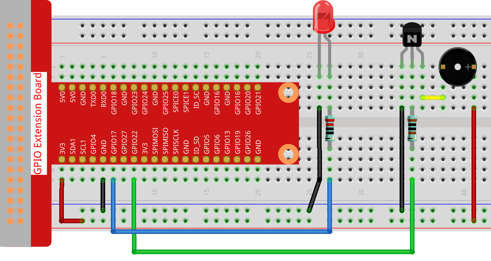

.. note::

    ¡Hola! Bienvenido a la Comunidad de Entusiastas de SunFounder Raspberry Pi & Arduino & ESP32 en Facebook. Sumérgete más en Raspberry Pi, Arduino y ESP32 con otros entusiastas.

    **¿Por qué unirte?**

    - **Soporte experto**: Resuelve problemas postventa y desafíos técnicos con la ayuda de nuestra comunidad y equipo.
    - **Aprende y comparte**: Intercambia consejos y tutoriales para mejorar tus habilidades.
    - **Avances exclusivos**: Obtén acceso anticipado a nuevos anuncios de productos y vistas previas.
    - **Descuentos especiales**: Disfruta de descuentos exclusivos en nuestros productos más nuevos.
    - **Promociones y sorteos festivos**: Participa en sorteos y promociones de temporada.

    👉 ¿Listo para explorar y crear con nosotros? Haz clic en [|link_sf_facebook|] y únete hoy mismo!

.. _3.1.10_c:

3.1.10 Generador de Código Morse
===================================

Introducción
-----------------

En este proyecto, crearemos un generador de código Morse, donde escribirás una 
serie de letras en inglés en la Raspberry Pi para que aparezca como código Morse.

Componentes necesarios
------------------------------

En este proyecto, necesitamos los siguientes componentes.

.. image:: ../img/3.1.10.png
    :align: center

Es definitivamente conveniente comprar un kit completo, aquí está el enlace:

.. list-table::
    :widths: 20 20 20
    :header-rows: 1

    *   - Nombre	
        - COMPONENTES EN ESTE KIT
        - ENLACE
    *   - Kit Raphael
        - 337
        - |link_Raphael_kit|

También puedes comprarlos por separado en los enlaces a continuación.

.. list-table::
    :widths: 30 20
    :header-rows: 1

    *   - INTRODUCCIÓN DEL COMPONENTE
        - ENLACE DE COMPRA

    *   - :ref:`cpn_gpio_extension_board`
        - |link_gpio_board_buy|
    *   - :ref:`cpn_breadboard`
        - |link_breadboard_buy|
    *   - :ref:`cpn_wires`
        - |link_wires_buy|
    *   - :ref:`cpn_resistor`
        - |link_resistor_buy|
    *   - :ref:`cpn_led`
        - |link_led_buy|
    *   - :ref:`cpn_buzzer`
        - \-
    *   - :ref:`cpn_transistor`
        - |link_transistor_buy|

Diagrama Esquemático
---------------------------

============== ========== ======== ===
Nombre T-Board Pin físico wiringPi BCM
GPIO17         Pin 11     0        17
GPIO22         Pin 15     3        22
============== ========== ======== ===

.. image:: ../img/Schematic_three_one11.png
   :align: center

Procedimientos Experimentales
-----------------------------------

**Paso 1:** Construir el circuito. (Presta atención a los polos del zumbador: el que 
tiene la etiqueta + es el polo positivo y el otro es el negativo).

**Paso 2**: Abre el archivo de código.

.. raw:: html

   <run></run>

.. code-block:: 

    cd ~/raphael-kit/c/3.1.10/

**Paso 3**: Compila el código.

.. raw:: html

   <run></run>

.. code-block:: 

    gcc 3.1.10_MorseCodeGenerator.c -lwiringPi

**Paso 4**: Ejecuta el archivo ejecutable anterior.

.. raw:: html

   <run></run>

.. code-block:: 

    sudo ./a.out

Después de que el programa se ejecute, escribe una serie de caracteres y 
el zumbador y el LED enviarán las señales de código Morse correspondientes.

.. note::

    Si no funciona después de ejecutarlo, o aparece un mensaje de error: \"wiringPi.h: No such file or directory\", consulta :ref:`install_wiringpi`.

**Explicación del Código**

.. code-block:: c

    struct MORSE{
        char word;
        unsigned char *code;
    };

    struct MORSE morseDict[]=
    {
        {'A',"01"}, {'B',"1000"}, {'C',"1010"}, {'D',"100"}, {'E',"0"}, 
        {'F',"0010"}, {'G',"110"}, {'H',"0000"}, {'I',"00"}, {'J',"0111"}, 
        {'K',"101"}, {'L',"0100"}, {'M',"11"}, {'N',"10"}, {'O',"111"}, 
        {'P',"0110"}, {'Q',"1101"}, {'R',"010"}, {'S',"000"}, {'T',"1"},
        {'U',"001"}, {'V',"0001"}, {'W',"011"}, {'X',"1001"}, {'Y',"1011"}, 
        {'Z',"1100"},{'1',"01111"}, {'2',"00111"}, {'3',"00011"}, {'4',"00001"}, 
        {'5',"00000"},{'6',"10000"}, {'7',"11000"}, {'8',"11100"}, {'9',"11110"},
        {'0',"11111"},{'?',"001100"}, {'/',"10010"}, {',',"110011"}, {'.',"010101"},
        {';',"101010"},{'!',"101011"}, {'@',"011010"}, {':',"111000"}
    };

Esta estructura MORSE es el diccionario del código Morse, que contiene los caracteres 
A-Z, números 0-9 y símbolos “?” “/” “:” “,” “.” “;” “!” “@”.

.. code-block:: c

    char *lookup(char key,struct MORSE *dict,int length)
    {
        for (int i=0;i<length;i++)
        {
            if(dict[i].word==key){
                return dict[i].code;
            }
        }    
    }

La función  ``lookup()`` funciona “consultando el diccionario”. Define una ``key`` que 
busca las palabras iguales a ``key`` en la estructura ``morseDict`` y devuelve la información 
correspondiente — ``code`` de la palabra determinada.

.. code-block:: c

    void on(){
        digitalWrite(ALedPin,HIGH);
        digitalWrite(BeepPin,HIGH);     
    }

Crea una función ``on()`` para activar el zumbador y el LED.

.. code-block:: c

    void off(){
        digitalWrite(ALedPin,LOW);
        digitalWrite(BeepPin,LOW);
    }

La función ``off()`` apaga el zumbador y el LED.

.. code-block:: c

    void beep(int dt){
        on();
        delay(dt);
        off();
        delay(dt);
    }

Define una función ``beep()`` para que el zumbador y el LED emitan sonidos y parpadeen 
en un intervalo determinado de **dt**.

.. code-block:: c

    void morsecode(char *code){
        int pause = 250;
        char *point = NULL;
        int length = sizeof(morseDict)/sizeof(morseDict[0]);
        for (int i=0;i<strlen(code);i++)
        {
            point=lookup(code[i],morseDict,length);
            for (int j=0;j<strlen(point);j++){
                if (point[j]=='0')
                {
                    beep(pause/2);
                }else if(point[j]=='1')
                {
                    beep(pause);
                }
                delay(pause);
            }
        }
    }

La función `morsecode()` se utiliza para procesar el código Morse de los 
caracteres de entrada haciendo que el “1” del código mantenga la emisión de 
sonidos o luces y el “0” emita brevemente sonidos o luces, por ejemplo, si se 
ingresa “SOS”, habrá una señal que contiene tres segmentos cortos, tres largos 
y luego tres cortos “ · · · - - - · · · ”.

.. code-block:: c

    int toupper(int c)
    {
        if ((c >= 'a') && (c <= 'z'))
            return c + ('A' - 'a');
        return c;
    }
    char *strupr(char *str)
    {
        char *orign=str;
        for (; *str!='\0'; str++)
            *str = toupper(*str);
    return orign;
    }

Antes de codificar, necesitas unificar las letras en mayúsculas.

.. code-block:: c

    void main(){
        setup();
        char *code;
        int length=8;
        code = (char*)malloc(sizeof(char)*length);
        while (1){
            printf("Please input the messenger:");
            scanf("%s",code);
            code=strupr(code);
            printf("%s\n",code);
            morsecode(code);
        }
    }

Cuando escribes los caracteres relevantes con el teclado, ``code=strupr(code)`` convertirá las letras ingresadas en su forma mayúscula.

``Printf()``  luego imprime el texto claro en la pantalla de la computadora, y la función ``morsecod()`` hace que el zumbador y el LED emitan el código Morse.

Ten en cuenta que la longitud del carácter de entrada no debe exceder el **length** (se puede revisar).

Foto del Fenómeno
-----------------------

.. image:: ../img/image270.jpeg
   :align: center