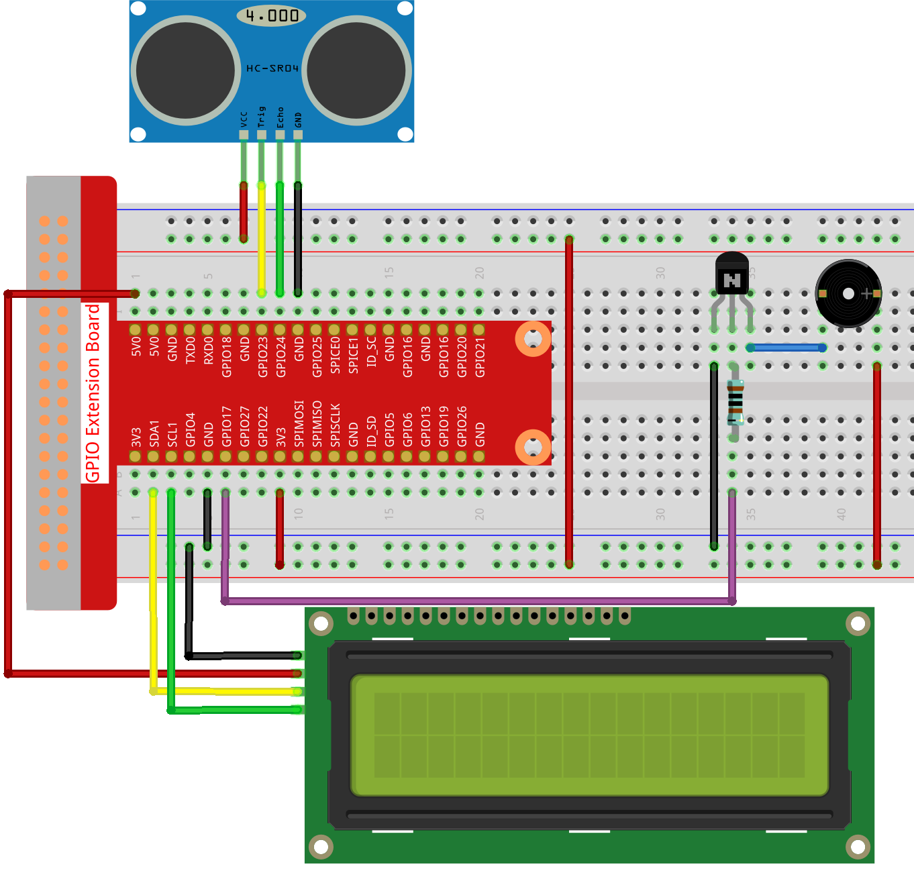
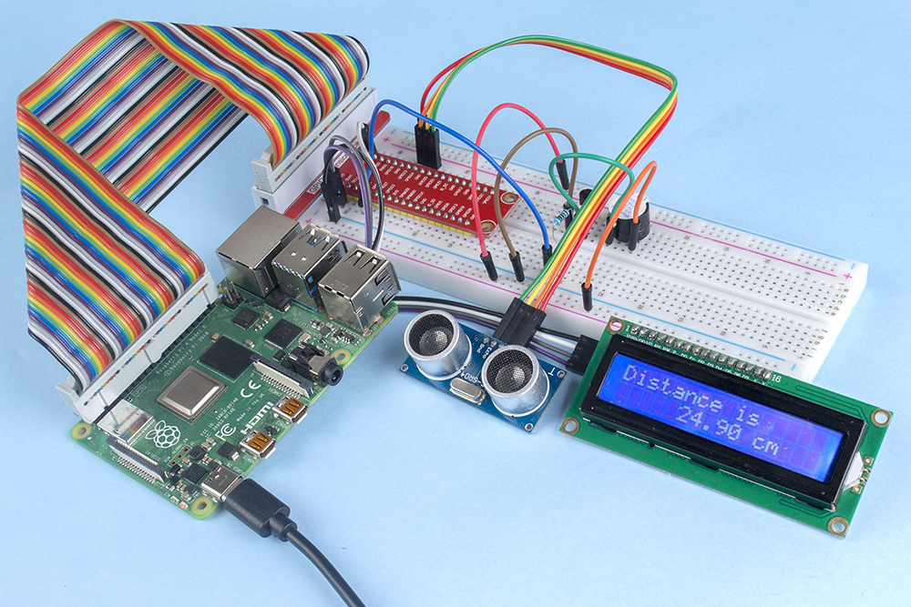

.. note::

    こんにちは、SunFounderのRaspberry Pi & Arduino & ESP32愛好家コミュニティへようこそ！Facebook上でRaspberry Pi、Arduino、ESP32についてもっと深く掘り下げ、他の愛好家と交流しましょう。

    **参加する理由は？**

    - **エキスパートサポート**：コミュニティやチームの助けを借りて、販売後の問題や技術的な課題を解決します。
    - **学び＆共有**：ヒントやチュートリアルを交換してスキルを向上させましょう。
    - **独占的なプレビュー**：新製品の発表や先行プレビューに早期アクセスしましょう。
    - **特別割引**：最新製品の独占割引をお楽しみください。
    - **祭りのプロモーションとギフト**：ギフトや祝日のプロモーションに参加しましょう。

    👉 私たちと一緒に探索し、創造する準備はできていますか？[|link_sf_facebook|]をクリックして今すぐ参加しましょう！

.. _3.1.3_c:

3.1.3 逆転アラーム
===========================

はじめに
-------------

このプロジェクトでは、LCD、ブザー、超音波センサーを使用して、逆転補助システムを作成します。これをリモコンの車両に取り付けて、車をガレージに逆駐車する実際のプロセスをシミュレートすることができます。

必要な部品
------------------------------

このプロジェクトには以下の部品が必要です。

.. image:: ../img/list_Reversing_Alarm.png
    :align: center

全てのキットを購入すると便利です。以下はそのリンクです。

.. list-table::
    :widths: 20 20 20
    :header-rows: 1

    *   - 名前
        - このキットのアイテム
        - リンク
    *   - Raphael Kit
        - 337
        - |link_Raphael_kit|

以下のリンクから個別に購入することも可能です。

.. list-table::
    :widths: 30 20
    :header-rows: 1

    *   - コンポーネントの紹介
        - 購入リンク

    *   - :ref:`cpn_gpio_board`
        - |link_gpio_board_buy|
    *   - :ref:`cpn_breadboard`
        - |link_breadboard_buy|
    *   - :ref:`cpn_wires`
        - |link_wires_buy|
    *   - :ref:`cpn_resistor`
        - |link_resistor_buy|
    *   - :ref:`cpn_buzzer`
        - \-
    *   - :ref:`cpn_transistor`
        - |link_transistor_buy|
    *   - :ref:`cpn_ultrasonic_sensor`
        - |link_ultrasonic_buy|
    *   - :ref:`cpn_i2c_lcd`
        - |link_i2clcd1602_buy|

回路図
--------------------

超音波センサーは障害物との距離を検出し、その情報をコードの形でLCDに表示します。同時に、超音波センサーは距離の値に応じてブザーから異なる周波数の警告音を発します。

============ ======== ======== ===
T-Board Name physical wiringPi BCM
GPIO23       Pin 16   4        23
GPIO24       Pin 18   5        24
GPIO17       Pin 11   0        17
SDA1         Pin 3             
SCL1         Pin 5             
============ ======== ======== ===

.. image:: ../img/Schematic_three_one3.png
   :align: center

実験手順
------------------------

**ステップ1:** 回路を組み立てる。

**ステップ2:** ディレクトリを変更する。

.. raw:: html

   <run></run>

.. code-block:: 

    cd ~/raphael-kit/c/3.1.3/

**ステップ3:** コンパイルする。

.. raw:: html

   <run></run>

.. code-block:: 

    gcc 3.1.3_ReversingAlarm.c -lwiringPi

**ステップ4:** 実行する。

.. raw:: html

   <run></run>

.. code-block:: 

    sudo ./a.out

コードを実行すると、超音波センサーモジュールは障害物までの距離を検出し、その情報をLCD1602に表示します。さらに、ブザーは距離に応じて周波数が変わる警告音を出します。

.. note::

    * エラープロンプト ``wiringPi.h: No such file or directory`` が表示された場合は、 :ref:`install_wiringpi` を参照してください。
    * ``Unable to open I2C device: No such file or directory`` というエラーが出た場合、 :ref:`i2c_config` を参照してI2Cを有効にし、配線が正しいか確認してください。
    * コードと配線が正しいのにLCDに内容が表示されない場合、背面の可変抵抗を回してコントラストを調整してください。

**コード**

.. note::
    下記のコードは不完全です。完全なコードを確認するには、コマンドnano 3.1.1_ReversingAlarm.cを使用することをおすすめします。

.. code-block:: c

    #include <wiringPi.h>
    #include <stdio.h>
    #include <sys/time.h>
    #include <wiringPi.h>
    #include <wiringPiI2C.h>
    #include <string.h>

    #define Trig    4
    #define Echo    5
    #define Buzzer  0

    int LCDAddr = 0x27;
    int BLEN = 1;
    int fd;

    //here is the function of LCD
    void write_word(int data){...}

    void send_command(int comm){...}

    void send_data(int data){...}

    void lcdInit(){...}

    void clear(){...}

    void write(int x, int y, char data[]){...}

    //here is the function of Ultrasonic
    void ultraInit(void){...}

    float disMeasure(void){...}

    //here is the main function
    int main(void)
    {
        float dis;
        char result[10];
        if(wiringPiSetup() == -1){ 
            printf("setup wiringPi failed !");
            return 1;
        }

        pinMode(Buzzer,OUTPUT);
        fd = wiringPiI2CSetup(LCDAddr);
        lcdInit();
        ultraInit();

        clear();
        write(0, 0, "Ultrasonic Starting"); 
        write(1, 1, "By Sunfounder");   

        while(1){
            dis = disMeasure();
            printf("%.2f cm \n",dis);
            digitalWrite(Buzzer,LOW);
            if (dis > 400){
                clear();
                write(0, 0, "Error");
                write(3, 1, "Out of range");    
                delay(500);
            }
            else
            {
                clear();
                write(0, 0, "Distance is");
                sprintf(result,"%.2f cm",dis);
                write(5, 1, result);

                if(dis>=50)
                {delay(500);}
                else if(dis<50 & dis>20) {
                    for(int i=0;i<2;i++){
                    digitalWrite(Buzzer,HIGH);
                    delay(50);
                    digitalWrite(Buzzer,LOW);
                    delay(200);
                    }
                }
                else if(dis<=20){
                    for(int i=0;i<5;i++){
                    digitalWrite(Buzzer,HIGH);
                    delay(50);
                    digitalWrite(Buzzer,LOW);
                    delay(50);
                    }
                }
            }   
        }

        return 0;
    }

**コード説明**

.. code-block:: c

    pinMode(Buzzer,OUTPUT);
    fd = wiringPiI2CSetup(LCDAddr);
    lcdInit();
    ultraInit();

このプログラムでは、前回のコンポーネントを総合的に応用しています。ここではブザー、LCD、超音波を使用しています。以前と同じ方法でこれらを初期化することができます。

.. code-block:: c

    dis = disMeasure();
    printf("%.2f cm \n",dis);
    digitalWrite(Buzzer,LOW);
    if (dis > 400){
        write(0, 0, "Error");
        write(3, 1, "Out of range");    
    }
    else
    {
        write(0, 0, "Distance is");
        sprintf(result,"%.2f cm",dis);
        write(5, 1, result);
    }

ここでは超音波センサの値を取得し、計算を通じて距離を取得します。

距離の値が検出される範囲値よりも大きい場合、LCDにエラーメッセージが表示されます。そして、距離の値が範囲内であれば、対応する結果が出力されます。

.. code-block:: c

    sprintf(result,"%.2f cm",dis);

LCDの出力モードは文字型のみをサポートしているため、変数disにはfloat型の値が格納されているので、sprintf()を使用する必要があります。この関数はfloat型の値を文字に変換し、文字変数result[]に格納します。%.2fは小数点以下2桁を保持することを意味します。

.. code-block:: c

    if(dis>=50)
    {delay(500);}
    else if(dis<50 & dis>20) {
        for(int i=0;i<2;i++){
        digitalWrite(Buzzer,HIGH);
        delay(50);
        digitalWrite(Buzzer,LOW);
        delay(200);
        }
    }
    else if(dis<=20){
        for(int i=0;i<5;i++){
        digitalWrite(Buzzer,HIGH);
        delay(50);
        digitalWrite(Buzzer,LOW);
        delay(50);
        }
    }

この判定条件はブザーの音を制御するために使用されます。距離の違いにより、3つのケースに分けられ、それぞれで異なる音の周波数が出力されます。delayの合計値が500であるため、すべてのケースで超音波センサーに500msの間隔を提供できます。

現象の画像
--------------------

