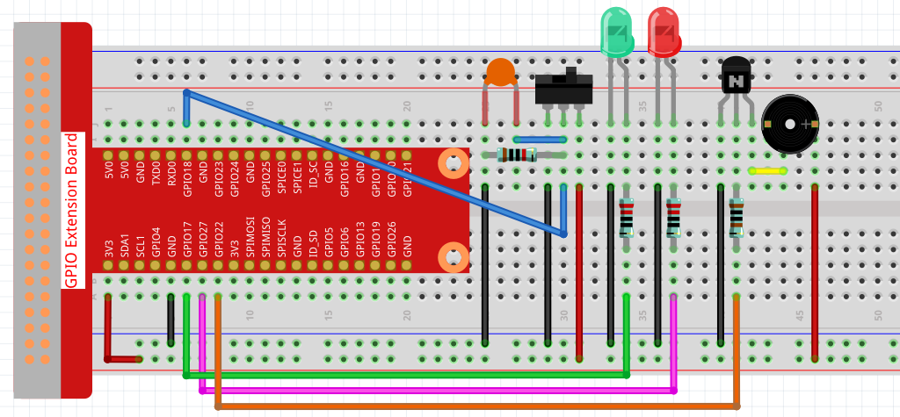

.. _3.1.9_c:

3.1.9 Alarmglocke
~~~~~~~~~~~~~~~~~~~~~~

Einführung
-------------

In diesem Projekt erstellen wir ein manuelles Alarmsystem. Sie können den Kippschalter durch einen Thermistor oder einen lichtempfindlichen Sensor ersetzen, um einen Temperaturalarm oder einen Lichtalarm zu erstellen.

Benötigte Komponenten
------------------------------

Für dieses Projekt benötigen wir folgende Komponenten.

.. image:: ../img/list_Alarm_Bell.png
    :align: center

Es ist definitiv praktisch, ein gesamtes Kit zu kaufen, hier ist der Link:

.. list-table::
    :widths: 20 20 20
    :header-rows: 1

    *   - Name	
        - ARTIKEL IN DIESEM KIT
        - LINK
    *   - Raphael Kit
        - 337
        - |link_Raphael_kit|

Sie können sie auch separat über die untenstehenden Links kaufen.

.. list-table::
    :widths: 30 20
    :header-rows: 1

    *   - KOMPONENTENBESCHREIBUNG
        - KAUF-LINK

    *   - :ref:`cpn_gpio_board`
        - |link_gpio_board_buy|
    *   - :ref:`cpn_breadboard`
        - |link_breadboard_buy|
    *   - :ref:`cpn_wires`
        - |link_wires_buy|
    *   - :ref:`cpn_resistor`
        - |link_resistor_buy|
    *   - :ref:`cpn_led`
        - |link_led_buy|
    *   - :ref:`cpn_Buzzer`
        - |link_passive_buzzer_buy|
    *   - :ref:`cpn_slide_switch`
        - |link_slide_switch_buy|
    *   - :ref:`cpn_transistor`
        - |link_transistor_buy|
    *   - :ref:`cpn_capacitor`
        - |link_capacitor_buy|

Schaltplan
-------------------

============ ======== ======== ===
T-Board Name physical wiringPi BCM
GPIO17       Pin 11   0        17
GPIO18       Pin 12   1        18
GPIO27       Pin 13   2        27
GPIO22       Pin 15   3        22
============ ======== ======== ===

.. image:: ../img/Schematic_three_one10.png
   :align: center

Experimentelle Verfahren
-----------------------------

**Schritt 1**: Schalten Sie den Stromkreis.

**Schritt 2**: Verzeichnis wechseln.

.. raw:: html

   <run></run>

.. code-block:: 

    cd ~/raphael-kit/c/3.1.9/

**Schritt 3**: Kompilieren.

.. raw:: html

   <run></run>

.. code-block::

    gcc 3.1.9_AlarmBell.c -lwiringPi -lpthread

**Schritt 4**: Ausführen.

.. raw:: html

   <run></run>

.. code-block::

    sudo ./a.out

Nachdem das Programm gestartet wurde, schieben Sie den Schiebeschalter nach rechts und der Summer gibt Alarmsignale aus. Gleichzeitig blinken die rote und grüne LED mit einer bestimmten Frequenz.

.. note::

    Wenn es nach dem Start nicht funktioniert oder eine Fehlermeldung angezeigt wird: \"wiringPi.h: No such file or directory\", beziehen Sie sich bitte auf :ref:`install_wiringpi`.

**Code-Erklärung**

.. code-block:: c

    #include <pthread.h>

In diesem Code verwenden Sie eine neue Bibliothek, ``pthread.h``, die ein Satz von gängigen Thread-Bibliotheken ist und die Mehrfachverkabelung ermöglicht. Wir fügen beim Kompilieren den Parameter ``-lpthread`` hinzu, um das unabhängige Arbeiten der LED und des Summers zu ermöglichen.

.. code-block:: c

    void *ledWork(void *arg){       
        while(1)    
        {   
            if(flag==0){
                pthread_exit(NULL);
            }
            digitalWrite(ALedPin,HIGH);
            delay(500);
            digitalWrite(ALedPin,LOW);
            digitalWrite(BLedPin,HIGH);
            delay(500);
            digitalWrite(BLedPin,LOW);
        }
    }

Die Funktion ``ledWork()`` dient dazu, den Arbeitszustand dieser 2 LEDs festzulegen:
Sie lässt die grüne LED für 0,5 Sekunden leuchten und schaltet sie dann aus;
ebenso lässt sie die rote LED für 0,5 Sekunden leuchten und schaltet sie dann aus.

.. code-block:: c

    void *buzzWork(void *arg){
        while(1)
        {
            if(flag==0){
                pthread_exit(NULL);
            }
            if((note>=800)||(note<=130)){
                pitch = -pitch;
            }
            note=note+pitch;
            softToneWrite(BeepPin,note);
            delay(10);
        }
    }

Die Funktion ``buzzWork()`` wird verwendet, um den Arbeitszustand des Buzzers festzulegen.
Hier setzen wir die Frequenz zwischen 130 und 800, um in einem Intervall von 20 zu akkumulieren oder abzubauen.

.. code-block:: c

    void on(){
        flag = 1;
        if(softToneCreate(BeepPin) == -1){
            printf("setup softTone failed !");
            return; 
        }    
        pthread_t tLed;     
        pthread_create(&tLed,NULL,ledWork,NULL);    
        pthread_t tBuzz;  
        pthread_create(&tBuzz,NULL,buzzWork,NULL);      
    }

In der Funktion on():

1) Definieren Sie die Markierung ``flag=1``, die das Ende des Steuerthreads anzeigt.

2) Erstellen Sie einen softwaregesteuerten Tonpin ``BeepPin``.

3) Erstellen Sie zwei separate Threads, damit die LED und der Buzzer gleichzeitig arbeiten können.

* ``pthread_t tLed``: Ein Thread ``tLed`` deklarieren.
* ``pthread_create(&tLed,NULL,ledWork,NULL)``: Erstellen Sie den Thread und sein Prototyp lautet wie folgt:

.. code-block:: 

    int pthread_create(pthread_t *restrict tidp,const pthread_attr_t*restrict_attr,void*（*start_rtn)(void*),void *restrict arg);

Bei Erfolg, Rückgabewert 0; sonst wird die Fehlerzahl -1 zurückgegeben.

* Das erste Parameter ist ein Zeiger auf die Thread-Identifikation.
* Das zweite dient zur Festlegung des Thread-Attributs.
* Das dritte ist die Startadresse der Thread-Ausführungsfunktion.
* Das letzte ist das, das die Funktion ausführt.

.. code-block:: c

    void off(){
        flag = 0;
        softToneStop(BeepPin);
        digitalWrite(ALedPin,LOW);
        digitalWrite(BLedPin,LOW);
    }

Die Funktion ``Off()`` definiert „flag=0“, um die Threads **ledWork** und **BuzzWork** zu beenden und dann den Buzzer und die LED auszuschalten.

.. code-block:: c

    int main(){       
        setup(); 
        int lastState = 0;
        while(1){
            int currentState = digitalRead(switchPin);
            if ((currentState == 1)&&(lastState==0)){
                on();
            }
            else if((currentState == 0)&&(lastState==1)){
                off();
            }
            lastState=currentState;
        }
        return 0;
    }

Main() enthält den gesamten Ablauf des Programms: Zuerst wird der Wert des Schiebeschalters gelesen; wenn der Kippschalter nach rechts gekippt wird (der Wert ist 1), wird die Funktion ``on()`` aufgerufen, der Buzzer gibt Töne ab und die roten und grünen LEDs blinken. Andernfalls arbeiten der Buzzer und die LED nicht.

Phänomen-Bild
------------------------

.. image:: ../img/image267.jpeg
   :align: center