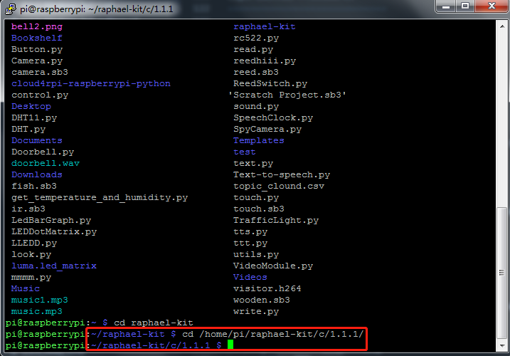

 
.. note::

    Bonjour et bienvenue dans la Communauté Facebook des passionnés de Raspberry Pi, Arduino et ESP32 de SunFounder ! Plongez plus profondément dans l'univers des Raspberry Pi, Arduino et ESP32 avec d'autres passionnés.

    **Pourquoi rejoindre ?**

    - **Support d'experts** : Résolvez les problèmes après-vente et les défis techniques avec l'aide de notre communauté et de notre équipe.
    - **Apprendre et partager** : Échangez des astuces et des tutoriels pour améliorer vos compétences.
    - **Aperçus exclusifs** : Accédez en avant-première aux annonces de nouveaux produits et aux aperçus.
    - **Réductions spéciales** : Profitez de réductions exclusives sur nos produits les plus récents.
    - **Promotions festives et cadeaux** : Participez à des cadeaux et des promotions de vacances.

    👉 Prêt à explorer et à créer avec nous ? Cliquez [|link_sf_facebook|] et rejoignez-nous aujourd'hui !

.. _1.1.1_c_pi5:

1.1.1 LED Clignotant
=========================

Introduction
-----------------

Dans ce projet, nous allons apprendre à créer une LED clignotante par programmation.
Grâce à vos réglages, votre LED peut produire une série de phénomènes intéressants. Allons-y.

Composants nécessaires
------------------------------

Dans ce projet, nous avons besoin des composants suivants.

.. image:: ../img/blinking_led_list.png
    :width: 800
    :align: center

Il est certainement pratique d'acheter un kit complet, voici le lien :

.. list-table::
    :widths: 20 20 20
    :header-rows: 1

    *   - Name	
        - ITEMS IN THIS KIT
        - LINK
    *   - Raphael Kit
        - 337
        - |link_Raphael_kit|

Vous pouvez également les acheter séparément via les liens ci-dessous.

.. list-table::
    :widths: 30 20
    :header-rows: 1

    *   - INTRODUCTION DES COMPOSANTS
        - LIEN D'ACHAT

    *   - :ref:`cpn_gpio_extension_board`
        - |link_gpio_board_buy|
    *   - :ref:`cpn_breadboard`
        - |link_breadboard_buy|
    *   - :ref:`cpn_wires`
        - |link_wires_buy|
    *   - :ref:`cpn_resistor`
        - |link_resistor_buy|
    *   - :ref:`cpn_led`
        - |link_led_buy|

Schéma de câblage
---------------------

Dans cette expérience, connectez une résistance de 220Ω à l'anode (la longue broche de la LED),
puis la résistance à 3,3 V, et connectez la cathode (la broche courte) de la LED à GPIO17 du Raspberry Pi.
Ainsi, pour allumer une LED, nous devons rendre GPIO17 à un niveau bas (0V).
Nous pouvons obtenir ce phénomène par programmation.

.. note::

    **Pin11** se réfère à la 11ème broche du Raspberry Pi de gauche à droite, et ses numéros de broche correspondants **wiringPi** et **BCM** sont indiqués dans le tableau suivant.

Dans le contenu lié au langage C, nous faisons équivaloir GPIO0 à 0 dans wiringPi.
Parmi le contenu lié au langage Python, BCM 17 est 17 dans la colonne BCM du tableau suivant.
En même temps, ils sont les mêmes que la 11ème broche du Raspberry Pi, Pin 11.

============ ======== ======== ===
Nom T-Board  Physique wiringPi BCM
GPIO17       Pin 11   0        17
============ ======== ======== ===

.. image:: ../img/image48.png
    :width: 800
    :align: center

Procédures expérimentales
-----------------------------

**Étape 1:** Construisez le circuit.

.. image:: ../img/image49.png
    :width: 800
    :align: center

**Étape 2 :** Allez dans le dossier du code.

1) Si vous utilisez un écran, il est recommandé de suivre les étapes suivantes.

Allez dans **~/** et trouvez le dossier **raphael-kit**.

Trouvez **C** dans le dossier, cliquez dessus avec le bouton droit de la souris et sélectionnez **Ouvrir dans le terminal**.

.. image:: ../img/image50.png
    :width: 800
    :align: center

Ensuite, une fenêtre apparaîtra comme indiqué ci-dessous. Vous avez maintenant entré dans le chemin du code **1.1.1_BlinkingLed.c**.

Dans les projets suivants, nous utiliserons la commande pour entrer dans le fichier de code au lieu de faire un clic droit. 
Mais vous pouvez choisir la méthode que vous préférez.

2) Si vous vous connectez à distance au Raspberry Pi, utilisez ``cd`` pour changer de répertoire :

.. raw:: html

   <run></run>

.. code-block::

   cd ~/raphael-kit/c/1.1.1/

.. note::
    Changez de répertoire vers le chemin du code dans cette expérience via cd.

Dans tous les cas, vous êtes maintenant dans le dossier C. 
Les procédures suivantes basées sur ces deux méthodes sont les mêmes. Continuons.

**Étape 3 :** Compilez le code

.. raw:: html

   <run></run>

.. code-block::

   gcc 1.1.1_BlinkingLed.c -o BlinkingLed -lwiringPi

.. note::
    gcc est GNU Compiler Collection. 
    Ici, il compile le fichier de langage C ``1.1.1_BlinkingLed.c`` et produit un fichier exécutable.

Dans la commande, ``-o`` signifie sortie (le caractère immédiatement après -o est le nom de fichier de sortie après compilation,
et un exécutable nommé ``BlinkingLed`` sera généré ici) et ``-lwiringPi`` est pour charger la bibliothèque wiringPi (``l`` est l'abréviation de library).

**Étape 4 :** Exécutez le fichier exécutable généré à l'étape précédente.

.. raw:: html

   <run></run>

.. code-block::

   sudo ./BlinkingLed

.. note::

   Si cela ne fonctionne pas après l'exécution, ou s'il y a une erreur : \"wiringPi.h: No such file or directory\", veuillez vous référer à :ref:`install_wiringpi`.

Pour contrôler le GPIO, vous devez exécuter le programme, 
en utilisant la commande ``sudo`` (superuser do). 
La commande ``./`` indique le répertoire actuel. 
La commande entière est d'exécuter le ``BlinkingLed`` dans le répertoire actuel.

Après l'exécution du code, vous verrez la LED clignoter.

Si vous souhaitez modifier le fichier de code ``1.1.1_BlinkingLed.c``, arrêtez le code puis tapez la commande suivante pour l'ouvrir :

.. raw:: html

   <run></run>

.. code-block::

   nano 1.1.1_BlinkingLed.c

Appuyez sur ``Ctrl+X`` pour quitter. Si vous avez modifié le code, 
une invite vous demandera si vous souhaitez enregistrer les modifications ou non. 
Tapez ``Y`` (enregistrer) ou ``N`` (ne pas enregistrer). Puis appuyez sur ``Entrée`` pour quitter. 
Répétez ``Étape 3`` et ``Étape 4`` pour voir l'effet après modification.

.. image:: ../img/image53.png
    :width: 800
    :align: center
    
**Code**

Le code du programme est présenté comme suit :

.. code-block:: c

   #include <wiringPi.h>  
   #include <stdio.h>
   #define LedPin      0
   int main(void)
   {
      // When initialize wiring failed, print message to screen
      if(wiringPiSetup() == -1){
         printf("setup wiringPi failed !");
         return 1;
      }
      pinMode(LedPin, OUTPUT);// Set LedPin as output to write value to it.
      while(1){
         // LED on
         digitalWrite(LedPin, LOW);
         printf("...LED on\n");
         delay(500);
         // LED off
         digitalWrite(LedPin, HIGH);
         printf("LED off...\n");
         delay(500);
      }
      return 0;
   }

**Explication du code**

.. code-block:: c

   #include <wiringPi.h>

La bibliothèque de gestion matérielle est conçue pour le langage C du Raspberry Pi. 
Ajouter cette bibliothèque facilite l'initialisation du matériel, et la sortie des ports I/O, 
PWM, etc.

.. code-block:: c

   #include <stdio.h>

Bibliothèque standard d'E/S. La fonction printf utilisée pour afficher les données à l'écran est réalisée par cette bibliothèque. 
Il existe de nombreuses autres fonctions de performance à explorer.

.. code-block:: c

   #define LedPin 0

La broche GPIO17 de la T_Extension Board correspond à la GPIO0 dans wiringPi.
Assigner GPIO0 à LedPin, LedPin représente GPIO0 dans le code suivant.

.. code-block:: c

   if(wiringPiSetup() == -1){
      printf("setup wiringPi failed !");
      return 1;

Cela initialise wiringPi et suppose que le programme appelant va utiliser le schéma de numérotation des broches wiringPi.

Cette fonction doit être appelée avec les privilèges root.
Lorsque l'initialisation de wiring échoue, afficher un message à l'écran.
La fonction ``return`` est utilisée pour sortir de la fonction en cours.
Utiliser return dans la fonction ``main()`` met fin au programme.

.. code-block:: c

   pinMode(LedPin, OUTPUT);

Définir ``LedPin`` comme sortie pour écrire une valeur dessus.

.. code-block:: c

   digitalWrite(LedPin, LOW);

Définir GPIO0 à 0V (niveau bas). Étant donné que la cathode de la LED est connectée à GPIO0,
la LED s'allume si GPIO0 est réglé sur bas. Au contraire,
définir GPIO0 à un niveau haut éteindra la LED.

.. code-block:: c

   printf("...LED éteinte\n");

La fonction printf est une fonction de bibliothèque 
standard et son prototype se trouve dans le fichier d'en-tête ``stdio.h``.

La forme générale de l'appel est : ``printf(" chaîne de contrôle de format ", colonnes de tableau de sortie)``. 
La chaîne de contrôle de format est utilisée pour spécifier le format de sortie, 
qui est divisé en chaîne de format et chaîne sans format. 
La chaîne de format commence par ``%`` suivie de caractères de format, tels que ``%d`` pour la sortie d'entier décimal. 
Les chaînes sans format sont imprimées telles quelles. 
Ce qui est utilisé ici est une chaîne sans format, 
suivie de ``\n`` qui est un caractère de nouvelle ligne, représentant un saut de ligne automatique après l'impression d'une chaîne.

.. code-block:: c

   delay(500);

Maintient l'état actuel HIGH ou LOW pendant 500 ms.

Il s'agit d'une fonction qui suspend le programme pendant une période de temps. 
Et la vitesse du programme est déterminée par notre matériel. 
Ici, nous allumons ou éteignons la LED. S'il n'y a pas de fonction de délai, 
le programme exécutera l'ensemble du programme très rapidement et en boucle continue. 
Nous avons donc besoin de la fonction de délai pour nous aider à écrire et déboguer le programme.

.. code-block:: c

   return 0;

Habituellement, il est placé à la fin de la fonction principale, indiquant que la fonction renvoie 0 en cas de succès.

Image du phénomène
--------------------

.. image:: ../img/image54.jpeg
   :width: 800
   :align: center