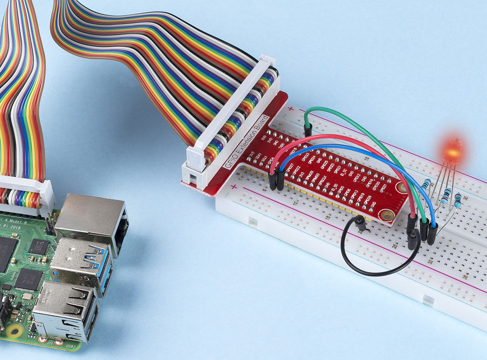

.. note::

    Ciao, benvenuto nella Community di appassionati di SunFounder Raspberry Pi & Arduino & ESP32 su Facebook! Approfondisci Raspberry Pi, Arduino ed ESP32 insieme ad altri appassionati.

    **Perché unirti a noi?**

    - **Supporto esperto**: Risolvi problemi post-vendita e sfide tecniche con l'aiuto della nostra comunità e del nostro team.
    - **Impara e condividi**: Scambia consigli e tutorial per migliorare le tue competenze.
    - **Anteprime esclusive**: Ottieni accesso anticipato agli annunci di nuovi prodotti e alle anteprime.
    - **Sconti speciali**: Approfitta di sconti esclusivi sui nostri prodotti più recenti.
    - **Promozioni festive e omaggi**: Partecipa a omaggi e promozioni festive.

    👉 Pronto a esplorare e creare con noi? Clicca su [|link_sf_facebook|] e unisciti oggi stesso!

.. _1.1.2_c_pi5:

1.1.2 LED RGB
====================

Introduzione
-----------------

In questo progetto, controlleremo un LED RGB per farlo lampeggiare in vari colori.

Componenti necessari
------------------------------

In questo progetto, abbiamo bisogno dei seguenti componenti. 

.. image:: ../img/list_rgb_led.png
    :align: center

È sicuramente conveniente acquistare un intero kit, ecco il link: 

.. list-table::
    :widths: 20 20 20
    :header-rows: 1

    *   - Nome	
        - COMPONENTI IN QUESTO KIT
        - LINK
    *   - Raphael Kit
        - 337
        - |link_Raphael_kit|

Puoi anche acquistarli separatamente dai link sottostanti.

.. list-table::
    :widths: 30 20
    :header-rows: 1

    *   - INTRODUZIONE COMPONENTI
        - LINK PER L'ACQUISTO

    *   - :ref:`cpn_gpio_extension_board`
        - |link_gpio_board_buy|
    *   - :ref:`cpn_breadboard`
        - |link_breadboard_buy|
    *   - :ref:`cpn_wires`
        - |link_wires_buy|
    *   - :ref:`cpn_resistor`
        - |link_resistor_buy|
    *   - :ref:`cpn_rgb_led`
        - |link_rgb_led_buy|

Schema di collegamento
---------------------------

Dopo aver collegato i pin di R, G e B a una resistenza limitatrice di 
corrente, connettili rispettivamente ai GPIO17, GPIO18 e GPIO27. Il 
pin più lungo (GND) del LED è collegato al GND del Raspberry Pi. Quando 
i tre pin ricevono diversi valori PWM, il LED RGB visualizzerà colori differenti.

============ ======== ======== ===
T-Board Name physical wiringPi BCM
GPIO17       Pin 11   0        17
GPIO18       Pin 12   1        18
GPIO27       Pin 13   2        27
============ ======== ======== ===

.. image:: ../img/rgb_led_schematic.png

Procedure sperimentali
----------------------------

**Passo 1:** Costruisci il circuito.

.. image:: ../img/image61.png

**Passo 2:** Vai alla cartella del codice.

.. raw:: html

   <run></run>

.. code-block::

    cd ~/raphael-kit/c/1.1.2/

**Passo 3:** Compila il codice.

.. raw:: html

   <run></run>

.. code-block::

    gcc 1.1.2_rgbLed.c -lwiringPi

.. note::

    Quando viene eseguito il comando ``gcc``, se non viene utilizzato ``-o``, il file eseguibile verrà chiamato ``a.out``.

**Passo 4:** Esegui il file eseguibile.

.. raw:: html

   <run></run>

.. code-block::

    sudo ./a.out

Dopo l'esecuzione del codice, vedrai il LED RGB visualizzare rosso, verde, blu, giallo, rosa e ciano.

.. note::

   Se non funziona dopo l'esecuzione o appare un errore come: \"wiringPi.h: No such file or directory\", consulta :ref:`install_wiringpi_pi5`.

**Codice**

.. code-block:: c

    #include <wiringPi.h>
    #include <softPwm.h>
    #include <stdio.h>
    #define uchar unsigned char
    #define LedPinRed    0
    #define LedPinGreen  1
    #define LedPinBlue   2

    void ledInit(void){
        softPwmCreate(LedPinRed,  0, 100);
        softPwmCreate(LedPinGreen,0, 100);
        softPwmCreate(LedPinBlue, 0, 100);
    }

    void ledColorSet(uchar r_val, uchar g_val, uchar b_val){
        softPwmWrite(LedPinRed,   r_val);
        softPwmWrite(LedPinGreen, g_val);
        softPwmWrite(LedPinBlue,  b_val);
    }

    int main(void){

        if(wiringPiSetup() == -1){ //quando l'inizializzazione di wiring fallisce, stampa un messaggio a schermo
            printf("setup wiringPi failed !");
            return 1;
        }

        ledInit();
        while(1){
            printf("Red\n");
            ledColorSet(0xff,0x00,0x00);   //red     
            delay(500);
            printf("Green\n");
            ledColorSet(0x00,0xff,0x00);   //green
            delay(500);
            printf("Blue\n");
            ledColorSet(0x00,0x00,0xff);   //blue
            delay(500);
            printf("Yellow\n");
            ledColorSet(0xff,0xff,0x00);   //yellow
            delay(500);
            printf("Purple\n");
            ledColorSet(0xff,0x00,0xff);   //purple
            delay(500);
            printf("Cyan\n");
            ledColorSet(0xc0,0xff,0x3e);   //cyan
            delay(500);
        }
        return 0;
    }

**Spiegazione del Codice**

.. code-block:: c

    #include <softPwm.h>

Libreria usata per realizzare la funzione pwm del software.

.. code-block:: c

    void ledInit(void){
        softPwmCreate(LedPinRed,  0, 100);
        softPwmCreate(LedPinGreen,0, 100);
        softPwmCreate(LedPinBlue, 0, 100);
    }

La funzione è usare il software per creare un pin PWM, impostando il suo periodo tra 0x100us-100x100us.

Il prototipo della funzione softPwmCreate(LedPinRed, 0, 100) è il seguente:

.. code-block:: c

    int softPwmCreate(int pin,int initialValue,int pwmRange);

* **Parametro pin:** Qualsiasi pin GPIO del Raspberry Pi può essere impostato come pin PWM.
* **Parametro initialValue:** La larghezza iniziale dell'impulso è initialValue volte100us.
* **Parametro pwmRange:** il periodo del PWM è pwmRange volte100us.

.. code-block:: c

    void ledColorSet(uchar r_val, uchar g_val, uchar b_val){
        softPwmWrite(LedPinRed,   r_val);
        softPwmWrite(LedPinGreen, g_val);
        softPwmWrite(LedPinBlue,  b_val);
    }

Questa funzione serve a impostare i colori del LED. Utilizzando RGB, il parametro 
formale **r_val** rappresenta la luminosità del rosso, **g_val** del verde,
**b_val** del blu.

Il prototipo della funzione softPwmWrite(LedPinBlue, b_val) è il 
seguente:

.. code-block:: c

    void softPwmWrite (int pin, int value);

* **Parametro pin:** Qualsiasi pin GPIO del Raspberry Pi può essere impostato come pin PWM.
* **Parametro Value:** La larghezza dell'impulso del PWM è value volte 100us. Nota che value può essere solo inferiore a pwmRange definito precedentemente. Se è più grande di pwmRange, il valore sarà impostato a pwmRange.

.. code-block:: c

    ledColorSet(0xff,0x00,0x00);

Chiama la funzione definita in precedenza. Scrivi 0xff in LedPinRed e 0x00 in 
LedPinGreen e LedPinBlue. Solo il LED rosso si accenderà dopo l'esecuzione di 
questo codice. Se vuoi accendere i LED di altri colori, basta modificare i parametri.

Immagine del Fenomeno
--------------------------

