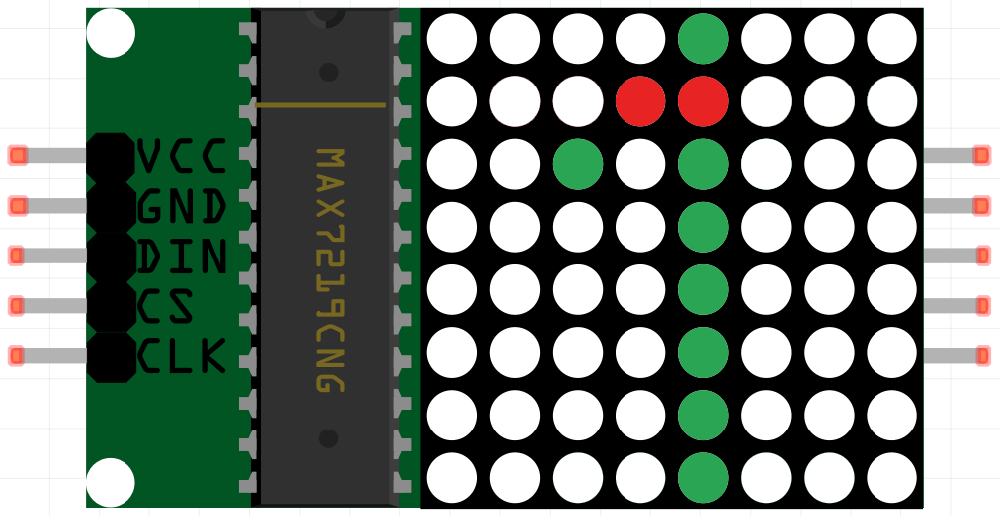

.. note::

    ¡Hola! Bienvenido a la comunidad de entusiastas de SunFounder Raspberry Pi, Arduino y ESP32 en Facebook. Sumérgete en el mundo de Raspberry Pi, Arduino y ESP32 con otros entusiastas.

    **¿Por qué unirte?**

    - **Soporte Experto**: Resuelve problemas postventa y desafíos técnicos con la ayuda de nuestra comunidad y equipo.
    - **Aprende y Comparte**: Intercambia consejos y tutoriales para mejorar tus habilidades.
    - **Preestrenos Exclusivos**: Accede anticipadamente a anuncios de nuevos productos y adelantos.
    - **Descuentos Especiales**: Disfruta de descuentos exclusivos en nuestros productos más recientes.
    - **Promociones y Sorteos Festivos**: Participa en sorteos y promociones de temporada.

    👉 ¿Listo para explorar y crear con nosotros? Haz clic en [|link_sf_facebook|] y únete hoy mismo!

.. _1.1.6_c_pi5:

1.1.6 Módulo de Matriz de LED
==================================

Introducción
--------------------

En este proyecto, aprenderás sobre el Módulo de Matriz de LED. Este módulo utiliza el controlador MAX7219 para manejar la matriz de LED de 8 x 8.

Componentes Necesarios
------------------------------

En este proyecto, necesitamos los siguientes componentes.

.. image:: ../img/list_dot.png

Es definitivamente conveniente comprar un kit completo, aquí tienes el enlace:

.. list-table::
    :widths: 20 20 20
    :header-rows: 1

    *   - Nombre	
        - ELEMENTOS EN ESTE KIT
        - ENLACE
    *   - Kit Raphael
        - 337
        - |link_Raphael_kit|

También puedes comprarlos por separado en los enlaces a continuación.

.. list-table::
    :widths: 30 20
    :header-rows: 1

    *   - INTRODUCCIÓN DEL COMPONENTE
        - ENLACE DE COMPRA

    *   - :ref:`cpn_gpio_extension_board`
        - |link_gpio_board_buy|
    *   - :ref:`cpn_breadboard`
        - |link_breadboard_buy|
    *   - :ref:`cpn_wires`
        - |link_wires_buy|
    *   - :ref:`cpn_dot_matrix`
        - |link_led_matrix_buy|

Diagrama Esquemático
-----------------------

============== ======== ======== ====
Nombre T-Board físico   wiringPi BCM
SPIMOSI        Pin 19   12       MOSI
SPICE0         Pin 24   10       CE0
SPISCLK        Pin 23   14       SCLK
============== ======== ======== ====

.. image:: ../img/schematic_dot.png

Procedimientos Experimentales
-------------------------------

**Paso 1:** Construir el circuito.

.. image:: ../img/1.1.6fritzing.png

.. note::

    Activa el SPI antes de comenzar el experimento, consulta :ref:`spi_configuration` para más detalles. También se necesita la biblioteca :ref:`BCM2835`.

**Paso 2:** Ve a la carpeta del código.

.. raw:: html

   <run></run>

.. code-block:: 

    cd ~/raphael-kit/c/1.1.6/

**Paso 3:** Compila el código.

.. raw:: html

   <run></run>

.. code-block:: 

    make

**Paso 4:** Ejecuta el archivo ejecutable.

.. raw:: html

   <run></run>

.. code-block:: 

    sudo ./1.1.6_LedMatrix

Después de ejecutar el código, la Matriz de LED muestra en secuencia de 0 a 9 y de A a Z.

.. note::

    Si no funciona después de ejecutarlo, o aparece un mensaje de error: \"wiringPi.h: No such file or directory\", por favor consulta :ref:`install_wiringpi`.
**Código**

.. code-block:: c

    #include <bcm2835.h>
    #include <stdio.h>
    #include <string.h>
    #include <ctype.h>

    #define uchar unsigned char
    #define uint unsigned int

    #define Max7219_pinCS  RPI_GPIO_P1_24

    uchar disp1[36][8]={
    {0x3C,0x42,0x42,0x42,0x42,0x42,0x42,0x3C},//0
    {0x08,0x18,0x28,0x08,0x08,0x08,0x08,0x08},//1
    {0x7E,0x2,0x2,0x7E,0x40,0x40,0x40,0x7E},//2
    {0x3E,0x2,0x2,0x3E,0x2,0x2,0x3E,0x0},//3
    {0x8,0x18,0x28,0x48,0xFE,0x8,0x8,0x8},//4
    {0x3C,0x20,0x20,0x3C,0x4,0x4,0x3C,0x0},//5
    {0x3C,0x20,0x20,0x3C,0x24,0x24,0x3C,0x0},//6
    {0x3E,0x22,0x4,0x8,0x8,0x8,0x8,0x8},//7
    {0x0,0x3E,0x22,0x22,0x3E,0x22,0x22,0x3E},//8
    {0x3E,0x22,0x22,0x3E,0x2,0x2,0x2,0x3E},//9
    {0x8,0x14,0x22,0x3E,0x22,0x22,0x22,0x22},//A
    {0x3C,0x22,0x22,0x3E,0x22,0x22,0x3C,0x0},//B
    {0x3C,0x40,0x40,0x40,0x40,0x40,0x3C,0x0},//C
    {0x7C,0x42,0x42,0x42,0x42,0x42,0x7C,0x0},//D
    {0x7C,0x40,0x40,0x7C,0x40,0x40,0x40,0x7C},//E
    {0x7C,0x40,0x40,0x7C,0x40,0x40,0x40,0x40},//F
    {0x3C,0x40,0x40,0x40,0x40,0x44,0x44,0x3C},//G
    {0x44,0x44,0x44,0x7C,0x44,0x44,0x44,0x44},//H
    {0x7C,0x10,0x10,0x10,0x10,0x10,0x10,0x7C},//I
    {0x3C,0x8,0x8,0x8,0x8,0x8,0x48,0x30},//J
    {0x0,0x24,0x28,0x30,0x20,0x30,0x28,0x24},//K
    {0x40,0x40,0x40,0x40,0x40,0x40,0x40,0x7C},//L
    {0x81,0xC3,0xA5,0x99,0x81,0x81,0x81,0x81},//M
    {0x0,0x42,0x62,0x52,0x4A,0x46,0x42,0x0},//N
    {0x3C,0x42,0x42,0x42,0x42,0x42,0x42,0x3C},//O
    {0x3C,0x22,0x22,0x22,0x3C,0x20,0x20,0x20},//P
    {0x1C,0x22,0x22,0x22,0x22,0x26,0x22,0x1D},//Q
    {0x3C,0x22,0x22,0x22,0x3C,0x24,0x22,0x21},//R
    {0x0,0x1E,0x20,0x20,0x3E,0x2,0x2,0x3C},//S
    {0x0,0x3E,0x8,0x8,0x8,0x8,0x8,0x8},//T
    {0x42,0x42,0x42,0x42,0x42,0x42,0x22,0x1C},//U
    {0x42,0x42,0x42,0x42,0x42,0x42,0x24,0x18},//V
    {0x0,0x49,0x49,0x49,0x49,0x2A,0x1C,0x0},//W
    {0x0,0x41,0x22,0x14,0x8,0x14,0x22,0x41},//X
    {0x41,0x22,0x14,0x8,0x8,0x8,0x8,0x8},//Y
    {0x0,0x7F,0x2,0x4,0x8,0x10,0x20,0x7F},//Z
    };

    void Delay_xms(uint x)
    {
        bcm2835_delay(x);
    }
    //------------------------

    void Write_Max7219_byte(uchar DATA)
    {
        bcm2835_gpio_write(Max7219_pinCS,LOW);
        bcm2835_spi_transfer(DATA);
    }

    void Write_Max7219(uchar address1,uchar dat1)
    {
        bcm2835_gpio_write(Max7219_pinCS,LOW);
        Write_Max7219_byte(address1);
        Write_Max7219_byte(dat1); 
        bcm2835_gpio_write(Max7219_pinCS,HIGH);
    }

    void Init_MAX7219()
    {
        Write_Max7219(0x09,0x00);
        Write_Max7219(0x0a,0x03);
        Write_Max7219(0x0b,0x07);
        Write_Max7219(0x0c,0x01);
        Write_Max7219(0x0f,0x00);
    }

    void Init_BCM2835()
    {
        bcm2835_spi_begin();
        bcm2835_spi_setBitOrder(BCM2835_SPI_BIT_ORDER_MSBFIRST);
        bcm2835_spi_setDataMode(BCM2835_SPI_MODE0);
        bcm2835_spi_setClockDivider(BCM2835_SPI_CLOCK_DIVIDER_256);
        bcm2835_gpio_fsel(Max7219_pinCS, BCM2835_GPIO_FSEL_OUTP);
        bcm2835_gpio_write(disp1[0][0],HIGH);
    }

    int main(void)
    {
        uchar i,j;

        if (!bcm2835_init())
        {
            printf("Unable to init bcm2835.\n");
            return 1;
        }
        Init_BCM2835();
        Delay_xms(50);
        Init_MAX7219();
        while(1)
        {
            for(j=0;j<36;j++)
            {
                for(i=1;i<9;i++)
                {
                    Write_Max7219(i,disp1[j][i-1]);
                }
                Delay_xms(1000);
            }
        }
        // bcm2835_spi_end();
        // bcm2835_close();
        return 0;
    }

**Explicación del Código**

.. code-block:: c

    #define Max7219_pinCS  24

El pin CS de la Matriz de LED está conectado al pin 24.

.. note::

    Cuando tienes múltiples dispositivos que necesitan comunicación SPI, solo conecta los pines CS en diferentes pines.

.. code-block:: c

    if (!bcm2835_init())
    {
        printf("Unable to init bcm2835.\n");
        return 1;
    }

Verifica si la biblioteca bcm2835 se ha instalado correctamente; de lo contrario, imprime el mensaje "Unable to init bcm2835".

.. code-block:: c

    Init_BCM2835();
    Delay_xms(50);
    Init_MAX7219();

Inicializa las bibliotecas y el módulo.

.. code-block:: c

    while(1)
    {
        for(j=0;j<36;j++)
        {
            for(i=1;i<9;i++)
            {
                Write_Max7219(i,disp1[j][i-1]);
            }
            Delay_xms(1000);
        }
    }

La función ``Write_Max7219()`` te permite mostrar el carácter especificado en la Matriz de LED, 
donde el primer parámetro indica la fila en la que se muestra, y el segundo parámetro introduce 
un número binario de 8 bits o un número hexadecimal que indica si la luz está encendida o apagada 
en esa fila (0 significa apagado, 1 significa encendido).

La variable ``j`` representa las filas en el arreglo ``disp1[]`` (35 filas) y la variable
 ``i`` representa la columna (8 columnas).

Por ejemplo, cuando j=1 e i=2, el valor ``disp1[1][1]`` (0x18) se muestra en la matriz de puntos. 
i se repite 8 veces para mostrar el 1 completo en la matriz de puntos. Después de 35 ciclos de j, 
se muestran 0-9 y A-Z en la matriz de puntos.

Imagen del Fenómeno
-----------------------

.. image:: ../img/1.1.6led_dot_matrix.JPG
