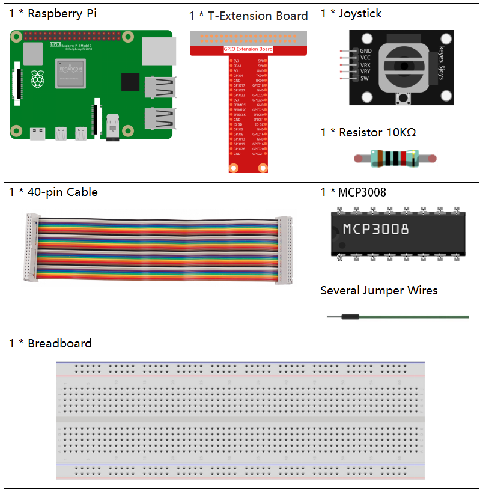

.. note::

    Hello, welcome to the SunFounder Raspberry Pi & Arduino & ESP32 Enthusiasts Community on Facebook! Dive deeper into Raspberry Pi, Arduino, and ESP32 with fellow enthusiasts.

    **Why Join?**

    - **Expert Support**: Solve post-sale issues and technical challenges with help from our community and team.
    - **Learn & Share**: Exchange tips and tutorials to enhance your skills.
    - **Exclusive Previews**: Get early access to new product announcements and sneak peeks.
    - **Special Discounts**: Enjoy exclusive discounts on our newest products.
    - **Festive Promotions and Giveaways**: Take part in giveaways and holiday promotions.

    👉 Ready to explore and create with us? Click [|link_sf_facebook|] and join today!

.. _2.1.9_c_pi5_mcp3008:

2.1.9 Joystick(MCP3008)
==========================

.. note::

   .. image:: ../img/mcp3008_and_adc0834.jpg
      :width: 25%
      :align: left
    

   Depending on your kit version, please identify whether you have **ADC0834** or **MCP3008** and proceed with the matching section.

Introduction
--------------

In this project, We're going to learn how joystick works. We manipulate
the Joystick and display the results on the screen.

Required Components
-------------------------------

In this project, we need the following components. 

It's definitely convenient to buy a whole kit, here's the link: 

.. list-table::
    :widths: 20 20 20
    :header-rows: 1

    *   - Name	
        - ITEMS IN THIS KIT
        - LINK
    *   - Raphael Kit
        - 337
        - |link_Raphael_kit|

You can also buy them separately from the links below.

.. list-table::
    :widths: 30 20
    :header-rows: 1

    *   - COMPONENT INTRODUCTION
        - PURCHASE LINK

    *   - :ref:`cpn_gpio_board`
        - |link_gpio_board_buy|
    *   - :ref:`cpn_breadboard`
        - |link_breadboard_buy|
    *   - :ref:`cpn_wires`
        - |link_wires_buy|
    *   - :ref:`cpn_resistor`
        - |link_resistor_buy|
    *   - :ref:`cpn_joystick`
        - \-
    *   - :ref:`cpn_mcp3008`
        - \-

Schematic Diagram
-----------------

When the data of joystick is read, there are some differents between
axis: data of X and Y axis is analog, which need to use MCP3008 to
convert the analog value to digital value. Data of Z axis is digital, so
you can directly use the GPIO to read, or you can also use ADC to read.

.. .. image:: ../img/image319.png

    *   - T-Board Name
        - physical
        - WiringPi
        - BCM

    *   - SPICE0
        - pin24
        - 10
        - 8
    *   - SPIMOSI
        - pin19
        - 12
        - 10
    *   - SPIMISO
        - pin21
        - 13
        - 9
    *   - SPISCLK
        - pin23
        - 14
        - 11
    *   - GPIO22
        - pin15
        - 3
        - 22

.. image:: ../img/schematic_2.1.9_joystick_mcp3008.png

Experimental Procedures
-----------------------

**Step 1:** Build the circuit.

.. image:: ../img/july24_2.1.9_joystick_mcp3008.png

**Step 2:** Go to the folder of the code.

.. raw:: html

   <run></run>

.. code-block::

    cd ~/raphael-kit/c/2.1.9-2/

**Step 3:** Compile the code.

.. raw:: html

   <run></run>

.. code-block::

    gcc 2.1.9_Joystick.c -o joystick -lwiringPi

**Step 4:** Run the executable file.

.. raw:: html

   <run></run>

.. code-block::

    ./joystick

After the code runs, turn the Joystick, then the corresponding values of
x, y, Btn are displayed on screen.

.. note::

    If it does not work after running, or there is an error prompt: \"wiringPi.h: No such file or directory\", please refer to :ref:`install_wiringpi_pi5`.

**Code**

.. code-block:: c

    #include <wiringPi.h>
    #include <wiringPiSPI.h>
    #include <stdio.h>

    #define SPI_CHANNEL 0
    #define SPI_SPEED   1000000  // 1 MHz
    #define BtnPin      3        // WiringPi 3 = BCM GPIO22

    // Read from MCP3008 channel (0–7)
    int read_ADC(int channel) {
        if (channel < 0 || channel > 7) return -1;

        unsigned char buffer[3];
        buffer[0] = 1;                            // Start bit
        buffer[1] = (8 + channel) << 4;           // Channel config
        buffer[2] = 0;

        wiringPiSPIDataRW(SPI_CHANNEL, buffer, 3);

        int result = ((buffer[1] & 0x03) << 8) | buffer[2];
        return result;
    }

    int main(void) {
        if (wiringPiSetup() == -1) {
            printf("WiringPi setup failed!\n");
            return 1;
        }

        if (wiringPiSPISetup(SPI_CHANNEL, SPI_SPEED) == -1) {
            printf("SPI setup failed!\n");
            return 1;
        }

        pinMode(BtnPin, INPUT);
        pullUpDnControl(BtnPin, PUD_UP);

        while (1) {
            int x_val = read_ADC(0);     // VRX on CH0
            int y_val = read_ADC(1);     // VRY on CH1
            int btn_val = digitalRead(BtnPin);  // SW button

            printf("x = %d, y = %d, btn = %d\n", x_val, y_val, btn_val);
            delay(100);
        }

        return 0;
    }

**Code Explanation**

#. This section initializes the libraries needed for GPIO and SPI communication.

   .. code-block:: c

       #include <wiringPi.h>
       #include <wiringPiSPI.h>
       #include <stdio.h>

       #define SPI_CHANNEL 0
       #define SPI_SPEED   1000000  // 1 MHz
       #define BtnPin      3        // WiringPi 3 = BCM GPIO22

#. Defines a function ``read_ADC()`` to read analog data from MCP3008. It communicates over SPI to request data from a given channel (0–7), then parses the response to get a 10-bit ADC result.

   .. code-block:: c

       int read_ADC(int channel) {
           if (channel < 0 || channel > 7) return -1;

           unsigned char buffer[3];
           buffer[0] = 1;
           buffer[1] = (8 + channel) << 4;
           buffer[2] = 0;

           wiringPiSPIDataRW(SPI_CHANNEL, buffer, 3);

           int result = ((buffer[1] & 0x03) << 8) | buffer[2];
           return result;
       }

#. The main function initializes the WiringPi and SPI interfaces, configures the joystick's button pin, and continuously reads joystick values and prints them to the console.

   .. code-block:: c

       int main(void) {
           if (wiringPiSetup() == -1) {
               printf("WiringPi setup failed!\n");
               return 1;
           }

           if (wiringPiSPISetup(SPI_CHANNEL, SPI_SPEED) == -1) {
               printf("SPI setup failed!\n");
               return 1;
           }

           pinMode(BtnPin, INPUT);
           pullUpDnControl(BtnPin, PUD_UP);

           while (1) {
               int x_val = read_ADC(0);     // VRX to CH0
               int y_val = read_ADC(1);     // VRY to CH1
               int btn_val = digitalRead(BtnPin);  // SW to GPIO22

               printf("x = %d, y = %d, btn = %d\n", x_val, y_val, btn_val);
               delay(100);
           }

           return 0;
       }

#. In this program:

   - The joystick's VRX is connected to CH0 of MCP3008.
   - The VRY is connected to CH1.
   - The button (SW) is connected to GPIO22 (WiringPi pin 3).
   - The ``read_ADC()`` function is used to read analog values from VRX and VRY.
   - The digital value of the joystick button is read using ``digitalRead()``.
   - All values are printed continuously every 100 milliseconds.

.. Phenomenon Picture
.. ------------------

.. .. image:: ../img/image194.jpeg

