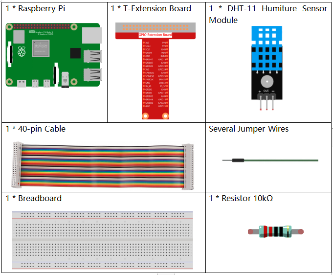

.. note::

    Hallo und willkommen in der SunFounder Raspberry Pi & Arduino & ESP32 Enthusiasten-Gemeinschaft auf Facebook! Tauchen Sie tiefer ein in die Welt von Raspberry Pi, Arduino und ESP32 mit anderen Enthusiasten.

    **Warum beitreten?**

    - **Expertenunterstützung**: Lösen Sie Nachverkaufsprobleme und technische Herausforderungen mit Hilfe unserer Gemeinschaft und unseres Teams.
    - **Lernen & Teilen**: Tauschen Sie Tipps und Anleitungen aus, um Ihre Fähigkeiten zu verbessern.
    - **Exklusive Vorschauen**: Erhalten Sie frühzeitigen Zugang zu neuen Produktankündigungen und exklusiven Einblicken.
    - **Spezialrabatte**: Genießen Sie exklusive Rabatte auf unsere neuesten Produkte.
    - **Festliche Aktionen und Gewinnspiele**: Nehmen Sie an Gewinnspielen und Feiertagsaktionen teil.

    👉 Sind Sie bereit, mit uns zu erkunden und zu erschaffen? Klicken Sie auf [|link_sf_facebook|] und treten Sie heute bei!

.. _2.2.3_c_pi5:

2.2.3 DHT-11
==================

Einführung
--------------

Der digitale Temperatur- und Feuchtigkeitssensor DHT11 ist ein zusammengesetzter Sensor, der einen kalibrierten digitalen Signalausgang von Temperatur und Feuchtigkeit enthält. Die Technologie einer spezialisierten digitalen Modulsammlung und die Technologie der Temperatur- und Feuchtigkeitserfassung werden angewendet, um sicherzustellen, dass das Produkt eine hohe Zuverlässigkeit und ausgezeichnete Stabilität aufweist.

Die Sensoren umfassen einen feuchten Widerstandssensor und einen NTC-Temperatursensor, die an einen leistungsfähigen 8-Bit-Mikrocontroller angeschlossen sind.

Benötigte Komponenten
------------------------------

Für dieses Projekt benötigen wir die folgenden Komponenten.

Es ist definitiv praktisch, ein ganzes Kit zu kaufen, hier ist der Link:

.. list-table::
    :widths: 20 20 20
    :header-rows: 1

    *   - Name	
        - ARTIKEL IN DIESEM KIT
        - LINK
    *   - Raphael Kit
        - 337
        - |link_Raphael_kit|

Sie können sie auch einzeln über die untenstehenden Links kaufen.

.. list-table::
    :widths: 30 20
    :header-rows: 1

    *   - KOMPONENTENBESCHREIBUNG
        - KAUF-LINK

    *   - :ref:`cpn_gpio_board`
        - |link_gpio_board_buy|
    *   - :ref:`cpn_breadboard`
        - |link_breadboard_buy|
    *   - :ref:`cpn_wires`
        - |link_wires_buy|
    *   - :ref:`cpn_resistor`
        - |link_resistor_buy|
    *   - :ref:`cpn_humiture_sensor`
        - |link_humiture_buy|

Schaltplan
-----------------

.. image:: ../img/image326.png

Experimentelle Verfahren
---------------------------

**Schritt 1:** Bauen Sie die Schaltung.

.. image:: ../img/image207.png

**Schritt 2:** Wechseln Sie in das Verzeichnis des Codes.

.. raw:: html

   <run></run>

.. code-block::

    cd ~/raphael-kit/c/2.2.3/

**Schritt 3:** Kompilieren Sie den Code.

.. raw:: html

   <run></run>

.. code-block::

    gcc 2.2.3_DHT.c -lwiringPi

**Schritt 4:** Führen Sie die ausführbare Datei aus.

.. raw:: html

   <run></run>

.. code-block::

    sudo ./a.out

Nachdem der Code ausgeführt wurde, zeigt das Programm die von DHT11 erfasste Temperatur und Feuchtigkeit auf dem Computerbildschirm an.

.. note::

    Wenn es nach dem Ausführen nicht funktioniert oder eine Fehlermeldung erscheint: \"wiringPi.h: Datei oder Verzeichnis nicht gefunden\", beachten Sie bitte :ref:`install_wiringpi`.

**Code**

.. code-block:: c

    #include <wiringPi.h>
    #include <stdio.h>
    #include <stdlib.h>
    #include <stdint.h>

    #define maxTim 85
    #define dhtPin 0

    int dht11_dat[5] = {0,0,0,0,0};

    void readDht11() {
        uint8_t laststate = HIGH;
        uint8_t counter = 0;
        uint8_t j = 0, i;
        float Fah; // fahrenheit
        dht11_dat[0] = dht11_dat[1] = dht11_dat[2] = dht11_dat[3] = dht11_dat[4] = 0;
        // pull pin down for 18 milliseconds
        pinMode(dhtPin, OUTPUT);
        digitalWrite(dhtPin, LOW);
        delay(18);
        // then pull it up for 40 microseconds
        digitalWrite(dhtPin, HIGH);
        delayMicroseconds(40); 
        // prepare to read the pin
        pinMode(dhtPin, INPUT);

        // detect change and read data
        for ( i=0; i< maxTim; i++) {
            counter = 0;
            while (digitalRead(dhtPin) == laststate) {
                counter++;
                delayMicroseconds(1);
                if (counter == 255) {
                    break;
                }
            }
            laststate = digitalRead(dhtPin);

            if (counter == 255) break;
            // ignore first 3 transitions
            if ((i >= 4) && (i%2 == 0)) {
                // shove each bit into the storage bytes
                dht11_dat[j/8] <<= 1;
                if (counter > 50)
                    dht11_dat[j/8] |= 1;
                j++;
            }
        }
        // check we read 40 bits (8bit x 5 ) + verify checksum in the last byte
        // print it out if data is good
        if ((j >= 40) && 
                (dht11_dat[4] == ((dht11_dat[0] + dht11_dat[1] + dht11_dat[2] + dht11_dat[3]) & 0xFF)) ) {
            Fah = dht11_dat[2] * 9. / 5. + 32;
            printf("Humidity = %d.%d %% Temperature = %d.%d *C (%.1f *F)\n", 
                    dht11_dat[0], dht11_dat[1], dht11_dat[2], dht11_dat[3], Fah);
        }
    }

    int main (void) {
        if(wiringPiSetup() == -1){ //when initialize wiring failed, print messageto screen
            printf("setup wiringPi failed !");
            return 1; 
        }
        while (1) {
            readDht11();
            delay(500); // wait 1sec to refresh
        }
        return 0 ;
    }

**Code-Erklärung**

.. code-block:: c

    void readDht11() {
        uint8_t laststate = HIGH;
        uint8_t counter = 0;
        uint8_t j = 0, i;
        float Fah; // fahrenheit
        dht11_dat[0] = dht11_dat[1] = dht11_dat[2] = dht11_dat[3] = dht11_dat[4] = 0;
        // ...
    }

Diese Funktion dient zur Implementierung der Funktion von DHT11.

Sie kann im Allgemeinen in 3 Teile unterteilt werden:

1. Vorbereitung zum Auslesen des Pins:

.. code-block:: c

    // pull pin down for 18 milliseconds
    pinMode(dhtPin, OUTPUT);
    digitalWrite(dhtPin, LOW);
    delay(18);
    // then pull it up for 40 microseconds
    digitalWrite(dhtPin, HIGH);
    delayMicroseconds(40); 
    // prepare to read the pin
    pinMode(dhtPin, INPUT);

Der Kommunikationsfluss wird durch die Arbeitszeitsteuerung bestimmt.

.. image:: ../img/image208.png

Wenn DHT11 startet, sendet der MCU ein niedriges Signal und hält dann das Signal für 40us auf einem hohen Niveau. Danach beginnt die Erfassung des Zustands der Außenumgebung.

2. Daten auslesen:

.. code-block:: c

    // detect change and read data  
    for ( i=0; i< maxTim; i++) {
            counter = 0;
            while (digitalRead(dhtPin) == laststate) {
                counter++;
                delayMicroseconds(1);
                if (counter == 255) {
                    break;
                }
            }
            laststate = digitalRead(dhtPin);
            if (counter == 255) break;
            // ignore first 3 transitions
            if ((i >= 4) && (i%2 == 0)) {
                // shove each bit into the storage bytes
                dht11_dat[j/8] <<= 1;
                if (counter > 50)
                    dht11_dat[j/8] |= 1;
                j++;
            }
        }

Die Schleife speichert die erkannten Daten im Array dht11_dat[]. DHT11 überträgt jedes Mal 40 Bits Daten. Die ersten 16 Bits betreffen die Feuchtigkeit, die mittleren 16 Bits die Temperatur und die letzten acht Bits dienen zur Überprüfung. Das Datenformat lautet:

**8bit Feuchtigkeits-Ganzzahldaten** + **8bit Feuchtigkeits-Nachkommadaten** + **8bit Temperatur-Ganzzahldaten** + **8bit Temperatur-Nachkommadaten** + **8bit Prüfbit**.

3. Feuchtigkeit & Temperatur ausgeben.

.. code-block:: c

    // check we read 40 bits (8bit x 5 ) + verify checksum in the last byte
    // print it out if data is good
    if ((j >= 40) && 
            (dht11_dat[4] == ((dht11_dat[0] + dht11_dat[1] + dht11_dat[2] + dht11_dat[3]) & 0xFF)) ) {
        Fah = dht11_dat[2] * 9. / 5. + 32;
        printf("Humidity = %d.%d %% Temperature = %d.%d *C (%.1f *F)\n", 
                dht11_dat[0], dht11_dat[1], dht11_dat[2], dht11_dat[3], Fah);
    }

Wenn die Datenspeicherung 40 Bits erreicht, überprüfen Sie die Gültigkeit der Daten über das **Prüfbit (dht11_dat[4])** und geben dann die Temperatur und Feuchtigkeit aus.

Zum Beispiel, wenn die empfangenen Daten 00101011 (8-Bit-Wert für Feuchtigkeitsganzzahl) 00000000 (8-Bit-Wert für Feuchtigkeitsnachkommastellen) 00111100 (8-Bit-Wert für Temperaturganzzahl) 00000000 (8-Bit-Wert für Temperaturnachkommastellen) 01100111 (Prüfbit) sind:

**Berechnung:**

00101011+00000000+00111100+00000000=01100111.

Das Endergebnis entspricht den Prüfbitdaten, dann sind die empfangenen Daten korrekt:

Feuchtigkeit =43%，Temperatur =60*C.

Wenn es nicht den Prüfbitdaten entspricht, ist die Datenübertragung nicht normal und die Daten werden erneut empfangen.

Phänomen-Bild
------------------

.. image:: ../img/image209.jpeg