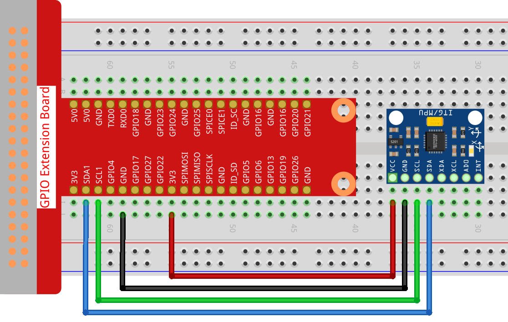
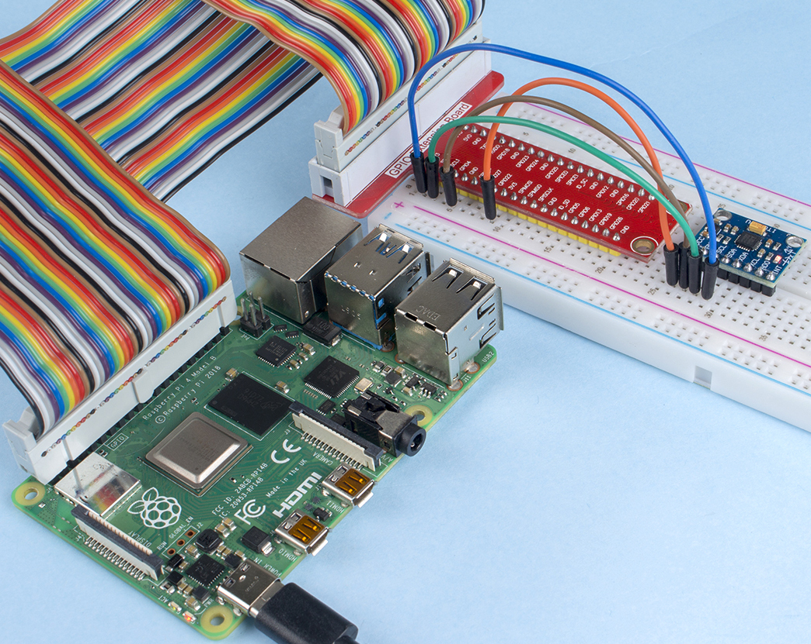

.. note::

    Hallo und willkommen in der SunFounder Raspberry Pi & Arduino & ESP32 Enthusiasten-Gemeinschaft auf Facebook! Tauchen Sie tiefer ein in die Welt von Raspberry Pi, Arduino und ESP32 mit anderen Enthusiasten.

    **Warum beitreten?**

    - **Expertenunterstützung**: Lösen Sie Nachverkaufsprobleme und technische Herausforderungen mit Hilfe unserer Gemeinschaft und unseres Teams.
    - **Lernen & Teilen**: Tauschen Sie Tipps und Anleitungen aus, um Ihre Fähigkeiten zu verbessern.
    - **Exklusive Vorschauen**: Erhalten Sie frühzeitigen Zugang zu neuen Produktankündigungen und exklusiven Einblicken.
    - **Spezialrabatte**: Genießen Sie exklusive Rabatte auf unsere neuesten Produkte.
    - **Festliche Aktionen und Gewinnspiele**: Nehmen Sie an Gewinnspielen und Feiertagsaktionen teil.

    👉 Sind Sie bereit, mit uns zu erkunden und zu erschaffen? Klicken Sie auf [|link_sf_facebook|] und treten Sie heute bei!

.. _2.2.9_c_pi5:

2.2.9 MPU6050 Modul
===========================

Einführung
------------

Das MPU-6050 ist das weltweit erste und einzige 6-Achsen-Bewegungserfassungsgerät 
(3-Achsen-Gyroskop und 3-Achsen-Beschleunigungsmesser) konzipiert für Smartphones, 
Tablets und tragbare Sensoren, die diese Merkmale aufweisen, einschließlich niedriger 
Energieverbrauch, geringe Kosten und hohe Leistungsanforderungen.

In diesem Experiment verwenden wir I2C, um die Werte des Drei-Achsen-Beschleunigungssensors 
und des Drei-Achsen-Gyroskops für den MPU6050 zu erhalten und sie auf dem Bildschirm anzuzeigen.

Benötigte Komponenten
------------------------------

Für dieses Projekt benötigen wir die folgenden Komponenten. 

.. image:: ../img/list_2.2.6.png

Es ist definitiv praktisch, ein ganzes Kit zu kaufen, hier ist der Link: 

.. list-table::
    :widths: 20 20 20
    :header-rows: 1

    *   - Name
        - ARTIKEL IN DIESEM KIT
        - LINK
    *   - Raphael Kit
        - 337
        - |link_Raphael_kit|

Sie können sie auch separat über die untenstehenden Links kaufen.

.. list-table::
    :widths: 30 20
    :header-rows: 1

    *   - KOMPONENTENBESCHREIBUNG
        - KAUF-LINK

    *   - :ref:`cpn_gpio_board`
        - |link_gpio_board_buy|
    *   - :ref:`cpn_breadboard`
        - |link_breadboard_buy|
    *   - :ref:`cpn_wires`
        - |link_wires_buy|
    *   - :ref:`cpn_mpu6050`
        - |link_mpu6050_buy|

Schaltplan
-----------------

Der MPU6050 kommuniziert über die I2C-Busschnittstelle mit dem Mikrocontroller.
Die Anschlüsse SDA1 und SCL1 müssen mit den entsprechenden Pins verbunden werden.

.. image:: ../img/image330.png

Experimentelle Verfahren
----------------------------------

**Schritt 1:** Schaltung aufbauen.

**Schritt 2**: I2C einrichten (siehe Anhang :ref:`i2c_config`. Wenn Sie I2C bereits eingerichtet haben, überspringen Sie diesen Schritt.)

**Schritt 3:** Wechseln Sie in den Ordner mit dem Code.

.. raw:: html

   <run></run>

.. code-block::

    cd ~/raphael-kit/c/2.2.9/

**Schritt 4:** Kompilieren Sie den Code.

.. raw:: html

   <run></run>

.. code-block::

    gcc 2.2.9_mpu6050.c -lwiringPi -lm

**Schritt 5:** Führen Sie die ausführbare Datei aus.

.. raw:: html

   <run></run>

.. code-block::

    sudo ./a.out

Mit dem ausgeführten Code werden der Ablenkwinkel der x- und y-Achse sowie die 
Beschleunigung und die Winkelgeschwindigkeit jeder Achse, die vom MPU6050 gelesen 
werden, nach der Berechnung auf dem Bildschirm angezeigt.

.. note::

    * Falls der Fehler ``wiringPi.h: No such file or directory`` angezeigt wird, beachten Sie bitte :ref:`install_wiringpi`.
    * Wenn der Fehler ``Unable to open I2C device: No such file or directory`` auftritt, beziehen Sie sich auf :ref:`i2c_config`, um I2C zu aktivieren und überprüfen Sie, ob die Verkabelung korrekt ist.

**Code**

.. code-block:: c

    #include  <wiringPiI2C.h>
    #include <wiringPi.h>
    #include  <stdio.h>
    #include  <math.h>
    int fd;
    int acclX, acclY, acclZ;
    int gyroX, gyroY, gyroZ;
    double acclX_scaled, acclY_scaled, acclZ_scaled;
    double gyroX_scaled, gyroY_scaled, gyroZ_scaled;

    int read_word_2c(int addr)
    {
    int val;
    val = wiringPiI2CReadReg8(fd, addr);
    val = val << 8;
    val += wiringPiI2CReadReg8(fd, addr+1);
    if (val >= 0x8000)
        val = -(65536 - val);
    return val;
    }

    double dist(double a, double b)
    {
    return sqrt((a*a) + (b*b));
    }

    double get_y_rotation(double x, double y, double z)
    {
    double radians;
    radians = atan2(x, dist(y, z));
    return -(radians * (180.0 / M_PI));
    }

    double get_x_rotation(double x, double y, double z)
    {
    double radians;
    radians = atan2(y, dist(x, z));
    return (radians * (180.0 / M_PI));
    }

    int main()
    {
    fd = wiringPiI2CSetup (0x68);
    wiringPiI2CWriteReg8 (fd,0x6B,0x00);//disable sleep mode 
    printf("set 0x6B=%X\n",wiringPiI2CReadReg8 (fd,0x6B));
    
    while(1) {

        gyroX = read_word_2c(0x43);
        gyroY = read_word_2c(0x45);
        gyroZ = read_word_2c(0x47);

        gyroX_scaled = gyroX / 131.0;
        gyroY_scaled = gyroY / 131.0;
        gyroZ_scaled = gyroZ / 131.0;

        //Print values for the X, Y, and Z axes of the gyroscope sensor.
        printf("My gyroX_scaled: %f\n", gyroY X_scaled);
        printf("My gyroY_scaled: %f\n", gyroY Y_scaled);
        printf("My gyroZ_scaled: %f\n", gyroY Z_scaled);

        acclX = read_word_2c(0x3B);
        acclY = read_word_2c(0x3D);
        acclZ = read_word_2c(0x3F);

        acclX_scaled = acclX / 16384.0;
        acclY_scaled = acclY / 16384.0;
        acclZ_scaled = acclZ / 16384.0;
        
        //Print the X, Y, and Z values of the acceleration sensor.
        printf("My acclX_scaled: %f\n", acclX_scaled);
        printf("My acclY_scaled: %f\n", acclY_scaled);
        printf("My acclZ_scaled: %f\n", acclZ_scaled);

        printf("My X rotation: %f\n", get_x_rotation(acclX_scaled, acclY_scaled, acclZ_scaled));
        printf("My Y rotation: %f\n", get_y_rotation(acclX_scaled, acclY_scaled, acclZ_scaled));
        
        delay(100);
    }
    return 0;
    }

**Code-Erklärung**

.. code-block:: c

    int read_word_2c(int addr)
    {
    int val;
    val = wiringPiI2CReadReg8(fd, addr);
    val = val << 8;
    val += wiringPiI2CReadReg8(fd, addr+1);
    if (val >= 0x8000)
        val = -(65536 - val);
    return val;
    }

Sensorwerte aus MPU6050 auslesen.

.. code-block:: c

    double get_y_rotation(double x, double y, double z)
    {
    double radians;
    radians = atan2(x, dist(y, z));
    return -(radians * (180.0 / M_PI));
    }

Hierbei erhalten wir den Ablenkwinkel auf der Y-Achse.

.. code-block:: c

    double get_x_rotation(double x, double y, double z)
    {
    double radians;
    radians = atan2(y, dist(x, z));
    return (radians * (180.0 / M_PI));
    }

Berechnen des Ablenkwinkels der X-Achse.

.. code-block:: c

    gyroX = read_word_2c(0x43);
    gyroY = read_word_2c(0x45);
    gyroZ = read_word_2c(0x47);

    gyroX_scaled = gyroX / 131.0;
    gyroY_scaled = gyroY / 131.0;
    gyroZ_scaled = gyroZ / 131.0;

    //Print values for the X, Y, and Z axes of the gyroscope sensor.
    printf("My gyroX_scaled: %f\n", gyroY X_scaled);
    printf("My gyroY_scaled: %f\n", gyroY Y_scaled);
    printf("My gyroZ_scaled: %f\n", gyroY Z_scaled);

Die Werte der x-, y- und z-Achse am Gyroskopsensor auslesen, die Metadaten 
in Winkelgeschwindigkeitswerte umwandeln und dann ausgeben.

.. code-block:: c

    acclX = read_word_2c(0x3B);
    acclY = read_word_2c(0x3D);
    acclZ = read_word_2c(0x3F);

    acclX_scaled = acclX / 16384.0;
    acclY_scaled = acclY / 16384.0;
    acclZ_scaled = acclZ / 16384.0;
        
    //Print the X, Y, and Z values of the acceleration sensor.
    printf("My acclX_scaled: %f\n", acclX_scaled);
    printf("My acclY_scaled: %f\n", acclY_scaled);
    printf("My acclZ_scaled: %f\n", acclZ_scaled);

Werte der x-, y- und z-Achse am Beschleunigungssensor auslesen, die Metadaten 
in beschleunigte Geschwindigkeitswerte (Gravitätseinheit) umwandeln und dann ausgeben.

.. code-block:: c

    printf("My X rotation: %f\n", get_x_rotation(acclX_scaled, acclY_scaled, acclZ_scaled));
    printf("My Y rotation: %f\n", get_y_rotation(acclX_scaled, acclY_scaled, acclZ_scaled));

Ablenkwinkel der x- und y-Achse ausgeben.

Phänomen-Bild
------------------

