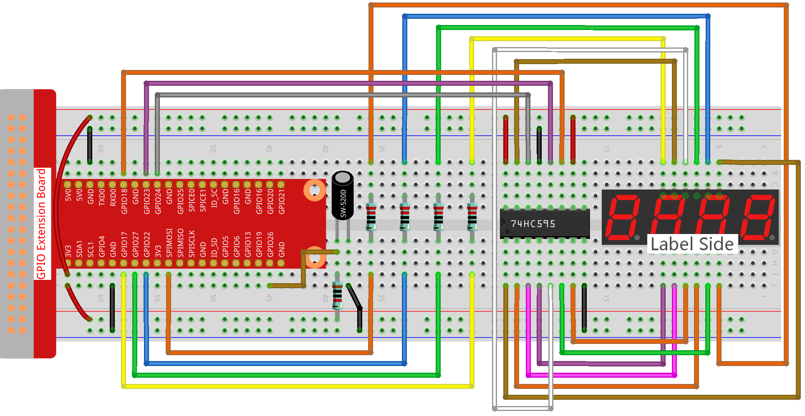

.. nota::

    ¡Hola! Bienvenidos a la Comunidad de Entusiastas de SunFounder Raspberry Pi & Arduino & ESP32 en Facebook. Profundiza en Raspberry Pi, Arduino y ESP32 con otros entusiastas.

    **¿Por qué unirse?**

    - **Soporte de Expertos**: Resuelve problemas post-venta y desafíos técnicos con la ayuda de nuestra comunidad y equipo.
    - **Aprende y Comparte**: Intercambia consejos y tutoriales para mejorar tus habilidades.
    - **Avances Exclusivos**: Obtén acceso anticipado a nuevos anuncios de productos y adelantos.
    - **Descuentos Especiales**: Disfruta de descuentos exclusivos en nuestros productos más nuevos.
    - **Promociones y Sorteos Festivos**: Participa en sorteos y promociones de temporada.

    👉 ¿Listo para explorar y crear con nosotros? Haz clic en [|link_sf_facebook|] y únete hoy mismo!

.. _3.1.12_c_pi5:

3.1.12 JUEGO - 10 Segundos
==============================

Introducción
-------------------

A continuación, sigamos para hacer un dispositivo de juego que desafíe tu concentración. 
Ata el interruptor de inclinación a un palo para hacer una varita mágica. Agita la varita, 
el display de 4 dígitos comenzará a contar, agítala nuevamente para detener la cuenta. 
Si logras mantener el contador en **10.00**, entonces ganas. Puedes jugar con tus amigos 
para ver quién es el mago del tiempo.

Componentes Necesarios
------------------------------

En este proyecto, necesitamos los siguientes componentes.

.. image:: ../img/list_GAME_10_Second.png
    :align: center

Es definitivamente conveniente comprar un kit completo, aquí está el enlace:

.. list-table::
    :widths: 20 20 20
    :header-rows: 1

    *   - Nombre
        - ELEMENTOS EN ESTE KIT
        - ENLACE
    *   - Kit Raphael
        - 337
        - |link_Raphael_kit|

También puedes comprarlos por separado en los enlaces a continuación.

.. list-table::
    :widths: 30 20
    :header-rows: 1

    *   - INTRODUCCIÓN AL COMPONENTE
        - ENLACE DE COMPRA

    *   - :ref:`cpn_gpio_extension_board`
        - |link_gpio_board_buy|
    *   - :ref:`cpn_breadboard`
        - |link_breadboard_buy|
    *   - :ref:`cpn_wires`
        - |link_wires_buy|
    *   - :ref:`cpn_resistor`
        - |link_resistor_buy|
    *   - :ref:`cpn_4_digit`
        - \-
    *   - :ref:`cpn_74hc595`
        - |link_74hc595_buy|
    *   - :ref:`cpn_tilt_switch`
        - \-

Diagrama Esquemático
--------------------------

============== ====== ======== ===
T-Board Nombre físico wiringPi BCM
GPIO17         Pin 11 0        17
GPIO27         Pin 13 2        27
GPIO22         Pin 15 3        22
SPIMOSI        Pin 19 12       10
GPIO18         Pin 12 1        18
GPIO23         Pin 16 4        23
GPIO24         Pin 18 5        24
GPIO26         Pin 37 25       26
============== ====== ======== ===

.. image:: ../img/Schematic_three_one13.png
   :align: center

Procedimientos Experimentales
---------------------------------

**Paso 1**: Construir el circuito.

**Paso 2**: Ir a la carpeta del código.

.. raw:: html

   <run></run>

.. code-block:: 

    cd ~/raphael-kit/c/3.1.12/

**Paso 3**: Compilar el código.

.. raw:: html

   <run></run>

.. code-block:: 

    gcc 3.1.12_GAME_10Second.c -lwiringPi

**Paso 4**: Ejecutar el archivo ejecutable.

.. raw:: html

   <run></run>

.. code-block:: 

    sudo ./a.out

Agita la varita, el display de 4 dígitos comenzará a contar, agítala de
nuevo para detener la cuenta. Si logras mantener el contador en **10.00**,
entonces ganas. Agítala una vez más para comenzar la siguiente ronda del
juego.

.. nota::

    Si no funciona después de ejecutarlo, o aparece un mensaje de error: \"wiringPi.h: No such file or directory\", por favor, consulta :ref:`install_wiringpi`.

**Explicación del Código**

.. code-block:: c

    void stateChange(){
        if (gameState == 0){
            counter = 0;
            delay(1000);
            ualarm(10000,10000); 
        }else{
            alarm(0);
            delay(1000);
        }
        gameState = (gameState + 1)%2;
    }

El juego se divide en dos modos:

gameState=0 es el modo "inicio", en el cual se cronometra el tiempo y se
muestra en el display de segmentos, y al agitar el interruptor de
inclinación se entra en el modo "mostrar".

GameState=1 es el modo "mostrar", que detiene el cronometraje y muestra
el tiempo en el display de segmentos. Al agitar nuevamente el interruptor
de inclinación se reinicia el cronómetro y el juego comienza de nuevo.

.. code-block:: c

    void loop(){
        int currentState =0;
        int lastState=0;
        while(1){
            display();
            currentState=digitalRead(sensorPin);
            if((currentState==0)&&(lastState==1)){
                stateChange();
            }
            lastState=currentState;
        }
    }

Loop() es la función principal. Primero, el tiempo se muestra en el
display de 4 dígitos y se lee el valor del interruptor de inclinación.
Si el estado del interruptor de inclinación ha cambiado, se llama a
stateChange().

Imagen del Fenómeno
-----------------------

.. image:: ../img/image278.jpeg
   :align: center

