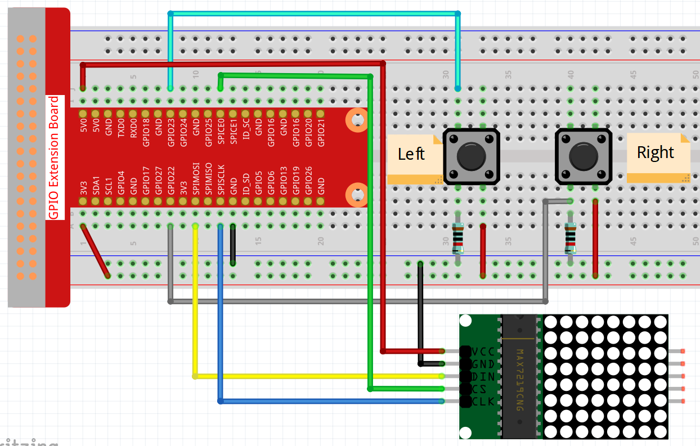

.. note::

    Hallo und willkommen in der SunFounder Raspberry Pi & Arduino & ESP32 Enthusiasten-Gemeinschaft auf Facebook! Tauchen Sie tiefer ein in die Welt von Raspberry Pi, Arduino und ESP32 mit anderen Enthusiasten.

    **Warum beitreten?**

    - **Expertenunterstützung**: Lösen Sie Nachverkaufsprobleme und technische Herausforderungen mit Hilfe unserer Gemeinschaft und unseres Teams.
    - **Lernen & Teilen**: Tauschen Sie Tipps und Anleitungen aus, um Ihre Fähigkeiten zu verbessern.
    - **Exklusive Vorschauen**: Erhalten Sie frühzeitigen Zugang zu neuen Produktankündigungen und exklusiven Einblicken.
    - **Spezialrabatte**: Genießen Sie exklusive Rabatte auf unsere neuesten Produkte.
    - **Festliche Aktionen und Gewinnspiele**: Nehmen Sie an Gewinnspielen und Feiertagsaktionen teil.

    👉 Sind Sie bereit, mit uns zu erkunden und zu erschaffen? Klicken Sie auf [|link_sf_facebook|] und treten Sie heute bei!

.. _3.1.13_c_pi5:

3.1.13 GAME - NichtNicht
===========================

Einführung
-------------------

In diesem Projekt werden wir ein interessantes Spielgerät erstellen, das wir "Nicht Nicht" nennen.

Während des Spiels wird das Punktmatrix zufällig einen Pfeil aktualisieren. Ihre Aufgabe ist es, innerhalb einer begrenzten Zeit die Taste in die entgegengesetzte Richtung des Pfeils zu drücken. Wenn die Zeit abgelaufen ist oder die Taste in die gleiche Richtung wie der Pfeil gedrückt wird, sind Sie aus dem Spiel.

Dieses Spiel kann wirklich Ihr umgekehrtes Denken schulen. Sollen wir es mal versuchen?

Benötigte Komponenten
------------------------------

Für dieses Projekt benötigen wir die folgenden Komponenten.

.. image:: ../img/list_GAME_14_NotNot.png
    :align: center

Es ist definitiv praktisch, ein ganzes Kit zu kaufen. Hier ist der Link:

.. list-table::
    :widths: 20 20 20
    :header-rows: 1

    *   - Name
        - ARTIKEL IN DIESEM KIT
        - LINK
    *   - Raphael Kit
        - 337
        - |link_Raphael_kit|

Sie können diese auch einzeln über die untenstehenden Links kaufen.

.. list-table::
    :widths: 30 20
    :header-rows: 1

    *   - KOMPONENTEN BESCHREIBUNG
        - KAUF LINK

    *   - :ref:`cpn_gpio_board`
        - |link_gpio_board_buy|
    *   - :ref:`cpn_breadboard`
        - |link_breadboard_buy|
    *   - :ref:`cpn_wires`
        - |link_wires_buy|
    *   - :ref:`cpn_dot_matrix`
        - |link_led_matrix_buy|
    *   - :ref:`cpn_button`
        - |link_button_buy|

Schaltplan
------------------------

============ ======== ======== ====
T-Board Name physical wiringPi BCM
GPIO22       Pin 15   3        22
GPIO23       Pin 16   4        23
SPIMOSI      Pin 19   12       MOSI
SPICE0       pin 24   10       CE0
SPISCLK      Pin 23   14       SCLK
============ ======== ======== ====

.. image:: ../img/Schematic_notnot.png
   :align: center

Experimentelle Verfahren
---------------------------------

**Schritt 1**: Schalten Sie die Schaltung.

**Schritt 2**: Aktivieren Sie das SPI, bevor Sie das Experiment starten. Weitere Details finden Sie unter :ref:`spi_configuration`.

**Schritt 3**: Navigieren Sie zum Ordner des Codes.

.. raw:: html

   <run></run>

.. code-block:: 

    cd ~/raphael-kit/c/3.1.13/

**Schritt 4**: Kompilieren Sie den Code.

.. raw:: html

   <run></run>

.. code-block:: 

    make

**Schritt 5**: Führen Sie die ausführbare Datei aus.

.. raw:: html

   <run></run>

.. code-block:: 

    sudo ./3.1.13_GAME_NotNot

Nachdem das Programm gestartet ist, wird auf dem Punktmatrix zufällig ein linker oder rechter Pfeil angezeigt. Ihre Aufgabe ist es, die Taste in die entgegengesetzte Richtung des Pfeils zu drücken. Dann erscheint ein "√" auf dem Punktmatrix. Wenn Sie die Taste in die gleiche Richtung wie der Pfeil drücken, sind Sie aus dem Spiel und das Punktmatrix zeigt ein "x" an. Sie können auch 2 neue Tasten hinzufügen oder sie durch Joystick-Tasten für oben, unten, links und rechts - 4 Richtungen ersetzen, um die Schwierigkeit des Spiels zu erhöhen.

.. note::

    Wenn es nach dem Start nicht funktioniert oder eine Fehlermeldung erscheint: \"wiringPi.h: Datei oder Verzeichnis nicht gefunden\", beachten Sie bitte :ref:`install_wiringpi_pi5`.

**Code-Erklärung**

Dieses C-Programm ist darauf ausgelegt, auf einem Raspberry Pi unter Verwendung der WiringPi-Bibliothek ausgeführt zu werden. Es kommuniziert mit einem 8x8-LED-Matrix-Display, das über den MAX7219-Treiberchip gesteuert wird, und verwendet zwei Tasten zur Benutzerinteraktion. Das Programm zeigt zufällig einen Pfeil nach links oder rechts auf der LED-Matrix an, und der Benutzer muss die entsprechende Taste drücken. Anschließend wird ein Häkchen für eine richtige Antwort oder ein Kreuz für eine falsche angezeigt.

#. Header-Dateien:

   * ``wiringPi.h``: Bietet Funktionen zur GPIO-Steuerung mit der WiringPi-Bibliothek.
   * ``wiringPiSPI.h``: Bietet Funktionen für die SPI-Kommunikation.
   * ``stdio.h``: Standard-Ein-/Ausgabefunktionen (``printf`` usw.).
   * ``stdlib.h``: Standardbibliotheksfunktionen (``rand``, ``srand``, ``exit``).
   * ``time.h``: Funktionen zur Bearbeitung von Datum und Uhrzeit (``time``, ``NULL``).

#. Typdefinitionen:

   * ``#define uchar unsigned char``: Definiert ``uchar`` als Alias für ``unsigned char``.
   * ``#define uint unsigned int``: Definiert ``uint`` als Alias für ``unsigned int``.

#. Konstanten und Makros:

   * ``SPI_CHANNEL``: SPI-Kanal für die Kommunikation (0 oder 1).
   * ``SPI_SPEED``: SPI-Kommunikationsgeschwindigkeit auf 1 MHz gesetzt.
   * ``AButtonPin``: WiringPi-Pin-Nummer für Taste A (GPIO 22).
   * ``BButtonPin``: WiringPi-Pin-Nummer für Taste B (GPIO 23).

#. Globale Variablen:

   * ``int stage = 0;``: Verfolgt die aktuelle Phase des Spiels (Anzeige des Pfeils oder Ergebnis).

#. Daten-Arrays:

   * ``uchar arrow[2][8]``: Enthält zwei 8-Byte-Muster, die einen rechten und linken Pfeil für die LED-Matrix darstellen.

     * ``arrow[0]``: Muster für den rechten Pfeil.
     * ``arrow[1]``: Muster für den linken Pfeil.

   * ``uchar check[2][8]``: Enthält zwei 8-Byte-Muster für die Symbole „Richtig“ (Häkchen) und „Falsch“ (Kreuz).

     * ``check[0]``: Muster für das Häkchen-Symbol.
     * ``check[1]``: Muster für das Kreuz-Symbol.

#. Funktion ``void Delay_xms(uint x)``:

   * Wrapper-Funktion für ``delay(x)``, bereitgestellt von WiringPi.
   * Verzögert die Programmausführung um ``x`` Millisekunden.

#. Funktion ``void Write_Max7219_byte(uchar DATA)``:

   * Sendet ein einzelnes Byte (``DATA``) an den MAX7219 über SPI.
   * Verwendet ``wiringPiSPIDataRW`` zur Durchführung der SPI-Datenübertragung.
   * ``DATA``: Das zu sendende Datenbyte.

#. Funktion ``void Write_Max7219(uchar address1, uchar dat1)``:

   * Sendet einen Befehl und Daten an den MAX7219.
   * Kombiniert ``address1`` (Registeradresse) und ``dat1`` (Daten) in einen Puffer und sendet sie über SPI.
   * ``address1``: Adresse des MAX7219-Registers.
   * ``dat1``: Daten zum Schreiben in das Register.

#. Funktion ``void Init_MAX7219()``:

   * Initialisiert den MAX7219-Display-Treiber mit den erforderlichen Konfigurationen.
   * Konfiguriert Decode-Modus, Intensität, Scan-Limit, Shutdown-Modus und Display-Test.
   * Löscht vorherige Daten auf dem Display.

#. Funktion ``void Init_WiringPi()``:

   * Initialisiert die WiringPi-Bibliothek und die SPI-Schnittstelle.
   * Konfiguriert die Tasten-Pins als Eingänge mit Pull-up-Widerständen.
   * Überprüft, ob die Initialisierung erfolgreich war und beendet das Programm bei einem Fehler.

#. Funktion ``int get_index()``:

   * Generiert einen zufälligen Index (0 oder 1), um zwischen dem linken und rechten Pfeil zu wählen.
   * Rückgabe: ``0`` oder ``1``.

#. Funktion ``int get_key(uint num)``:

   * Wartet darauf, dass der Benutzer eine Taste drückt, und bestimmt, ob die Eingabe mit dem angezeigten Pfeil übereinstimmt.
   * Parameter:

     * ``num``: Der Index des angezeigten Pfeils (0 für rechts, 1 für links).

   * Rückgabe:

     * ``1`` bei korrekter Benutzereingabe.
     * ``0`` bei falscher Benutzereingabe.

   * Funktionsweise:

     * Tritt in eine Endlosschleife ein und überprüft den Zustand der Tasten.
     * Verwendet ``digitalRead``, um Tastendrücke zu erkennen (aktiv LOW).
     * Vergleicht die gedrückte Taste mit der erwarteten Eingabe basierend auf ``num``.

#. Funktion ``void display(uint index)``:

   * Zeigt entweder einen Pfeil oder ein Ergebnissymbol auf der LED-Matrix an, basierend auf der ``stage``.
   * Parameter:

     * ``index``: Index zur Auswahl des Musters aus den Arrays ``arrow`` oder ``check``.

   * Funktionsweise:

     * Wenn ``stage == 0``, wird ein Pfeilmuster angezeigt.
     * Wenn ``stage == 1``, wird ein Häkchen- oder Kreuzsymbol angezeigt.

#. Hauptfunktion:

   * **Initialisierung:**

     * Initialisiert den Zufallszahlengenerator mit ``srand((unsigned)time(NULL))``.
     * Ruft ``Init_WiringPi()`` auf, um GPIO und SPI einzurichten.
     * Ruft ``Init_MAX7219()`` auf, um das LED-Matrix-Display zu initialisieren.
     * Führt eine kurze Verzögerung mit ``Delay_xms(50)`` ein.
   
   * **Spielschleife (``while (1)``):**

     * **Stufe 0 (Pfeil anzeigen):**

       * Ruft ``get_index()`` auf, um zufällig eine Pfeilrichtung auszuwählen.
       * Ruft ``display(direction)`` auf, um den Pfeil auf der LED-Matrix anzuzeigen.
       * Setzt ``stage = 1``, um zur nächsten Stufe zu wechseln.

     * **Stufe 1 (Benutzereingabe abwarten und Ergebnis anzeigen):**

       * Ruft ``get_key(direction)`` auf, um die Benutzereingabe abzuwarten und die Richtigkeit zu bestimmen.
       * Ruft ``display(key)`` auf, um das Ergebnissymbol (Häkchen oder Kreuz) anzuzeigen.
       * Wartet 1 Sekunde mit ``Delay_xms(1000)``, damit der Benutzer das Ergebnis sehen kann.
       * Setzt ``stage = 0``, um die Schleife neu zu starten.

**Programmfluss-Zusammenfassung:**

1. **Einrichtung:**

   * Initialisiert WiringPi und SPI.
   * Konfiguriert die Tasten-Pins und die MAX7219-Einstellungen.
   * Initialisiert den Zufallszahlengenerator.

2. **Pfeil anzeigen:**

   * Wählt zufällig eine Pfeilrichtung (links oder rechts).
   * Zeigt den entsprechenden Pfeil auf der LED-Matrix an.

3. **Benutzerinteraktion:**

   * Wartet darauf, dass der Benutzer entweder Taste A oder Taste B drückt.
   * Bestimmt, ob die gedrückte Taste der Pfeilrichtung entspricht.

4. **Ergebnis anzeigen:**

   * Zeigt ein Häkchen an, wenn die Benutzereingabe korrekt ist.
   * Zeigt ein Kreuz an, wenn die Benutzereingabe falsch ist.
   * Wartet 1 Sekunde vor der nächsten Runde.

5. **Wiederholen:**

   * Kehrt zur Anzeige eines neuen Pfeils zurück und setzt das Spiel fort.

