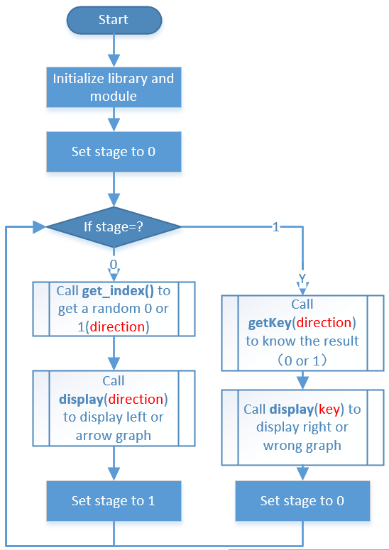
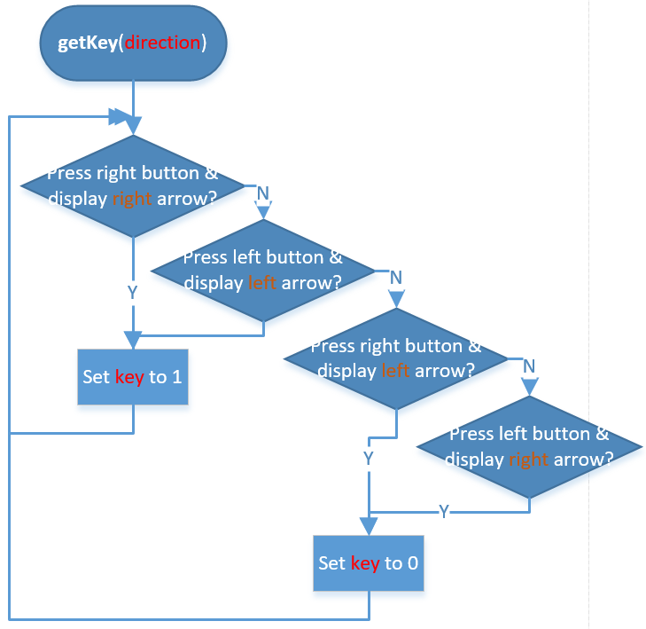

.. note::

    こんにちは、SunFounderのRaspberry Pi & Arduino & ESP32愛好家コミュニティへようこそ！Facebook上でRaspberry Pi、Arduino、ESP32についてもっと深く掘り下げ、他の愛好家と交流しましょう。

    **参加する理由は？**

    - **エキスパートサポート**：コミュニティやチームの助けを借りて、販売後の問題や技術的な課題を解決します。
    - **学び＆共有**：ヒントやチュートリアルを交換してスキルを向上させましょう。
    - **独占的なプレビュー**：新製品の発表や先行プレビューに早期アクセスしましょう。
    - **特別割引**：最新製品の独占割引をお楽しみください。
    - **祭りのプロモーションとギフト**：ギフトや祝日のプロモーションに参加しましょう。

    👉 私たちと一緒に探索し、創造する準備はできていますか？[|link_sf_facebook|]をクリックして今すぐ参加しましょう！

.. _3.1.13_c_pi5:

3.1.13 ゲーム– ノットノット
===========================

はじめに
-------------------

このプロジェクトでは、面白いゲームデバイスを作成し、それを「ノットノット」と呼びます。

ゲーム中、ドットマトリックスはランダムに矢印を更新します。あなたがする必要があることは、矢印と逆方向にボタンを押すことですが、時間内に行わなければなりません。時間切れになるか、矢印と同じ方向にボタンが押されると、あなたはアウトです。

このゲームは本当に逆の思考を鍛えることができ、さあ試してみましょうか？

必要な部品
------------------------------

このプロジェクトでは、以下のコンポーネントが必要です。

.. image:: ../img/list_GAME_14_NotNot.png
    :align: center

セットをまとめて購入するのは便利です。以下のリンクから入手できます。

.. list-table::
    :widths: 20 20 20
    :header-rows: 1

    *   - 名前
        - このキットのアイテム
        - リンク
    *   - Raphael Kit
        - 337
        - |link_Raphael_kit|

以下のリンクから個別に購入することもできます。

.. list-table::
    :widths: 30 20
    :header-rows: 1

    *   - コンポーネントの紹介
        - 購入リンク

    *   - :ref:`cpn_gpio_board`
        - |link_gpio_board_buy|
    *   - :ref:`cpn_breadboard`
        - |link_breadboard_buy|
    *   - :ref:`cpn_wires`
        - |link_wires_buy|
    *   - :ref:`cpn_dot_matrix`
        - |link_led_matrix_buy|
    *   - :ref:`cpn_button`
        - |link_button_buy|

回路図
------------------------

============ ======== ======== ====
T-Board Name physical wiringPi BCM
GPIO22       Pin 15   3        22
GPIO23       Pin 16   4        23
SPIMOSI      Pin 19   12       MOSI
SPICE0       pin 24   10       CE0
SPISCLK      Pin 23   14       SCLK
============ ======== ======== ====

.. image:: ../img/Schematic_notnot.png
   :align: center

実験手順
---------------------------------

**ステップ 1**: 回路を組み立てます。

.. image:: ../img/3.1.14game_notnot.png

.. note::

    実験を開始する前に SPI をオンにしてください。詳細については、:ref:`spi設定` を参照してください。
    また、:ref:`BCM2835` ライブラリも必要です。

**ステップ 2**: コードのフォルダに移動します。

.. raw:: html

   <run></run>

.. code-block:: 

    cd ~/raphael-kit/c/3.1.13/

**ステップ 3**: コードをコンパイルします。

.. raw:: html

   <run></run>

.. code-block:: 

    make

**ステップ 4**: 実行可能ファイルを実行します。

.. raw:: html

   <run></run>

.. code-block:: 

    sudo ./3.1.13_GAME_NotNot

プログラムが起動すると、ドットマトリックスにランダムで左または右の矢印が表示されます。あなたが行う必要があることは、矢印の反対方向のボタンを押すことで、「√」がドットマトリックスに表示されます。矢印と同じ方向のボタンが押された場合、あなたはアウトとなり、ドットマトリックスに「x」が表示されます。また、新しいボタンを2つ追加するか、ジョイスティックキーと置き換えて上下左右の4方向にすることもでき、ゲームの難易度を上げることができます。

.. note::

    実行後に動作しない場合、またはエラーメッセージ「wiringPi.h: No such file or directory」が表示される場合は、 :ref:`install_wiringpi` を参照してください。

**コード説明**

:ref:`1.1.6_c_pi5` をベースに、このプロジェクトは2つのボタンを追加して楽しいゲームデバイスを作成します。

プログラム全体のプロセスは以下の通りです：

1. システム時刻を使用して0または1のランダムな値を生成します。
2. ランダムな左または右の矢印パターンを表示します。
3. キーを押して結果を判定します。
4. 正しいまたは誤ったパターンを表示します。

.. code-block:: c

    int get_index()
    {
        srand((unsigned)time(NULL));
        return rand() % 2;
    }

システムのシードはシステム時刻によって変更されます、すなわち ``srand((unsigned)time(NULL))`` です。そのため、rand関数が呼び出されるたびに得られる値は完全にランダムであり、最終的に得られる値は0と1に分かれます。

.. code-block:: c

    int get_key(uint num)
    {
        while (1)
        {
            if (1 == bcm2835_gpio_lev(AButtonPin) && num == 0){
                return 1;
            }
            else if (1 == bcm2835_gpio_lev(BButtonPin) && num == 1){
                return 1;
            }
            else if (1 == bcm2835_gpio_lev(AButtonPin) && num == 1){
                return 0;
            }
            else if (1 == bcm2835_gpio_lev(BButtonPin) && num == 0){
                return 0;
            }
        }
    }

どのボタンが押されたかを判定し、それをドットマトリックスの矢印の方向と比較し、最終的な結果を0または1で返します。

.. code-block:: c

    void display(uint index){
        uchar i;
        if (stage == 0){
            for(i=1;i<9;i++)
            {
                Write_Max7219(i,arrow[index][i-1]);
            }
        }
        else if(stage == 1){
            for(i=1;i<9;i++)
            {
                Write_Max7219(i,check[index][i-1]);
            }
        }
    }

``stage`` と ``index`` の値に応じて、 ``left or right`` の矢印または ``right or wrong`` パターンを表示します。

.. image:: ../img/3.1.14_display.png
