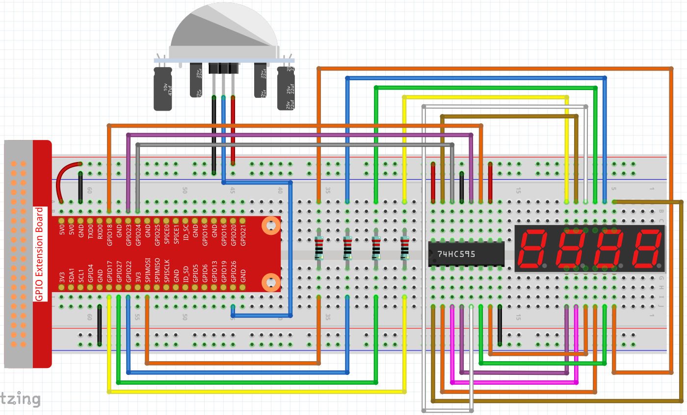

.. note::

    ¡Hola! Bienvenido a la Comunidad de Entusiastas de SunFounder para Raspberry Pi, Arduino y ESP32 en Facebook. Sumérgete en el mundo de Raspberry Pi, Arduino y ESP32 con otros entusiastas.

    **¿Por qué unirse?**

    - **Soporte Experto**: Resuelve problemas postventa y desafíos técnicos con la ayuda de nuestra comunidad y equipo.
    - **Aprende y Comparte**: Intercambia consejos y tutoriales para mejorar tus habilidades.
    - **Avances Exclusivos**: Obtén acceso anticipado a nuevos anuncios de productos y adelantos exclusivos.
    - **Descuentos Especiales**: Disfruta de descuentos exclusivos en nuestros productos más recientes.
    - **Promociones Festivas y Sorteos**: Participa en sorteos y promociones festivas.

    👉 ¿Listo para explorar y crear con nosotros? Haz clic en [|link_sf_facebook|] y únete hoy mismo!

.. _3.1.1_c_pi5:

3.1.1 Dispositivo de Conteo
============================

Introducción
---------------

Aquí crearemos un sistema contador que muestra números, compuesto por un sensor 
PIR y una pantalla de 4 dígitos. Cuando el PIR detecta que alguien pasa, el número 
en la pantalla de 4 dígitos aumentará en 1. Puedes usar este contador para contar 
el número de personas que pasan por un pasillo.

Componentes Necesarios
--------------------------

En este proyecto, necesitamos los siguientes componentes.

.. image:: ../img/list_Counting_Device1.png
    :align: center

.. image:: ../img/list_Counting_Device2.png
    :align: center

Es definitivamente conveniente comprar un kit completo, aquí está el enlace:

.. list-table::
    :widths: 20 20 20
    :header-rows: 1

    *   - Nombre
        - ELEMENTOS EN ESTE KIT
        - ENLACE
    *   - Raphael Kit
        - 337
        - |link_Raphael_kit|

También puedes comprarlos por separado desde los enlaces a continuación.

.. list-table::
    :widths: 30 20
    :header-rows: 1

    *   - INTRODUCCIÓN DE COMPONENTES
        - ENLACE DE COMPRA

    *   - :ref:`cpn_gpio_extension_board`
        - |link_gpio_board_buy|
    *   - :ref:`cpn_breadboard`
        - |link_breadboard_buy|
    *   - :ref:`cpn_wires`
        - |link_wires_buy|
    *   - :ref:`cpn_resistor`
        - |link_resistor_buy|
    *   - :ref:`cpn_4_digit`
        - \-
    *   - :ref:`cpn_74hc595`
        - |link_74hc595_buy|
    *   - :ref:`cpn_pir`
        - \-

Diagrama Esquemático
-------------------------

============ ======== ======== ===
T-Board Name physical wiringPi BCM
GPIO17       Pin 11   0        17
GPIO27       Pin 13   2        27
GPIO22       Pin 15   3        22
SPIMOSI      Pin 19   12       10
GPIO18       Pin 12   1        18
GPIO23       Pin 16   4        23
GPIO24       Pin 18   5        24
GPIO26       Pin 37   25       26
============ ======== ======== ===

.. image:: ../img/Schematic_three_one1.png
   :align: center

Procedimientos Experimentales
--------------------------------

**Paso 1**: Construye el circuito.

**Paso 2**: Ve a la carpeta del código.

.. raw:: html

   <run></run>

.. code-block:: 

    cd ~/raphael-kit/c/3.1.1/

**Paso 3**: Compila el código.

.. raw:: html

   <run></run>

.. code-block:: 

    gcc 3.1.1_CountingDevice.c -lwiringPi

**Paso 4**: Ejecuta el archivo ejecutable.

.. raw:: html

   <run></run>

.. code-block:: 

    sudo ./a.out

Después de ejecutar el código, cuando el PIR detecte que alguien está pasando, 
el número en la pantalla de 4 dígitos aumentará en 1.

Hay dos potenciómetros en el módulo PIR: uno es para ajustar la sensibilidad y el otro 
para ajustar la distancia de detección. Para que el módulo PIR funcione mejor, debes 
girar ambos en sentido antihorario hasta el final.

.. image:: ../img/PIR_TTE.png
    :width: 400
    :align: center

.. note::

    Si no funciona después de ejecutar el código, o aparece un mensaje de error: \"wiringPi.h: No such file or directory\", por favor consulta :ref:`install_wiringpi`.

**Explicación del Código**

.. code-block:: c

    void display()
    {
        clearDisplay();
        pickDigit(0);
        hc595_shift(number[counter % 10]);

        clearDisplay();
        pickDigit(1);
        hc595_shift(number[counter % 100 / 10]);

        clearDisplay();
        pickDigit(2);
        hc595_shift(number[counter % 1000 / 100]);
     
        clearDisplay();
        pickDigit(3);
        hc595_shift(number[counter % 10000 / 1000]);
    }

Primero, inicia la pantalla de cuatro segmentos y escribe el número de un solo dígito.
Luego, inicia la pantalla del tercer segmento y escribe el dígito de las decenas; después 
de eso, inicia la segunda y la primera pantalla de segmentos respectivamente y escribe los 
dígitos de las centenas y millares respectivamente. Debido a que la velocidad de actualización 
es muy rápida, vemos una pantalla completa de cuatro dígitos.

.. code-block:: c

    void loop(){
        int currentState =0;
        int lastState=0;
        while(1){
            display();
            currentState=digitalRead(sensorPin);
            if((currentState==0)&&(lastState==1)){
                counter +=1;
            }
            lastState=currentState;
        }
    }

Esta es la función principal: muestra el número en la pantalla de segmentos de 4 
dígitos y lee el valor del PIR. Cuando el PIR detecta que alguien pasa, el número 
en la pantalla de 4 dígitos aumentará en 1.

Imagen del Fenómeno
-------------------------

.. image:: ../img/image236.jpeg
   :align: center
