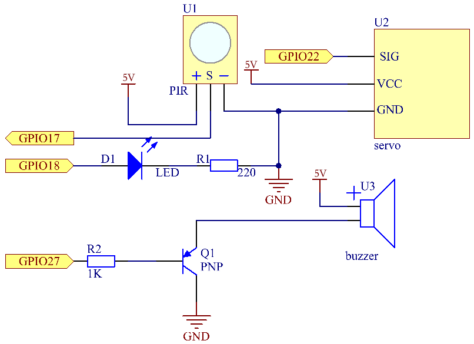
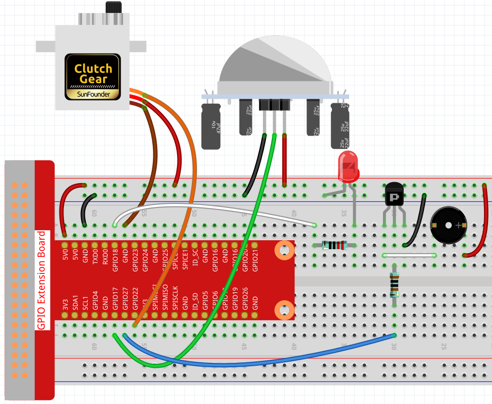

.. note::

    Ciao, benvenuto nella community SunFounder Raspberry Pi & Arduino & ESP32 Enthusiasts su Facebook! Immergiti più a fondo in Raspberry Pi, Arduino ed ESP32 insieme ad altri appassionati.

    **Perché unirti?**

    - **Supporto esperto**: Risolvi i problemi post-vendita e le sfide tecniche con l'aiuto della nostra community e del nostro team.
    - **Impara e condividi**: Scambia suggerimenti e tutorial per migliorare le tue competenze.
    - **Anteprime esclusive**: Ottieni accesso anticipato a nuovi annunci di prodotti e anteprime esclusive.
    - **Sconti speciali**: Goditi sconti esclusivi sui nostri prodotti più recenti.
    - **Promozioni festive e omaggi**: Partecipa a concorsi e promozioni festive.

    👉 Pronto a esplorare e creare con noi? Clicca su [|link_sf_facebook|] e unisciti oggi stesso!

.. _3.1.2_c_pi5:

3.1.2 Benvenuto
==================

Introduzione
------------------

In questo progetto, utilizzeremo un sensore PIR per rilevare il movimento dei 
pedoni e servomotori, LED e buzzer per simulare il funzionamento della porta 
sensore di un negozio. Quando un pedone entra nel campo di rilevamento del PIR, 
la luce indicatrice si accenderà, la porta si aprirà e il buzzer suonerà il 
campanello di apertura.

Componenti necessari
-----------------------

In questo progetto, abbiamo bisogno dei seguenti componenti.

.. image:: ../img/list_Welcome.png
    :align: center

È sicuramente conveniente acquistare un kit completo, ecco il link:

.. list-table::
    :widths: 20 20 20
    :header-rows: 1

    *   - Nome	
        - ELEMENTI IN QUESTO KIT
        - LINK
    *   - Kit Raphael
        - 337
        - |link_Raphael_kit|

Puoi anche acquistarli separatamente dai link sottostanti.

.. list-table::
    :widths: 30 20
    :header-rows: 1

    *   - INTRODUZIONE COMPONENTE
        - LINK PER L'ACQUISTO

    *   - :ref:`cpn_gpio_extension_board`
        - |link_gpio_board_buy|
    *   - :ref:`cpn_breadboard`
        - |link_breadboard_buy|
    *   - :ref:`cpn_wires`
        - |link_wires_buy|
    *   - :ref:`cpn_resistor`
        - |link_resistor_buy|
    *   - :ref:`cpn_led`
        - |link_led_buy|
    *   - :ref:`cpn_pir`
        - \-
    *   - :ref:`cpn_servo`
        - |link_servo_buy|
    *   - :ref:`cpn_buzzer`
        - |link_passive_buzzer_buy|
    *   - :ref:`cpn_transistor`
        - |link_transistor_buy|

Schema elettrico
---------------------

============ ======== ======== ===
T-Board Name physical wiringPi BCM
GPIO18       Pin 12   1        18
GPIO17       Pin 11   0        17
GPIO27       Pin 13   2        27
GPIO22       Pin 15   3        22
============ ======== ======== ===

Procedure sperimentali
-------------------------

**Passo 1:** Costruisci il circuito.

**Passo 2:** Vai alla cartella del codice.

.. raw:: html

   <run></run>

.. code-block:: 

    cd ~/raphael-kit/c/3.1.2/

**Passo 3:** Compila il codice.

.. raw:: html

   <run></run>

.. code-block:: 

    gcc 3.1.2_Welcome.c -lwiringPi

**Passo 4:** Esegui il file eseguibile.

.. raw:: html

   <run></run>

.. code-block:: 

    sudo ./a.out

Una volta eseguito il codice, se il sensore PIR rileva il passaggio di qualcuno, 
la porta si aprirà automaticamente (simulata dal servomotore), si accenderà la 
luce indicatrice e verrà suonato il campanello di apertura. Dopo la riproduzione 
del campanello, il sistema chiuderà automaticamente la porta e spegnerà la luce 
indicatrice, in attesa del prossimo passaggio.

Ci sono due potenziometri sul modulo PIR: uno per regolare la sensibilità e l'altro 
per regolare la distanza di rilevamento. Per far funzionare al meglio il modulo PIR, 
è necessario ruotarli entrambi in senso antiorario fino alla fine.

.. image:: ../img/PIR_TTE.png
    :width: 400
    :align: center

.. note::

    Se non funziona dopo l'esecuzione o compare un messaggio di errore: \"wiringPi.h: No such file or directory\", consulta :ref:`install_wiringpi_pi5`.

**Spiegazione del Codice**

.. code-block:: c

    void setAngle(int pin, int angle){    //Crea una funzione per controllare l'angolo del servo.
        if(angle < 0)
            angle = 0;
        if(angle > 180)
            angle = 180;
        softPwmWrite(pin,Map(angle, 0, 180, 5, 25));   
    } 

Crea una funzione, setAngle, per scrivere l'angolo nel servomotore da 0 a 180.

.. code-block:: c

    void doorbell(){
    for(int i=0;i<sizeof(song)/4;i++){
            softToneWrite(BuzPin, song[i]); 
            delay(beat[i] * 250);
        }

Crea una funzione, doorbell, per far suonare la musica dal buzzer.

.. code-block:: c

    void closedoor(){
    digitalWrite(ledPin, LOW);   //Spegni il LED
    for(int i=180;i>-1;i--){  //Fai ruotare il servomotore dall'angolo massimo all'angolo minimo
        setAngle(servoPin,i);
        delay(1);
        }
    }

Crea una funzione closedoor per simulare la chiusura della porta, spegnere 
il LED e far ruotare il servomotore da 180 gradi a 0 gradi.

.. code-block:: c

    void opendoor(){
        digitalWrite(ledPin, HIGH);   //Accendi il LED
        for(int i=0;i<181;i++){  //Fai ruotare il servomotore dall'angolo minimo all'angolo massimo
            setAngle(servoPin,i);
            delay(1);
        }
        doorbell();
        closedoor();
    }

La funzione opendoor() comprende diverse parti: accendere la luce 
indicatrice, ruotare il servomotore (simulare l'apertura della porta), 
suonare il campanello del negozio e richiamare la funzione closedoor() 
dopo la riproduzione della musica.

.. code-block:: c

    int main(void)
    {
        if(wiringPiSetup() == -1){ //se l'inizializzazione di wiring fallisce, stampa un messaggio sullo schermo
            printf("setup wiringPi failed !");
            return 1;
        }
        if(softToneCreate(BuzPin) == -1){
            printf("setup softTone failed !");
            return 1;
    ......

Nella funzione main(), inizializza la libreria wiringPi e configura softTone, 
quindi imposta ledPin su stato di uscita e pirPin su stato di ingresso. Se il 
sensore PIR rileva il passaggio di qualcuno, verrà chiamata la funzione opendoor 
per simulare l'apertura della porta.

Immagine del Fenomeno
--------------------------

.. image:: ../img/image240.jpeg
   :align: center
