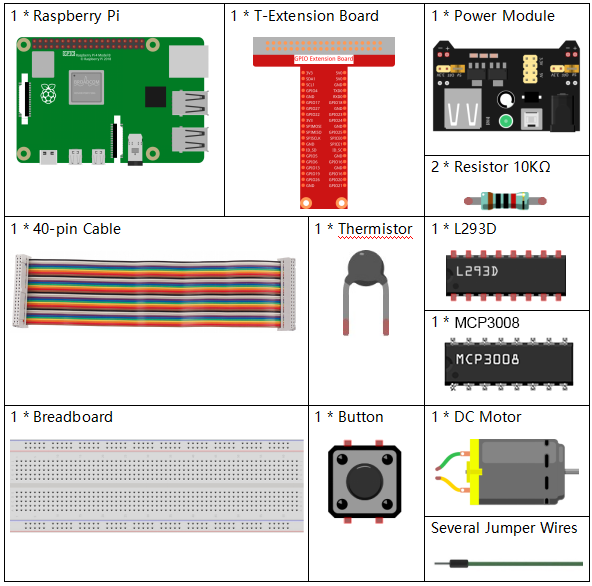
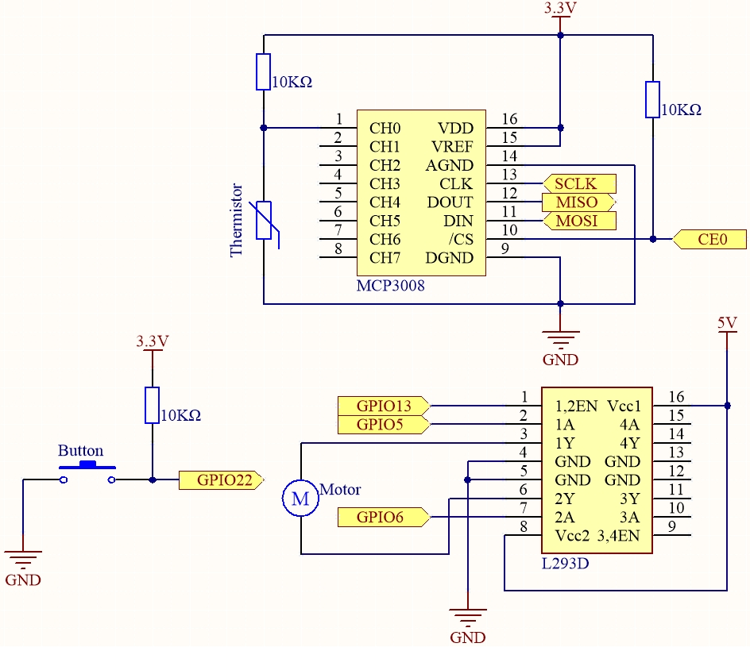
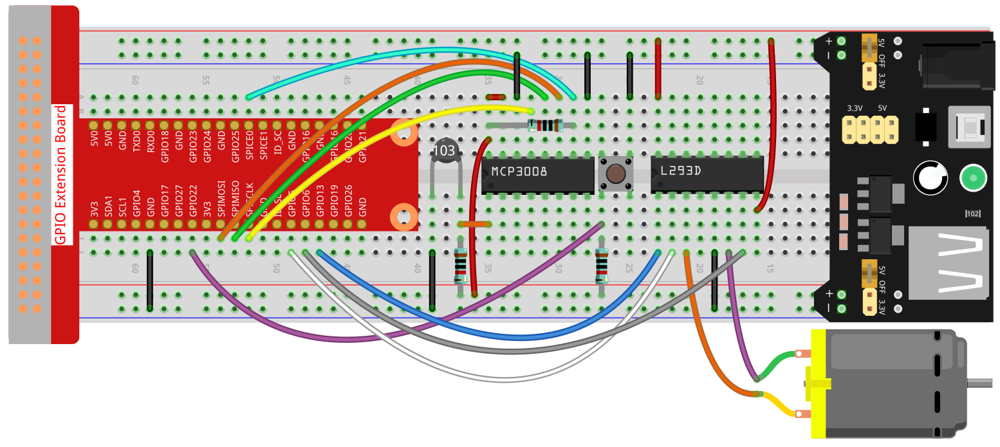

.. note::

    Hallo und willkommen in der SunFounder Raspberry Pi & Arduino & ESP32 Enthusiasten-Gemeinschaft auf Facebook! Tauchen Sie tiefer ein in die Welt von Raspberry Pi, Arduino und ESP32 mit anderen Enthusiasten.

    **Warum beitreten?**

    - **Expertenunterstützung**: Lösen Sie Nachverkaufsprobleme und technische Herausforderungen mit Hilfe unserer Gemeinschaft und unseres Teams.
    - **Lernen & Teilen**: Tauschen Sie Tipps und Anleitungen aus, um Ihre Fähigkeiten zu verbessern.
    - **Exklusive Vorschauen**: Erhalten Sie frühzeitigen Zugang zu neuen Produktankündigungen und exklusiven Einblicken.
    - **Spezialrabatte**: Genießen Sie exklusive Rabatte auf unsere neuesten Produkte.
    - **Festliche Aktionen und Gewinnspiele**: Nehmen Sie an Gewinnspielen und Feiertagsaktionen teil.

    👉 Sind Sie bereit, mit uns zu erkunden und zu erschaffen? Klicken Sie auf [|link_sf_facebook|] und treten Sie heute bei!

.. _3.1.4_c_pi5:

.. note::

    Hallo, willkommen in der SunFounder Raspberry Pi & Arduino & ESP32 Enthusiasten-Community auf Facebook!  
    Tauchen Sie tiefer in Raspberry Pi, Arduino und ESP32 mit anderen Enthusiasten ein.

    **Warum beitreten?**

    - **Expertenunterstützung**: Lösen Sie Probleme nach dem Kauf und technische Herausforderungen mit Hilfe unserer Community und unseres Teams.
    - **Lernen & Teilen**: Tauschen Sie Tipps und Tutorials aus, um Ihre Fähigkeiten zu verbessern.
    - **Exklusive Vorschauen**: Erhalten Sie frühzeitigen Zugriff auf neue Produktankündigungen und exklusive Einblicke.
    - **Spezielle Rabatte**: Genießen Sie exklusive Rabatte auf unsere neuesten Produkte.
    - **Festliche Aktionen und Giveaways**: Nehmen Sie an Verlosungen und Feiertagsaktionen teil.

    👉 Bereit, mit uns zu forschen und zu kreieren? Klicken Sie auf [|link_sf_facebook|] und treten Sie noch heute bei!

.. _3.1.4_c_pi5_mcp3008:

3.1.4 Intelligenter Ventilator (MCP3008)
=========================================

.. note::

    .. image:: ../img/mcp3008_and_adc0834.jpg
        :width: 25%
        :align: left
        
    Abhängig von Ihrer Kit-Version identifizieren Sie bitte, ob Sie **ADC0834** oder **MCP3008** haben, und fahren Sie mit dem entsprechenden Abschnitt fort.

Einführung
-----------------

In diesem Projekt verwenden wir Motoren, Tasten und Thermistoren, um einen manuellen + automatischen intelligenten Ventilator mit einstellbarer Drehzahl zu bauen.

Benötigte Komponenten
------------------------------

Für dieses Projekt benötigen wir die folgenden Komponenten: 

Es ist definitiv bequem, ein komplettes Kit zu kaufen. Hier ist der Link: 

.. list-table::
    :widths: 20 20 20
    :header-rows: 1

    *   - Name	
        - ELEMENTE IN DIESEM KIT
        - LINK
    *   - Raphael Kit
        - 337
        - |link_Raphael_kit|

Sie können die Komponenten auch einzeln über die folgenden Links kaufen:

.. list-table::
    :widths: 30 20
    :header-rows: 1

    *   - KOMPONENTENBESCHREIBUNG
        - KAUFLINK

    *   - :ref:`cpn_gpio_extension_board`
        - |link_gpio_board_buy|
    *   - :ref:`cpn_breadboard`
        - |link_breadboard_buy|
    *   - :ref:`cpn_wires`
        - |link_wires_buy|
    *   - :ref:`cpn_resistor`
        - |link_resistor_buy|
    *   - :ref:`cpn_power_module`
        - \-
    *   - :ref:`cpn_thermistor`
        - |link_thermistor_buy|
    *   - :ref:`cpn_l293d`
        - \-
    *   - :ref:`cpn_mcp3008`
        - \-
    *   - :ref:`cpn_button`
        - |link_button_buy|
    *   - :ref:`cpn_motor`
        - |link_motor_buy|

Schaltplan
------------------------

============ ======== ======== ===
T-Board-Name Physikal WiringPi BCM
SPICE0       Pin 24   10       8
SPIMOSI      Pin 19   12       10
SPIMISO      Pin 21   13       9
SPISCLK      Pin 23   14       11
GPIO22       Pin 15   3        22
GPIO5        Pin 29   21       5
GPIO6        Pin 31   22       6
GPIO13       Pin 33   23       13
============ ======== ======== ===

Experimentelle Verfahren
-----------------------------

**Schritt 1:** Schließen Sie den Stromkreis an.

.. note::
    Das Strommodul kann mit einer 9V-Batterie und dem 9V-Batterieclip aus dem Kit betrieben werden.  
    Stecken Sie die Jumperkappe des Strommoduls in die 5V-Stromschienen des Breadboards.

.. image:: ../img/image118.jpeg
    :align: center

**Schritt 2**: Wechseln Sie in den Code-Ordner.

.. raw:: html

   <run></run>

.. code-block:: 

    cd ~/raphael-kit/c/3.1.4-2/

**Schritt 3**: Kompilieren Sie den Code.

.. raw:: html

   <run></run>

.. code-block:: 

    gcc 3.1.4_SmartFan.c -o SmartFan -lwiringPi -lm

**Schritt 4**: Führen Sie die ausführbare Datei aus.

.. raw:: html

   <run></run>

.. code-block:: 

    ./SmartFan

Wenn der Code ausgeführt wird, starten Sie den Ventilator, indem Sie die Taste drücken.  
Jeder Tastendruck erhöht oder verringert die Geschwindigkeit um eine Stufe.  
Es gibt **5** Geschwindigkeitsstufen: **0–4**.  
Wenn die 4. Stufe erreicht ist und Sie erneut drücken, stoppt der Ventilator mit der Geschwindigkeit **0**.

Wenn die Temperatur um mehr als ±2℃ steigt oder fällt, passt sich die Geschwindigkeit automatisch um eine Stufe an.

.. note::

    Wenn es nach dem Ausführen nicht funktioniert oder die Fehlermeldung „wiringPi.h: No such file or directory“ angezeigt wird, lesen Sie bitte :ref:`install_wiringpi`.

Code
--------

.. code-block:: c

    #include <wiringPi.h>
    #include <wiringPiSPI.h>
    #include <stdio.h>
    #include <softPwm.h>
    #include <math.h>

    #define SPI_CHANNEL 0
    #define SPI_SPEED   1000000
    #define MotorPin1   21
    #define MotorPin2   22
    #define MotorEnable 23
    #define BtnPin      3

    int read_ADC(int channel)
    {
        if (channel < 0 || channel > 7) return -1;

        unsigned char buffer[3];
        buffer[0] = 1;                      // Startbit
        buffer[1] = (8 + channel) << 4;     // Single-Ended-Modus und Kanal
        buffer[2] = 0;

        wiringPiSPIDataRW(SPI_CHANNEL, buffer, 3);

        int result = ((buffer[1] & 3) << 8) | buffer[2];
        return result;
    }

    int temperture()
    {
        int analogVal = read_ADC(0);
        double Vr = 3.3 * analogVal / 1023.0;  // 3.3V Referenz
        double Rt = 10000.0 * Vr / (3.3 - Vr);
        double temp = 1 / (((log(Rt / 10000.0)) / 3950.0) + (1 / (273.15 + 25.0)));
        double cel = temp - 273.15;
        double Fah = cel * 1.8 + 32;
        printf("Celsius: %.2f C  Fahrenheit: %.2f F\n", cel, Fah);
        return (int)cel;
    }

    int motor(int level)
    {
        if (level == 0) {
            digitalWrite(MotorEnable, LOW);
            return 0;
        }
        if (level >= 4) {
            level = 4;
        }
        digitalWrite(MotorEnable, HIGH);
        softPwmWrite(MotorPin1, level * 25);
        return level;
    }

    void setup()
    {
        if (wiringPiSetup() == -1) {
            printf("wiringPi setup failed!\n");
            return;
        }

        if (wiringPiSPISetup(SPI_CHANNEL, SPI_SPEED) == -1) {
            printf("SPI setup failed!\n");
            return;
        }

        softPwmCreate(MotorPin1, 0, 100);
        softPwmCreate(MotorPin2, 0, 100);
        pinMode(MotorEnable, OUTPUT);
        pinMode(BtnPin, INPUT);
    }

    int main(void)
    {
        setup();
        int currentState, lastState = 0;
        int level = 0;
        int currentTemp, markTemp = 0;

        while (1) {
            currentState = digitalRead(BtnPin);
            currentTemp = temperture();

            if (currentTemp <= 0) continue;

            if (currentState == 1 && lastState == 0) {
                level = (level + 1) % 5;
                markTemp = currentTemp;
                delay(500);
            }

            lastState = currentState;

            if (level != 0) {
                if (currentTemp - markTemp <= -2) {
                    level = level - 1;
                    markTemp = currentTemp;
                }
                if (currentTemp - markTemp >= 2) {
                    level = level + 1;
                    markTemp = currentTemp;
                }
            }

            level = motor(level);
        }

        return 0;
    }

Code-Erklärung
----------------------

.. code-block:: c

    int read_ADC(int channel) { ... }

Diese Funktion liest den analogen Eingang des MCP3008 am angegebenen Kanal.  
Sie sendet einen 3-Byte-SPI-Befehl und gibt einen 10-Bit-Digitalwert zwischen 0–1023 zurück.

.. code-block:: c

    int temperture() { ... }

Die Funktion ``temperture()`` liest das Thermistor-Signal über den MCP3008 aus,  
berechnet Spannung, Widerstand und wandelt diese mit der Thermistor-Formel (Steinhart–Hart-Approximation) in Celsius und Fahrenheit um.

.. code-block:: c

    int motor(int level) { ... }

Die Funktion ``motor()`` steuert die Lüftergeschwindigkeit per PWM.  
Der Wert reicht von 0–4, wobei 0 den Lüfter ausschaltet und jede Stufe den Tastgrad um 25 % erhöht.

.. code-block:: c

    void setup() { ... }

Die Funktion ``setup()`` initialisiert WiringPi, konfiguriert SPI, PWM und die benötigten GPIO-Pins für die Motorsteuerung und den Tasten-Eingang.

.. code-block:: c

    int main(void) { ... }

Die ``main()``-Funktion enthält die Hauptschleife:  

1. Überwacht den Tastenzustand und liest die aktuelle Temperatur.  
2. Bei Tastendruck wird die Lüfterstufe erhöht (0–4) und die Temperatur gespeichert.  
3. Bei Temperaturänderungen von ±2 °C passt sich die Lüftergeschwindigkeit automatisch an.  
4. Ruft ``motor(level)`` auf, um die PWM-Ausgabe basierend auf der aktuellen Stufe zu aktualisieren.
