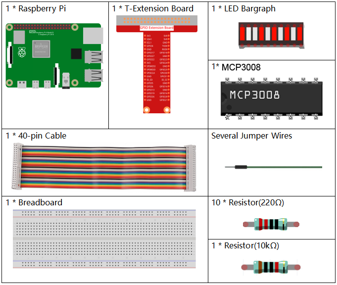
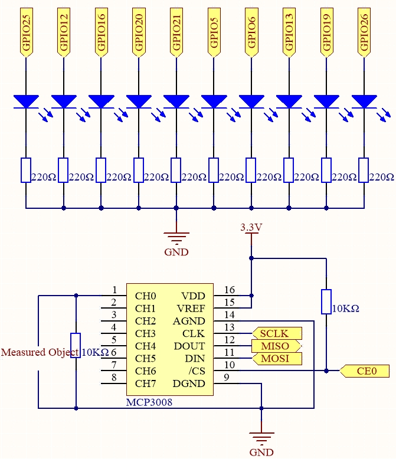

.. note::

    Hallo, willkommen in der SunFounder Raspberry Pi & Arduino & ESP32 Enthusiasten-Community auf Facebook!  
    Tauchen Sie tiefer in Raspberry Pi, Arduino und ESP32 mit anderen Enthusiasten ein.

    **Warum beitreten?**

    - **Expertenunterstützung**: Lösen Sie Probleme nach dem Kauf und technische Herausforderungen mit Hilfe unserer Community und unseres Teams.
    - **Lernen & Teilen**: Tauschen Sie Tipps und Tutorials aus, um Ihre Fähigkeiten zu verbessern.
    - **Exklusive Vorschauen**: Erhalten Sie frühzeitigen Zugriff auf neue Produktankündigungen und exklusive Einblicke.
    - **Spezielle Rabatte**: Genießen Sie exklusive Rabatte auf unsere neuesten Produkte.
    - **Festliche Aktionen und Giveaways**: Nehmen Sie an Verlosungen und Feiertagsaktionen teil.

    👉 Bereit, mit uns zu forschen und zu kreieren? Klicken Sie auf [|link_sf_facebook|] und treten Sie noch heute bei!

.. _3.1.5_c_pi5_mcp3008:

3.1.5 Batterieanzeige (MCP3008)
==================================

.. note::

    .. image:: ../img/mcp3008_and_adc0834.jpg
        :width: 25%
        :align: left
        
    Abhängig von Ihrer Kit-Version identifizieren Sie bitte, ob Sie **ADC0834** oder **MCP3008** haben, und fahren Sie mit dem entsprechenden Abschnitt fort.

Einführung
--------------

In diesem Projekt erstellen wir ein Batterieanzeigegerät, das den Ladezustand einer Batterie visuell auf einer LED-Balkenanzeige darstellt.

.. warning::

    Verwenden Sie keine Batteriekomponenten, die mehr als 3,3 V überschreiten, um Überlastung zu vermeiden, die den Chip oder den Raspberry Pi beschädigen könnte.

Benötigte Komponenten
------------------------------

Für dieses Projekt benötigen wir folgende Komponenten.

Es ist definitiv bequem, ein komplettes Kit zu kaufen. Hier ist der Link: 

.. list-table::
    :widths: 20 20 20
    :header-rows: 1

    *   - Name	
        - ELEMENTE IN DIESEM KIT
        - LINK
    *   - Raphael Kit
        - 337
        - |link_Raphael_kit|

Sie können die Komponenten auch einzeln über die folgenden Links kaufen:

.. list-table::
    :widths: 30 20
    :header-rows: 1

    *   - KOMPONENTENBESCHREIBUNG
        - KAUFLINK

    *   - :ref:`cpn_gpio_board`
        - |link_gpio_board_buy|
    *   - :ref:`cpn_breadboard`
        - |link_breadboard_buy|
    *   - :ref:`cpn_wires`
        - |link_wires_buy|
    *   - :ref:`cpn_resistor`
        - |link_resistor_buy|
    *   - :ref:`cpn_bar_graph`
        - \-
    *   - :ref:`cpn_mcp3008`
        - \-

Schaltplan
-------------------

============ ======== ======== ===
T-Board-Name Physikal WiringPi BCM
SPICE0       Pin 24   10       8
SPIMOSI      Pin 19   12       10
SPIMISO      Pin 21   13       9
SPISCLK      Pin 23   14       11
GPIO25       Pin 22   6        25
GPIO12       Pin 32   26       12
GPIO16       Pin 36   27       16
GPIO20       Pin 38   28       20
GPIO21       Pin 40   29       21
GPIO5        Pin 29   21       5
GPIO6        Pin 31   22       6
GPIO13       Pin 33   23       13
GPIO19       Pin 35   24       19
GPIO26       Pin 37   25       26
============ ======== ======== ===

Experimentelle Verfahren
-------------------------

**Schritt 1:** Schließen Sie den Stromkreis an.

.. image:: ../img/july24_3.1.5_battery_indicator_mcp3008.png

**Schritt 2:** Wechseln Sie in den Code-Ordner.

.. raw:: html

   <run></run>

.. code-block:: 

    cd ~/raphael-kit/c/3.1.5-2/

**Schritt 3:** Kompilieren Sie den Code.

.. raw:: html

   <run></run>

.. code-block:: 

    gcc 3.1.5_BatteryIndicator.c -lwiringPi

**Schritt 4:** Führen Sie die ausführbare Datei aus.

.. raw:: html

   <run></run>

.. code-block:: 

    sudo ./a.out

Nach dem Start des Programms verbinden Sie den 3. Pin des MCP3008 und GND mit den beiden Polen einer Batterie.  
Sie sehen, dass die entsprechende LED auf der LED-Balkenanzeige leuchtet, um den Ladezustand anzuzeigen (Messbereich: 0–5 V).

.. note::

    Wenn es nach dem Ausführen nicht funktioniert oder die Fehlermeldung „wiringPi.h: No such file or directory“ angezeigt wird, lesen Sie bitte :ref:`install_wiringpi_pi5`.

Code
--------

.. code-block:: c

    #include <wiringPi.h>
    #include <wiringPiSPI.h>
    #include <stdio.h>

    #define SPI_CHANNEL 0
    #define SPI_SPEED   1000000  // 1MHz
    #define VREF        3.3      

    int pins[10] = {6, 26, 27, 28, 29, 21, 22, 23, 24, 25};

    int read_ADC(int channel)
    {
        if (channel < 0 || channel > 7) return -1;

        unsigned char buffer[3];
        buffer[0] = 1;  // Startbit
        buffer[1] = (8 + channel) << 4;  // Single-Ended-Modus
        buffer[2] = 0;

        wiringPiSPIDataRW(SPI_CHANNEL, buffer, 3);

        int value = ((buffer[1] & 3) << 8) | buffer[2];
        return value;
    }

    void LedBarGraph(int value) {
        for (int i = 0; i < 10; i++) {
            if (i < value)
                digitalWrite(pins[i], HIGH);  
            else
                digitalWrite(pins[i],LOW);
        }
    }

    int main(void)
    {
        if (wiringPiSetup() == -1) {
            printf("setup wiringPi failed!\n");
            return 1;
        }

        if (wiringPiSPISetup(SPI_CHANNEL, SPI_SPEED) == -1) {
            printf("SPI setup failed!\n");
            return 1;
        }

        for (int i = 0; i < 10; i++) {
            pinMode(pins[i], OUTPUT);
            digitalWrite(pins[i], HIGH);
        }

        while (1) {
            int analogVal = read_ADC(0);  // MCP3008 CH0
            if (analogVal < 0) continue;

            float voltage = analogVal * VREF / 1023.0;
            int level = analogVal * 10 / 1024;  
            if (level > 10) level = 10;  

            LedBarGraph(level);

            printf("ADC Value: %d\tVoltage: %.2f V\tLevel: %d\n", analogVal, voltage, level);

            delay(200);
        }

        return 0;
    }

Code-Erklärung
----------------------

.. code-block:: c

    int read_ADC(int channel) { ... }

Diese Funktion liest analoge Werte vom MCP3008-ADC-Chip über SPI.  
Der Parameter `channel` wählt einen der acht analogen Eingänge (CH0–CH7) aus.  
Der MCP3008 gibt einen 10-Bit-Digitalwert zwischen 0 und 1023 zurück, der die analoge Spannung darstellt.

.. code-block:: c

    void LedBarGraph(int value) { ... }

Diese Funktion steuert eine LED-Balkenanzeige mit 10 LEDs.  
Jede LED repräsentiert ein Zehntel des Spannungsbereichs.  
Die LEDs werden der Reihe nach bis zum angegebenen Level eingeschaltet.

Hinweis: Diese Version geht davon aus, dass die LED-Anoden mit GPIOs verbunden sind und die Kathoden an GND liegen (aktive HIGH-Schaltung).

.. code-block:: c

    int main(void) { ... }

Die Hauptprogrammlogik:

- Initialisiert WiringPi und die SPI-Kommunikation.  
- Setzt die GPIO-Pins als Ausgänge zur Steuerung der 10-LED-Balkenanzeige.  
- Liest kontinuierlich die analoge Spannung über MCP3008 (CH0).  
- Wandelt den Messwert unter Verwendung von `VREF = 3,3 V` in eine Spannung um.  
- Skaliert die Spannung auf einen 0–10 Level-Balken und schaltet die entsprechenden LEDs ein.  
- Gibt den Roh-ADC-Wert, die Spannung (in Volt) und den LED-Level über die serielle Konsole aus.

Dies fungiert als visuelle Batterieanzeige oder als einfaches analoges Voltmeter.
