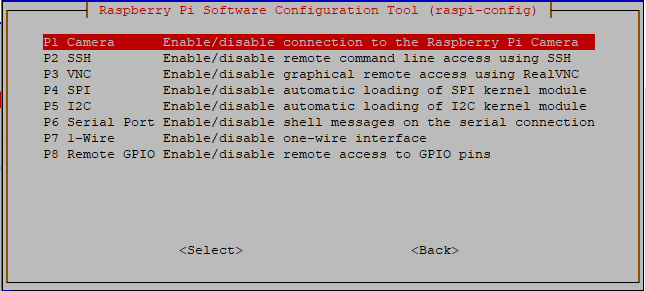
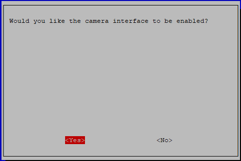

Camera Module Installation
====================================

On the camera module or Raspberry Pi, you will find a flat plastic connector. Carefully pull out the black fixing switch until the fixing switch is partially pulled out. Insert the FFC cable into the plastic connector in the direction shown and push the fixing switch back into place.

If the FFC wire is installed correctly, it will be straight and will not pull out when you gently pull on it. If not, reinstall it again.

.. image:: media/connect_ffc.png
.. image:: media/1.10_camera.png
   :width: 700

.. warning::

   Do not install the camera with the power on, it may damage your camera.

Run the following command to enable the camera interface of your Raspberry Pi. If you have enabled it, skip this; if you do not know whether you have done that or not, please continue.

.. code-block:: 

   sudo raspi-config

**3 Interfacing options**

.. image:: media/image282.png
   :align: center

**P1 Camera**

**<Yes>, then <Ok> -> <Finish>**

