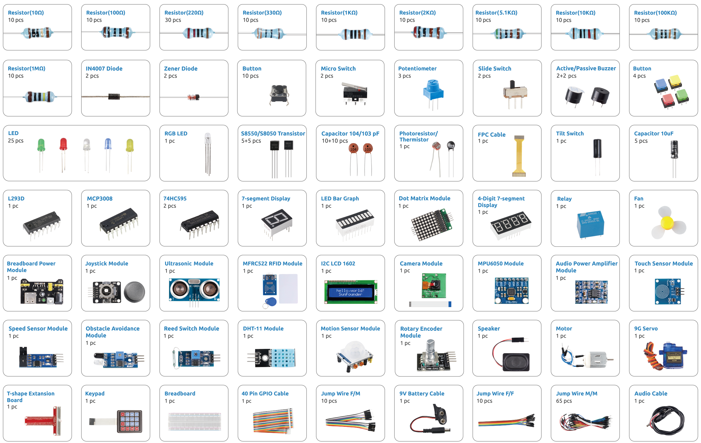

.. note::

    Hola, ¡bienvenido a la Comunidad de Entusiastas de SunFounder para Raspberry Pi, Arduino y ESP32 en Facebook! Sumérgete más en Raspberry Pi, Arduino y ESP32 con otros entusiastas.

    **¿Por qué unirse?**

    - **Soporte experto**: Resuelve problemas postventa y desafíos técnicos con la ayuda de nuestra comunidad y equipo.
    - **Aprende y comparte**: Intercambia consejos y tutoriales para mejorar tus habilidades.
    - **Vistas previas exclusivas**: Obtén acceso anticipado a nuevos anuncios de productos y adelantos.
    - **Descuentos especiales**: Disfruta de descuentos exclusivos en nuestros productos más recientes.
    - **Promociones y sorteos festivos**: Participa en sorteos y promociones especiales.

    👉 ¿Listo para explorar y crear con nosotros? Haz clic en [|link_sf_facebook|] y únete hoy mismo.

Introducción de Componentes
================================================

Después de abrir el paquete, verifica si todos los componentes coinciden con la descripción del producto y asegúrate de que cada parte esté en buen estado.

Esta sección proporciona una descripción general de cada componente incluido en el kit.  
Para cada ítem encontrarás:

* Una breve introducción  
* El principio de funcionamiento  
* Los proyectos en los que se utiliza el componente  

**Básico**

.. toctree::
    :maxdepth: 1

    _shared/component/cpn_gpio_board
    _shared/component/cpn_breadboard
    _shared/component/cpn_resistor
    _shared/component/cpn_transistor
    _shared/component/cpn_capacitor
    _shared/component/cpn_diode
    _shared/component/cpn_wires

**Chip**

.. toctree::
    :maxdepth: 1

    _shared/component/cpn_74hc595
    _shared/component/cpn_l293d
    _shared/component/cpn_adc0834
    _shared/component/cpn_mcp3008

**Pantalla**

.. toctree::
    :maxdepth: 1

    _shared/component/cpn_led
    _shared/component/cpn_rgb_led
    _shared/component/cpn_bar_graph
    _shared/component/cpn_7_segment
    _shared/component/cpn_4_digit
    _shared/component/cpn_max7219_module
    _shared/component/cpn_i2c_lcd

**Sonido**

.. toctree::
    :maxdepth: 1

    _shared/component/cpn_buzzer
    _shared/component/cpn_audio_speaker

**Driver**

.. toctree::
    :maxdepth: 1

    _shared/component/cpn_motor_dc
    _shared/component/cpn_servo_sg90
    _shared/component/cpn_power_module
    _shared/component/cpn_relay_6pin
    

**Controlador**

.. toctree::
    :maxdepth: 1

    _shared/component/cpn_button
    _shared/component/cpn_micro_switch
    _shared/component/cpn_slide_switch
    _shared/component/cpn_potentiometer
    _shared/component/cpn_joystick_module
    _shared/component/cpn_rotary_encoder_module
    _shared/component/cpn_keypad

**Sensor**

.. toctree::
    :maxdepth: 1

    _shared/component/cpn_photoresistor
    _shared/component/cpn_thermistor
    _shared/component/cpn_tilt_switch
    _shared/component/cpn_touch_switch_module
    _shared/component/cpn_reed_switch_module
    _shared/component/cpn_avoid_module
    _shared/component/cpn_speed_module
    _shared/component/cpn_pir_module
    _shared/component/cpn_ultrasonic_module
    _shared/component/cpn_dht11_module
    _shared/component/cpn_mpu6050_module
    _shared/component/cpn_mfrc522_module
    _shared/component/cpn_camera_module