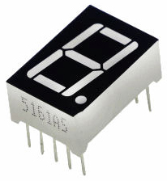

.. note::

    Hello, welcome to the SunFounder Raspberry Pi & Arduino & ESP32 Enthusiasts Community on Facebook! Dive deeper into Raspberry Pi, Arduino, and ESP32 with fellow enthusiasts.

    **Why Join?**

    - **Expert Support**: Solve post-sale issues and technical challenges with help from our community and team.
    - **Learn & Share**: Exchange tips and tutorials to enhance your skills.
    - **Exclusive Previews**: Get early access to new product announcements and sneak peeks.
    - **Special Discounts**: Enjoy exclusive discounts on our newest products.
    - **Festive Promotions and Giveaways**: Take part in giveaways and holiday promotions.

    👉 Ready to explore and create with us? Click [|link_sf_facebook|] and join today!

.. _cpn_7_segment:

7-segment Display
======================

A 7-segment display is an 8-shaped component which packages 7 LEDs. Each LED is called a segment - when energized, one segment forms part of a numeral to be displayed.

There are two types of pin connection: Common Cathode (CC) and Common Anode (CA). As the name suggests, a CC display has all the cathodes of the 7 LEDs connected when a CA display has all the anodes of the 7 segments connected.

In this kit, we use the Common Cathode 7-segment display, here is the electronic symbol.

.. image:: img/segment_cathode.png
    :width: 800

Each of the LEDs in the display is given a positional segment with one of its connection pins led out from the rectangular plastic package. These LED pins are labeled from "a" through to "g" representing each individual LED. The other LED pins are connected together forming a common pin. So by forward biasing the appropriate pins of the LED segments in a particular order, some segments will brighten and others stay dim, thus showing the corresponding character on the display. 

**Display Codes** 

To help you get to know how 7-segment displays(Common Cathode) display Numbers, we have drawn the following table. Numbers are the number 0-F displayed on the 7-segment display; (DP) GFEDCBA refers to the corresponding LED set to 0 or 1, For example, 00111111 means that DP and G are set to 0, while others are set to 1. Therefore, the number 0 is displayed on the 7-segment display, while HEX Code corresponds to hexadecimal number.

.. image:: img/segment_code.png

**Example**

* :ref:`1.1.4_c` (C Project)
* :ref:`1.1.4_py` (Python Project)
