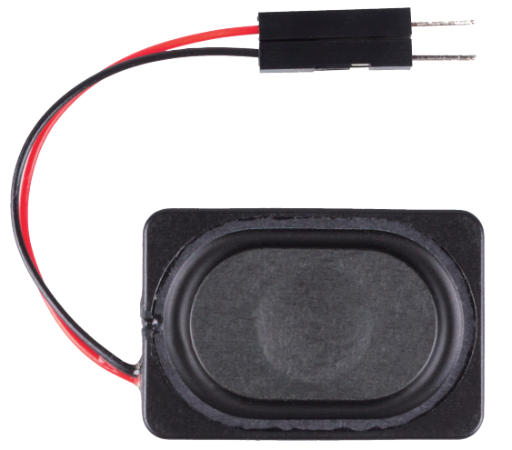

.. note::

    Hello, welcome to the SunFounder Raspberry Pi & Arduino & ESP32 Enthusiasts Community on Facebook! Dive deeper into Raspberry Pi, Arduino, and ESP32 with fellow enthusiasts.

    **Why Join?**

    - **Expert Support**: Solve post-sale issues and technical challenges with help from our community and team.
    - **Learn & Share**: Exchange tips and tutorials to enhance your skills.
    - **Exclusive Previews**: Get early access to new product announcements and sneak peeks.
    - **Special Discounts**: Enjoy exclusive discounts on our newest products.
    - **Festive Promotions and Giveaways**: Take part in giveaways and holiday promotions.

    👉 Ready to explore and create with us? Click [|link_sf_facebook|] and join today!

.. _cpn_audio_speaker:

Audio Module and Speaker
===========================

**Audio Amplifier Module**

.. image:: img/audio_module.jpg
    :width: 500
    :align: center

Audio Amplifier Module contains a HXJ8002 audio power amplifier chip. This chip is a power amplifier with low power supply, that can provide 3W average audio power for a 3Ω BTL load with low harmonic distortion (under 10% threshold distortion at 1KHz) from a 5V DC power supply. This chip can amplify audio signals without any coupling capacitors or bootstrap capacitors.

The module can be supplied by a 2.0V up to 5.5V DC with 10mA operating current (0.6uA for typical standby current) power source and produce a powerful amplified sound into a 3Ω, 4Ω, or 8Ω impedance speaker. This module has an improved pop and clicks circuitry for reducing significantly the transition nose at the powering on and off moment. Tiny size besides high efficiency and low power supplying make it applicable in widely portable and battery-powered projects and microcontrollers.  

* **IC**: HXJ8002
* **Input Voltage**: 2V ~ 5.5V
* **Standby Mode Current**: 0.6uA (typical value)
* **Output Power**: 3W (3Ω load) , 2.5W (4Ω load) , 1.5W (8Ω load)
* **Output Speaker Impedance**: 3Ω, 4Ω, 8Ω
* **Size**: 19.8mm x 14.2mm

**Speaker**

* **Size**: 20x30x7mm
* **Impedance**：8ohm
* **Rate Input Power**: 1.5W 
* **Max Input Power**: 2.0W
* **Wire Length**: 10cm

.. image:: img/2030_speaker.png

The size chart is as follows：

* :download:`2030 Speaker Datasheet <https://github.com/sunfounder/sf-pdf/raw/master/datasheet/2030-speaker-datasheet.pdf>`

**Audio Cable**

.. image:: img/audio_cable_pic2.png
    :width: 500
    :align: center

This is a 3.5mm male audio cable with a total length of 43cm. it has 3 connectors, red for the left channel, white for the right channel, and GND in the middle.

**Circuit**

.. image:: img/4.1.4fritzing.png

After building the circuit according to the above diagram, then plug the audio cable into the Raspberry Pi's 3.5mm audio jack.

.. image:: img/audio4.png
    :width: 400
    :align: center

If your speaker have no sound, it may be because the Raspberry Pi has selected the wrong audio output (The default is HDMI), you need to :ref:`change_audio_output` to **Headphones**.

If you feel that the volume of the speakers is too low, you can :ref:`adjust_volume`.

**Example**

* :ref:`3.1.3_py` (Python Project)
* :ref:`3.1.4_py` (Python Project)
* :ref:`4.1.2_py` (Python Project)
* :ref:`4.1.3_py` (Python Project)
* :ref:`4.1.5_py` (Python Project)
* :ref:`1.8_scratch` (Scratch Project)
* :ref:`1.9_scratch` (Scratch Project)
* :ref:`1.10_scratch` (Scratch Project)
