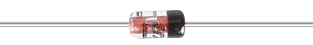

.. note::

    Hello, welcome to the SunFounder Raspberry Pi & Arduino & ESP32 Enthusiasts Community on Facebook! Dive deeper into Raspberry Pi, Arduino, and ESP32 with fellow enthusiasts.

    **Why Join?**

    - **Expert Support**: Solve post-sale issues and technical challenges with help from our community and team.
    - **Learn & Share**: Exchange tips and tutorials to enhance your skills.
    - **Exclusive Previews**: Get early access to new product announcements and sneak peeks.
    - **Special Discounts**: Enjoy exclusive discounts on our newest products.
    - **Festive Promotions and Giveaways**: Take part in giveaways and holiday promotions.

    👉 Ready to explore and create with us? Click [|link_sf_facebook|] and join today!

.. _cpn_diode:

Diode
=================

A diode is an electronic component with two electrodes. It allows current to flow in only one direction, which is often called the "Rectifying" function.
Thus, a diode can be thought of as an electronic version of a check valve.

Because of its unidirectional conductivity, the diode is used in almost all electronic circuits of some complexity. It is one of the first semiconductor devices and has a wide range of applications.

According to its use classification, it can be divided into detector diodes, rectifier diodes, limiter diodes, voltage regulator diodes, etc. 

Rectifier diodes and voltage regulator diodes are included in this kit.

**Rectifier Diode**

.. image:: img/in4007_diode.png
.. image:: img/symbol_rectifier_diode.png
    :width: 200

A rectifier diode is a semiconductor diode, used to rectify AC (alternating current) to DC (direct current) using the rectifier bridge application. The alternative of rectifier diode through the Schottky barrier is mainly valued within digital electronics. This diode is capable to conduct the values of current which changes from mA to a few kA & voltages up to a few kV.

The designing of rectifier diodes can be done with Silicon material and they are capable of conducting high electric current values. These diodes are not famous but still used Ge or gallium arsenide-based semiconductor diodes. Ge diodes have less allowable reversed voltage as well as a lesser allowable junction temperature. The Ge diode has a benefit as compared to Si diode that is low threshold voltage value while operating in a forward-bias.

* `1N400x general-purpose diode  - Wikipedia <https://en.wikipedia.org/wiki/1N400x_general-purpose_diode>`_

**Zener Diode**

A Zener diode is a special type of diode designed to reliably allow current to flow "backwards" when a certain set reverse voltage, known as the Zener voltage, is reached.

This diode is a semiconductor device that has a very high resistance up to the critical reverse breakdown voltage. At this critical breakdown point, the reverse resistance is reduced to a very small value, and the current increases while the voltage remains constant in this low resistance region.

.. image:: img/symbol-zener-diode.jpg

* `Zener diode - Wikipedia <https://en.wikipedia.org/wiki/Zener_diode>`_

**Example**

* :ref:`1.3.3_c` (C Project)
* :ref:`1.3.3_py` (Python Project)
