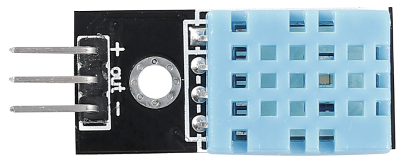

.. note::

    Hello, welcome to the SunFounder Raspberry Pi & Arduino & ESP32 Enthusiasts Community on Facebook! Dive deeper into Raspberry Pi, Arduino, and ESP32 with fellow enthusiasts.

    **Why Join?**

    - **Expert Support**: Solve post-sale issues and technical challenges with help from our community and team.
    - **Learn & Share**: Exchange tips and tutorials to enhance your skills.
    - **Exclusive Previews**: Get early access to new product announcements and sneak peeks.
    - **Special Discounts**: Enjoy exclusive discounts on our newest products.
    - **Festive Promotions and Giveaways**: Take part in giveaways and holiday promotions.

    👉 Ready to explore and create with us? Click [|link_sf_facebook|] and join today!

.. _cpn_humiture_sensor:

Humiture Sensor Module
=============================

The digital temperature and humidity sensor DHT11 is a composite sensor that contains a calibrated digital signal output of temperature and humidity. 
The technology of a dedicated digital modules collection and the temperature and humidity sensing technology are applied to ensure that the product has high reliability and excellent long-term stability.

Only three pins are available for use: VCC, GND, and DATA. 
The communication process begins with the DATA line sending start signals to DHT11, and DHT11 receives the signals and returns an answer signal. 
Then the host receives the answer signal and begins to receive 40-bit humiture data (8-bit humidity integer + 8-bit humidity decimal + 8-bit temperature integer + 8-bit temperature decimal + 8-bit checksum).

.. image:: img/Dht11.png

* `DHT11 Datasheet <https://components101.com/sites/default/files/component_datasheet/DHT11-Temperature-Sensor.pdf>`_

**Example**

* :ref:`2.2.3_c` (C Project)
* :ref:`2.2.3_py` (Python Project)