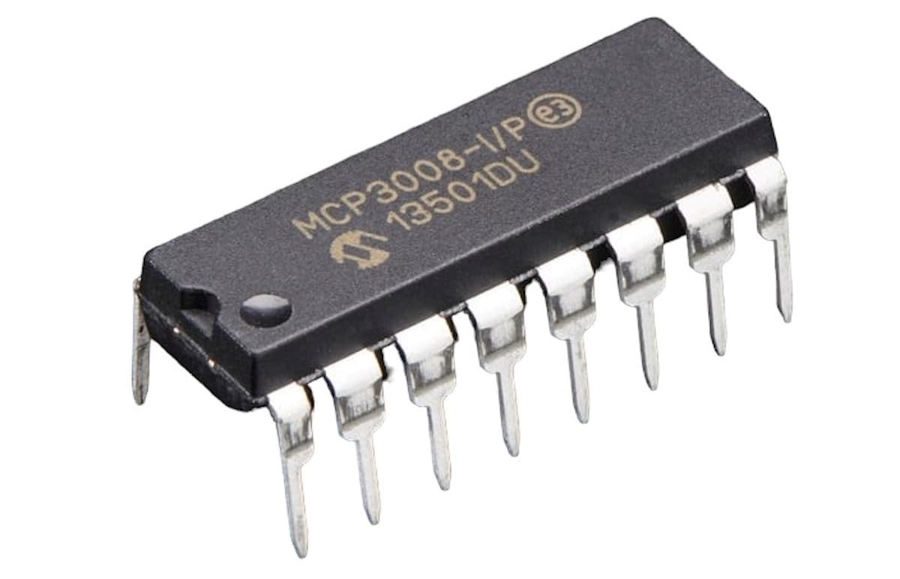
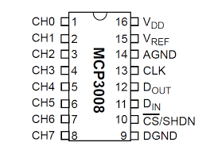

.. note::

    Hello, welcome to the SunFounder Raspberry Pi & Arduino & ESP32 Enthusiasts Community on Facebook! Dive deeper into Raspberry Pi, Arduino, and ESP32 with fellow enthusiasts.

    **Why Join?**

    - **Expert Support**: Solve post-sale issues and technical challenges with help from our community and team.
    - **Learn & Share**: Exchange tips and tutorials to enhance your skills.
    - **Exclusive Previews**: Get early access to new product announcements and sneak peeks.
    - **Special Discounts**: Enjoy exclusive discounts on our newest products.
    - **Festive Promotions and Giveaways**: Take part in giveaways and holiday promotions.

    👉 Ready to explore and create with us? Click [|link_sf_facebook|] and join today!

.. _cpn_mcp3008:

MCP3008
==============

MCP3008
==============

MCP3008 è un convertitore analogico-digitale (ADC) a 10 bit a approssimazioni successive con 8 canali di ingresso e un protocollo di comunicazione SPI (Serial Peripheral Interface).  
È in grado di interfacciarsi con un microcontrollore per convertire segnali di ingresso analogici in dati digitali per un'ulteriore elaborazione.

**Sequenza di funzionamento**

Una conversione sull'MCP3008 inizia impostando il pin CS (chip select) a livello basso, il che attiva la comunicazione con il dispositivo.  
Il microcontrollore invia quindi un flusso di controllo di 3 byte tramite l'interfaccia SPI per specificare la configurazione e selezionare il canale di ingresso.

Il primo byte inviato contiene il bit di start e il bit di selezione singolo/differenziale.  
I bit successivi indicano quale dei 8 canali (CH0–CH7) deve essere letto.  
I dati vengono immessi nel dispositivo a ogni fronte di salita del clock SPI (SCLK) e il risultato della conversione viene restituito simultaneamente.

All'interno è incluso un breve ritardo per consentire al canale di ingresso selezionato di stabilizzarsi prima che inizi la conversione.  
L'MCP3008 esegue quindi una conversione analogico-digitale a 10 bit utilizzando un circuito sample-and-hold e un comparatore SAR (Successive Approximation Register).

Il risultato della conversione viene trasmesso al microcontrollore tramite la linea MISO (Master In Slave Out).  
Il bit più significativo (MSB) del risultato a 10 bit viene inviato per primo, seguito dai bit rimanenti.  
Il microcontrollore legge il risultato tramite il bus SPI durante questo processo.

Dopo che l'intero valore digitale a 10 bit è stato trasmesso, l'MCP3008 completa il ciclo e attende il comando successivo.

* `MCP3008 series Datasheet <https://www.alldatasheet.com/datasheet-pdf/view/304558/MICROCHIP/MCP3008-ISLASHP.html>`_

**Example**

* :ref:`2.1.7_c_mcp3008` (C Project)
* :ref:`2.2.1_c_mcp3008` (C Project)
* :ref:`2.2.2_c_mcp3008` (C Project)
* :ref:`3.1.4_c_mcp3008` (C Project)
* :ref:`3.1.5_c_mcp3008` (C Project)
* :ref:`3.1.7_c_mcp3008` (C Project)
* :ref:`2.1.7_py_mcp3008` (Python Project)
* :ref:`2.2.1_py_mcp3008` (Pyhton Project)
* :ref:`2.2.2_py_mcp3008` (Pyhton Project)
* :ref:`4.1.10_py_mcp3008` (Pyhton Project)
* :ref:`4.1.11_py_mcp3008` (Pyhton Project)
* :ref:`4.1.13_py_mcp3008` (Pyhton Project)